# Архітектура системи — Mermaid-діаграми

> Документ описує повну архітектуру системи управління виробництвом та дистрибуцією.
> Актуальна дата: 2026-03-31.

---

## 1. Загальна карта системи

Всі модулі, їх зв'язки з Supabase-схемами та зовнішніми API.

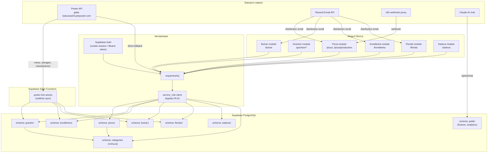
```mermaid
graph TD
    subgraph External["Зовнішні сервіси"]
        POSTER["Poster API<br/>galia-baluvana34.joinposter.com"]
        RESEND["Resend Email API"]
        N8N["n8n webhook proxy"]
        CLAUDE_AI["Claude AI chat"]
    end

    subgraph Auth["Авторизація"]
        SUPABASE_AUTH["Supabase Auth<br/>(cookie session / Bearer token)"]
        AUTH_GUARD["requireAuth()"]
        SERVICE_ROLE["service_role client<br/>(bypass RLS)"]
    end

    subgraph Modules["Модулі Next.js"]
        PIZZA["Pizza module<br/>/pizza, /pizza/production"]
        GRAVITON["Graviton module<br/>/graviton/*"]
        KONDITERKA["Konditerka module<br/>/konditerka"]
        BULVAR["Bulvar module<br/>/bulvar"]
        FLORIDA["Florida module<br/>/florida"]
        SADOVA["Sadova module<br/>/sadova"]
    end

    subgraph DB["Supabase PostgreSQL"]
        PIZZA1["schema: pizza1"]
        GRAVITON_DB["schema: graviton"]
        KONDITERKA1["schema: konditerka1"]
        BULVAR1["schema: bulvar1"]
        FLORIDA1["schema: florida1"]
        SADOVA1["schema: sadova1"]
        CATEGORIES["schema: categories (спільна)"]
        PUBLIC_DB["schema: public<br/>(finance, analytics)"]
    end

    subgraph EdgeFn["Supabase Edge Functions"]
        LIVE_STOCKS["poster-live-stocks<br/>(realtime sync)"]
    end

    POSTER -->|"menu, storages, manufactures"| LIVE_STOCKS
    POSTER -->|"direct fallback"| AUTH_GUARD

    SUPABASE_AUTH --> AUTH_GUARD
    AUTH_GUARD --> SERVICE_ROLE

    PIZZA --> AUTH_GUARD
    GRAVITON --> AUTH_GUARD
    KONDITERKA --> AUTH_GUARD
    BULVAR --> AUTH_GUARD
    FLORIDA --> AUTH_GUARD
    SADOVA --> AUTH_GUARD

    SERVICE_ROLE --> PIZZA1
    SERVICE_ROLE --> GRAVITON_DB
    SERVICE_ROLE --> KONDITERKA1
    SERVICE_ROLE --> BULVAR1
    SERVICE_ROLE --> FLORIDA1
    SERVICE_ROLE --> SADOVA1
    SERVICE_ROLE --> CATEGORIES

    LIVE_STOCKS --> GRAVITON_DB
    LIVE_STOCKS --> KONDITERKA1
    LIVE_STOCKS --> BULVAR1
    LIVE_STOCKS --> FLORIDA1

    PIZZA1 --> CATEGORIES
    GRAVITON_DB --> CATEGORIES

    RESEND -->|"distribution email"| PIZZA
    RESEND -->|"distribution email"| BULVAR
    RESEND -->|"distribution email"| KONDITERKA
    RESEND -->|"distribution email"| FLORIDA

    N8N -->|"webhook"| PIZZA
    CLAUDE_AI -->|"/api/ai/chat"| PUBLIC_DB
```

---

## 2. Supabase схеми — ER-діаграми

### 2.1 Схема `pizza1`

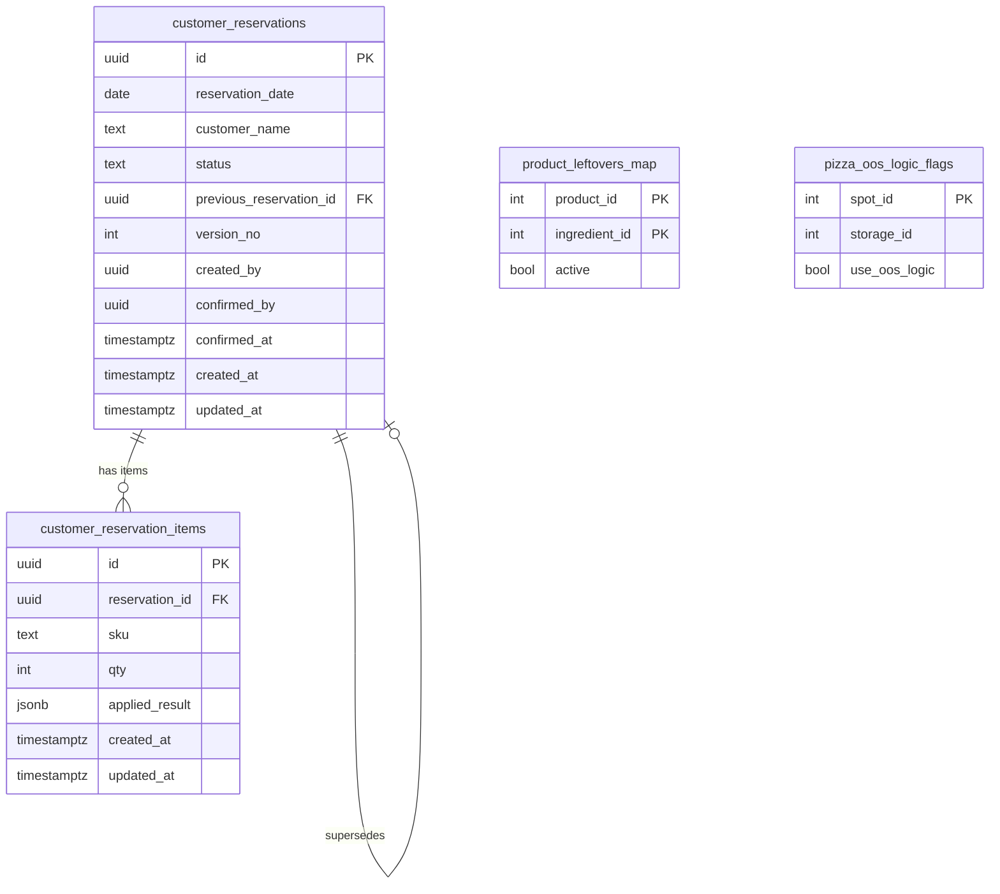
```mermaid
erDiagram
    customer_reservations {
        uuid id PK
        date reservation_date
        text customer_name
        text status
        uuid previous_reservation_id FK
        int version_no
        uuid created_by
        uuid confirmed_by
        timestamptz confirmed_at
        timestamptz created_at
        timestamptz updated_at
    }

    customer_reservation_items {
        uuid id PK
        uuid reservation_id FK
        text sku
        int qty
        jsonb applied_result
        timestamptz created_at
        timestamptz updated_at
    }

    product_leftovers_map {
        int product_id PK
        int ingredient_id PK
        bool active
    }

    pizza_oos_logic_flags {
        int spot_id PK
        int storage_id
        bool use_oos_logic
    }

    customer_reservations ||--o{ customer_reservation_items : "has items"
    customer_reservations ||--o| customer_reservations : "supersedes"
```

#### Вʼюхи schema `pizza1`:
- `v_pizza_distribution_stats_legacy` — legacy розподіл (без OOS)
- `v_pizza_distribution_stats_oos` — OOS-логіка (avg_sales_day, min_stock)
- `v_pizza_distribution_stats` — merge-view (перемикається через `pizza_oos_logic_flags`)
- `v_pizza_production_only` — тільки виробничі дані
- `v_pizza_summary_stats` — зведена статистика
- `v_today_distribution` — поточний розподіл (доступна через public schema)

#### Функції schema `pizza1`:
- `fn_full_recalculate_all(date)` — повний перерахунок розподілу
- `fn_apply_customer_reservation(id)` — застосувати резервацію до розподілу
- `fn_run_pizza_distribution` — оркестратор дистрибуції

---

### 2.2 Схема `categories` (спільна для всіх модулів)

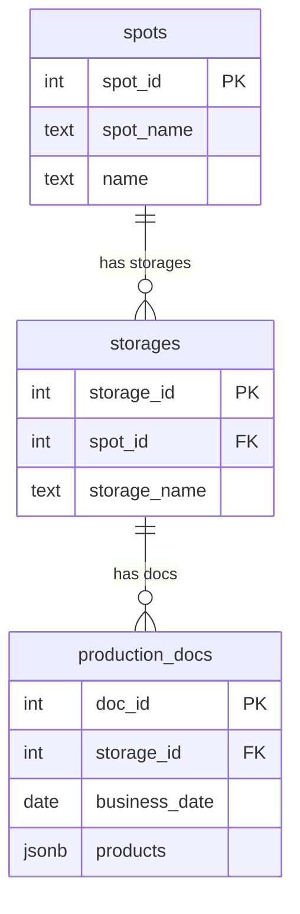
```mermaid
erDiagram
    spots {
        int spot_id PK
        text spot_name
        text name
    }

    storages {
        int storage_id PK
        int spot_id FK
        text storage_name
    }

    production_docs {
        int doc_id PK
        int storage_id FK
        date business_date
        jsonb products
    }

    spots ||--o{ storages : "has storages"
    storages ||--o{ production_docs : "has docs"
```

---

### 2.3 Схема `graviton`

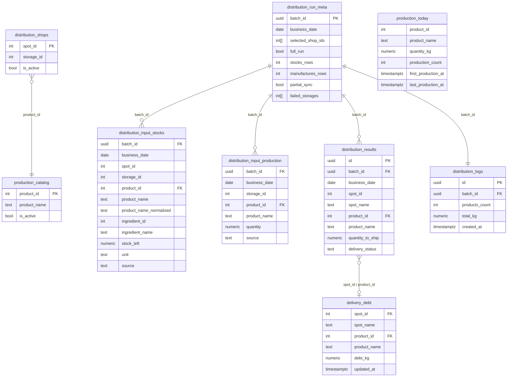
```mermaid
erDiagram
    distribution_shops {
        int spot_id PK
        int storage_id
        bool is_active
    }

    production_catalog {
        int product_id PK
        text product_name
        bool is_active
    }

    distribution_input_stocks {
        uuid batch_id FK
        date business_date
        int spot_id
        int storage_id
        int product_id FK
        text product_name
        text product_name_normalized
        int ingredient_id
        text ingredient_name
        numeric stock_left
        text unit
        text source
    }

    distribution_input_production {
        uuid batch_id FK
        date business_date
        int storage_id
        int product_id FK
        text product_name
        numeric quantity
        text source
    }

    distribution_run_meta {
        uuid batch_id PK
        date business_date
        int[] selected_shop_ids
        bool full_run
        int stocks_rows
        int manufactures_rows
        bool partial_sync
        int[] failed_storages
    }

    distribution_results {
        uuid id PK
        uuid batch_id FK
        date business_date
        int spot_id
        text spot_name
        int product_id FK
        text product_name
        numeric quantity_to_ship
        text delivery_status
    }

    distribution_logs {
        uuid id PK
        uuid batch_id FK
        int products_count
        numeric total_kg
        timestamptz created_at
    }

    delivery_debt {
        int spot_id FK
        text spot_name
        int product_id FK
        text product_name
        numeric debt_kg
        timestamptz updated_at
    }

    production_today {
        int product_id
        text product_name
        numeric quantity_kg
        int production_count
        timestamptz first_production_at
        timestamptz last_production_at
    }

    distribution_run_meta ||--o{ distribution_input_stocks : "batch_id"
    distribution_run_meta ||--o{ distribution_input_production : "batch_id"
    distribution_run_meta ||--o{ distribution_results : "batch_id"
    distribution_run_meta ||--|| distribution_logs : "batch_id"
    distribution_shops }o--|| production_catalog : "product_id"
    distribution_results }o--o| delivery_debt : "spot_id / product_id"
```

---

### 2.4 Схема `konditerka1`

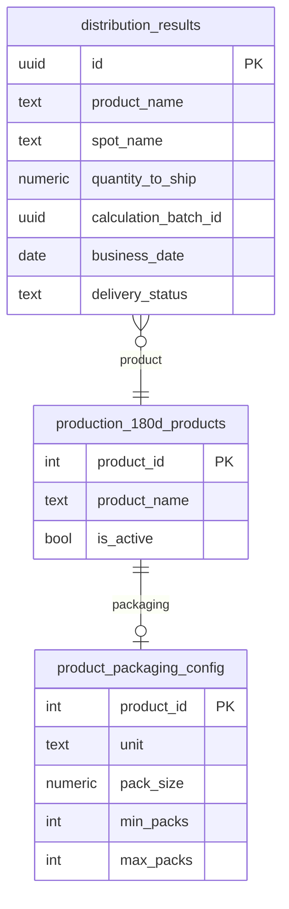
```mermaid
erDiagram
    distribution_results {
        uuid id PK
        text product_name
        text spot_name
        numeric quantity_to_ship
        uuid calculation_batch_id
        date business_date
        text delivery_status
    }

    product_packaging_config {
        int product_id PK
        text unit
        numeric pack_size
        int min_packs
        int max_packs
    }

    production_180d_products {
        int product_id PK
        text product_name
        bool is_active
    }

    distribution_results }o--|| production_180d_products : "product"
    production_180d_products ||--o| product_packaging_config : "packaging"
```

#### Вʼюхи `konditerka1`:
- `v_konditerka_distribution_stats` — дані для розподілу (stock_now, min_stock, avg_sales_day, need_net, baked_at_factory)
- `v_konditerka_today_distribution` — сьогоднішній розподіл
- `v_konditerka_analytics_kpi` — KPI

---

### 2.5 Схеми `bulvar1` та `florida1` (аналогічна структура)

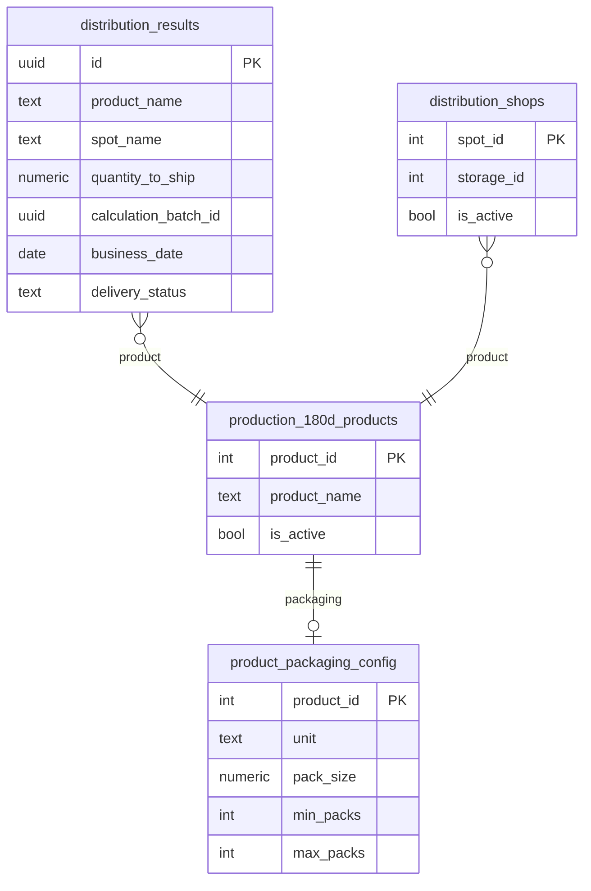
```mermaid
erDiagram
    distribution_results {
        uuid id PK
        text product_name
        text spot_name
        numeric quantity_to_ship
        uuid calculation_batch_id
        date business_date
        text delivery_status
    }

    product_packaging_config {
        int product_id PK
        text unit
        numeric pack_size
        int min_packs
        int max_packs
    }

    production_180d_products {
        int product_id PK
        text product_name
        bool is_active
    }

    distribution_shops {
        int spot_id PK
        int storage_id
        bool is_active
    }

    distribution_results }o--|| production_180d_products : "product"
    production_180d_products ||--o| product_packaging_config : "packaging"
    distribution_shops }o--|| production_180d_products : "product"
```

#### Вʼюхи `bulvar1`:
- `v_bulvar_distribution_stats_x3` — дані для розподілу
- `v_bulvar_analytics_kpi` — KPI
- `v_bulvar_analytics_top5` — топ-5 критичних позицій

#### Вʼюхи `florida1`:
- `v_florida_distribution_stats` — дані для розподілу
- `v_florida_today_distribution` — сьогоднішній розподіл

---

### 2.6 Схема `sadova1`

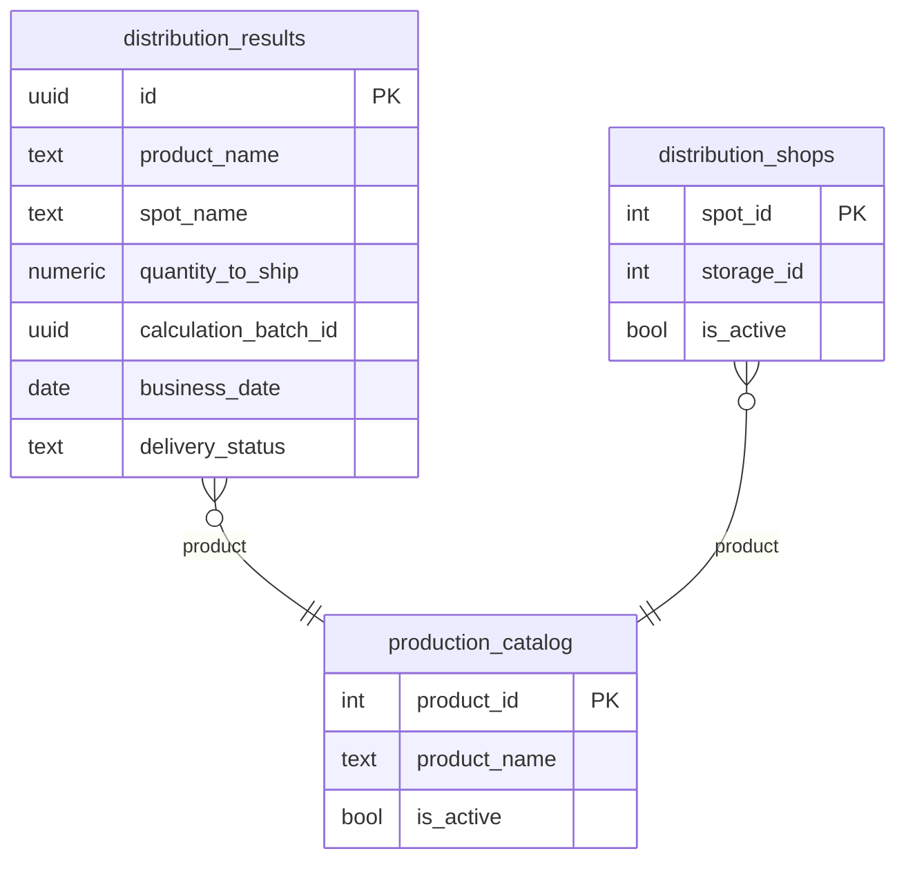
```mermaid
erDiagram
    distribution_results {
        uuid id PK
        text product_name
        text spot_name
        numeric quantity_to_ship
        uuid calculation_batch_id
        date business_date
        text delivery_status
    }

    production_catalog {
        int product_id PK
        text product_name
        bool is_active
    }

    distribution_shops {
        int spot_id PK
        int storage_id
        bool is_active
    }

    distribution_results }o--|| production_catalog : "product"
    distribution_shops }o--|| production_catalog : "product"
```

Sadova workshop: `storage_id = 34` (env: `SADOVA_WORKSHOP_STORAGE_ID`).

---

## 3. Distribution Pipeline — загальний flow

Однаковий патерн для всіх модулів: Bulvar, Konditerka, Florida, Sadova, Pizza.

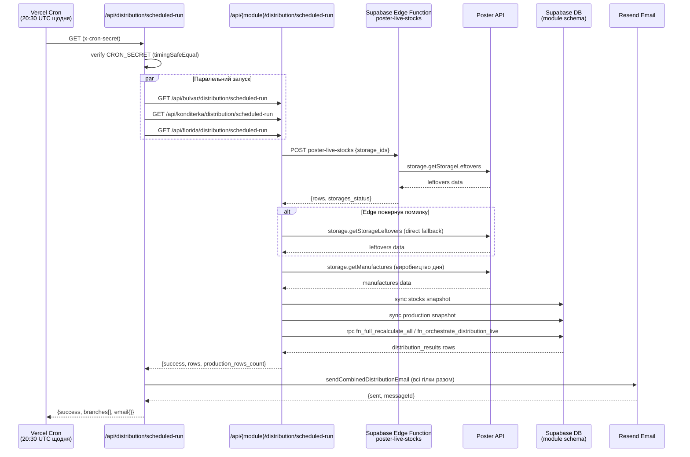
```mermaid
sequenceDiagram
    participant CRON as Vercel Cron<br/>(20:30 UTC щодня)
    participant ORCH as /api/distribution/scheduled-run
    participant BRANCH as /api/{module}/distribution/scheduled-run
    participant EDGE as Supabase Edge Function<br/>poster-live-stocks
    participant POSTER as Poster API
    participant DB as Supabase DB<br/>(module schema)
    participant EMAIL as Resend Email

    CRON->>ORCH: GET (x-cron-secret)
    ORCH->>ORCH: verify CRON_SECRET (timingSafeEqual)

    par Паралельний запуск
        ORCH->>BRANCH: GET /api/bulvar/distribution/scheduled-run
        ORCH->>BRANCH: GET /api/konditerka/distribution/scheduled-run
        ORCH->>BRANCH: GET /api/florida/distribution/scheduled-run
    end

    BRANCH->>EDGE: POST poster-live-stocks {storage_ids}
    EDGE->>POSTER: storage.getStorageLeftovers
    POSTER-->>EDGE: leftovers data
    EDGE-->>BRANCH: {rows, storages_status}

    alt Edge повернув помилку
        BRANCH->>POSTER: storage.getStorageLeftovers (direct fallback)
        POSTER-->>BRANCH: leftovers data
    end

    BRANCH->>POSTER: storage.getManufactures (виробництво дня)
    POSTER-->>BRANCH: manufactures data

    BRANCH->>DB: sync stocks snapshot
    BRANCH->>DB: sync production snapshot
    BRANCH->>DB: rpc fn_full_recalculate_all / fn_orchestrate_distribution_live
    DB-->>BRANCH: distribution_results rows

    BRANCH-->>ORCH: {success, rows, production_rows_count}

    ORCH->>EMAIL: sendCombinedDistributionEmail (всі гілки разом)
    EMAIL-->>ORCH: {sent, messageId}
    ORCH-->>CRON: {success, branches[], email{}}
```

---

## 4. Graviton — специфічна архітектура

Graviton — окрема мережа магазинів з D1/D2/D3 плануванням, live-sync з Poster, підтвердженням доставки та системою боргу.

```mermaid
graph TD
    subgraph GravitonPages["Graviton Pages"]
        G_OVERVIEW["/graviton — Огляд"]
        G_DIST["/graviton/distribution — Розподіл"]
        G_DEBT["/graviton/debt — Борг"]
        G_STORES["/graviton/stores — Магазини"]
        G_STORE_SLUG["/graviton/stores/{slug} — Магазин"]
        G_ANALYTICS["/graviton/analytics — Аналітика"]
        G_DELIVERY["/graviton/delivery — Доставка"]
    end

    subgraph GravitonAPI["Graviton API Routes"]
        G_DIST_RUN["POST /api/graviton/distribution/run"]
        G_CONFIRM_DELIVERY["GET+POST /api/graviton/confirm-delivery"]
        G_PROD_DAILY["GET /api/graviton/production-daily"]
        G_PLAN_D1["GET /api/graviton/plan-d1"]
        G_PLAN_D2["GET /api/graviton/plan-d2"]
        G_PLAN_D3["GET /api/graviton/plan-d3"]
        G_CRITICAL_D2["GET /api/graviton/critical-d2"]
        G_CRITICAL_D3["GET /api/graviton/critical-d3"]
        G_DEFICIT["GET /api/graviton/deficit"]
        G_DEFICIT_RESERVE["POST /api/graviton/deficit/reserve"]
        G_SHOPS["GET /api/graviton/shops"]
        G_METRICS["GET /api/graviton/metrics"]
        G_PROD_DETAIL["GET /api/graviton/production-detail"]
        G_PROD_TASKS["GET /api/graviton/production-tasks"]
        G_SUBMIT_ORDER["POST /api/graviton/submit-order"]
        G_ALL_PRODUCTS["GET /api/graviton/all-products"]
        G_SYNC_STOCKS["POST /api/graviton/sync-stocks"]
    end

    subgraph GravitonDB["graviton schema"]
        DIST_SHOPS["distribution_shops"]
        PROD_CATALOG["production_catalog"]
        DIST_INPUT_STOCKS["distribution_input_stocks"]
        DIST_INPUT_PROD["distribution_input_production"]
        DIST_RUN_META["distribution_run_meta"]
        DIST_RESULTS["distribution_results"]
        DIST_LOGS["distribution_logs"]
        DELIVERY_DEBT["delivery_debt"]
        PROD_TODAY["production_today"]
    end

    subgraph GravitonRPC["Graviton DB Functions"]
        FN_ORCH["fn_orchestrate_distribution_live(batch_id, date, shop_ids)"]
        FN_CONFIRM["fn_confirm_delivery(date, delivered_spot_ids)"]
    end

    G_OVERVIEW --> G_DEFICIT
    G_OVERVIEW --> G_METRICS
    G_OVERVIEW --> G_PROD_DAILY
    G_DIST --> G_DIST_RUN
    G_DIST --> G_PLAN_D1
    G_DIST --> G_PLAN_D2
    G_DIST --> G_PLAN_D3
    G_DEBT --> G_CONFIRM_DELIVERY
    G_STORES --> G_SHOPS
    G_STORE_SLUG --> G_CRITICAL_D2
    G_STORE_SLUG --> G_CRITICAL_D3
    G_DELIVERY --> G_CONFIRM_DELIVERY
    G_ANALYTICS --> G_METRICS

    G_DIST_RUN --> DIST_INPUT_STOCKS
    G_DIST_RUN --> DIST_INPUT_PROD
    G_DIST_RUN --> DIST_RUN_META
    G_DIST_RUN --> FN_ORCH
    FN_ORCH --> DIST_RESULTS
    FN_ORCH --> DIST_LOGS

    G_CONFIRM_DELIVERY --> FN_CONFIRM
    FN_CONFIRM --> DIST_RESULTS
    FN_CONFIRM --> DELIVERY_DEBT

    G_PROD_DAILY --> PROD_TODAY

    style G_DIST_RUN fill:#1e40af,color:#fff
    style FN_ORCH fill:#1e40af,color:#fff
    style FN_CONFIRM fill:#7c3aed,color:#fff
```

### D1/D2/D3 планування (Graviton)

| Endpoint | Опис | Схема |
|----------|------|-------|
| `plan-d1` | Сьогоднішній план розподілу (D+0) | `distribution_results` |
| `plan-d2` | Завтрашній план (D+1) | прогнозні дані |
| `plan-d3` | Післязавтра (D+2) | прогнозні дані |
| `critical-d2` | Критичні дефіцити D+1 | розрахункові |
| `critical-d3` | Критичні дефіцити D+2 | розрахункові |

---

## 5. Статусні машини

### 5.1 Резервації Pizza (customer_reservations.status)

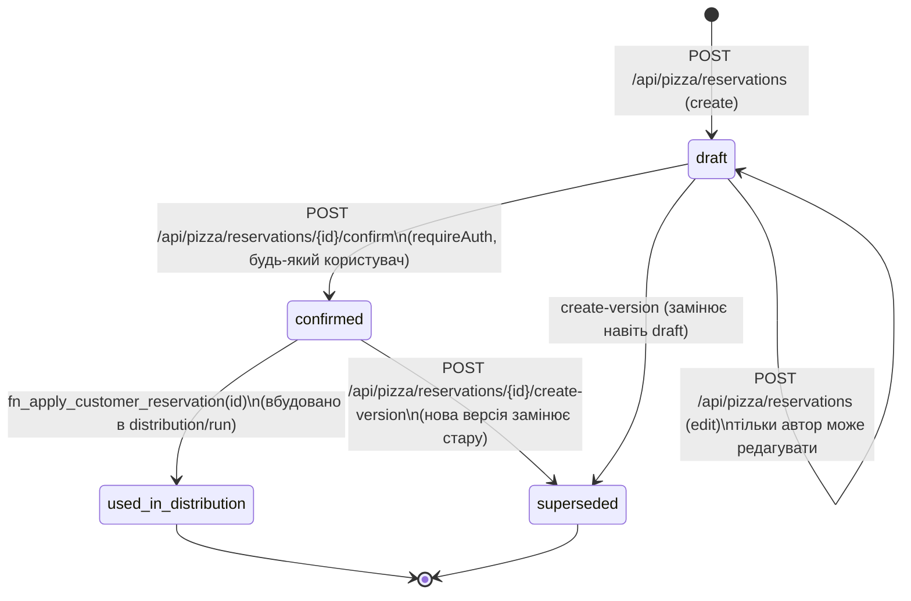
```mermaid
stateDiagram-v2
    [*] --> draft : POST /api/pizza/reservations (create)

    draft --> draft : POST /api/pizza/reservations (edit)\nтільки автор може редагувати

    draft --> confirmed : POST /api/pizza/reservations/{id}/confirm\n(requireAuth, будь-який користувач)

    confirmed --> used_in_distribution : fn_apply_customer_reservation(id)\n(вбудовано в distribution/run)

    confirmed --> superseded : POST /api/pizza/reservations/{id}/create-version\n(нова версія замінює стару)

    draft --> superseded : create-version (замінює навіть draft)

    used_in_distribution --> [*]
    superseded --> [*]
```

**Примітки:**
- Тільки `draft` статус дозволяє редагування
- `previous_reservation_id` зберігає ланцюжок версій
- `version_no` монотонно зростає
- Застосований резерв включає `applied_result jsonb` у `customer_reservation_items`

---

### 5.2 Доставка Graviton (distribution_results.delivery_status)

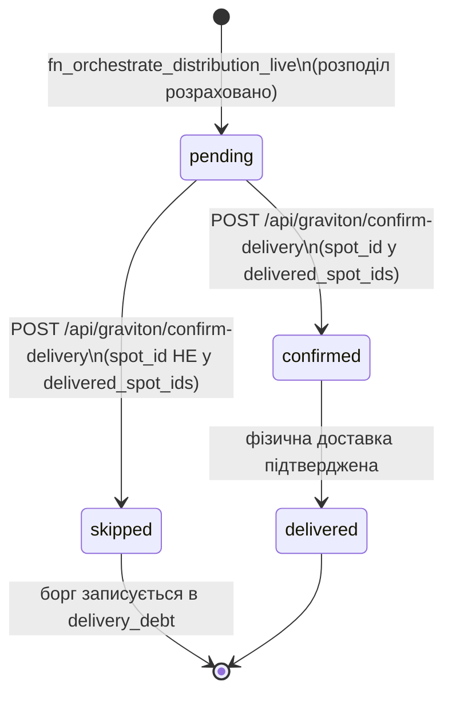
```mermaid
stateDiagram-v2
    [*] --> pending : fn_orchestrate_distribution_live\n(розподіл розраховано)

    pending --> confirmed : POST /api/graviton/confirm-delivery\n(spot_id у delivered_spot_ids)

    pending --> skipped : POST /api/graviton/confirm-delivery\n(spot_id НЕ у delivered_spot_ids)

    confirmed --> delivered : фізична доставка підтверджена

    skipped --> [*] : борг записується в delivery_debt

    delivered --> [*]
```

**Логіка боргу:**
- Магазини, яких **немає** у `delivered_spot_ids` → їх pending-рядки стають `skipped`
- Сума `quantity_to_ship` для skipped → додається до `delivery_debt`
- При наступній успішній доставці борг очищується

---

## 6. Auth flow

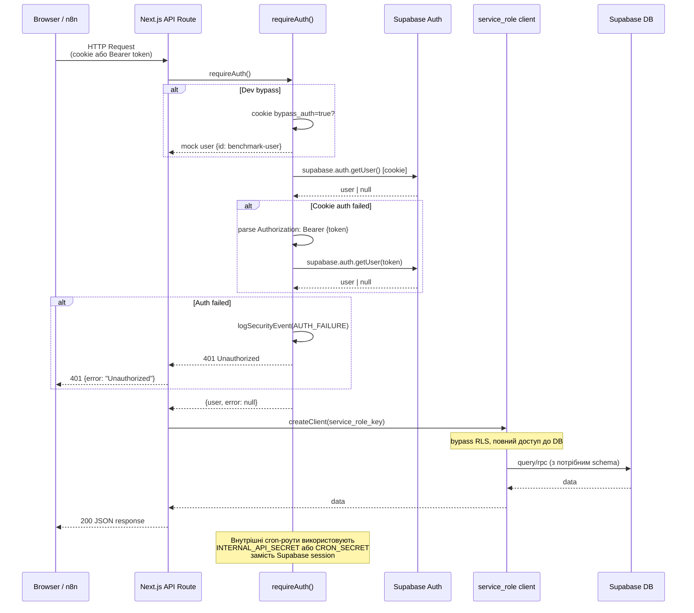
```mermaid
sequenceDiagram
    participant CLIENT as Browser / n8n
    participant ROUTE as Next.js API Route
    participant AUTH as requireAuth()
    participant SUPA_AUTH as Supabase Auth
    participant SERVICE as service_role client
    participant DB as Supabase DB

    CLIENT->>ROUTE: HTTP Request<br/>(cookie або Bearer token)

    ROUTE->>AUTH: requireAuth()

    alt Dev bypass
        AUTH->>AUTH: cookie bypass_auth=true?
        AUTH-->>ROUTE: mock user {id: benchmark-user}
    end

    AUTH->>SUPA_AUTH: supabase.auth.getUser() [cookie]
    SUPA_AUTH-->>AUTH: user | null

    alt Cookie auth failed
        AUTH->>AUTH: parse Authorization: Bearer {token}
        AUTH->>SUPA_AUTH: supabase.auth.getUser(token)
        SUPA_AUTH-->>AUTH: user | null
    end

    alt Auth failed
        AUTH->>AUTH: logSecurityEvent(AUTH_FAILURE)
        AUTH-->>ROUTE: 401 Unauthorized
        ROUTE-->>CLIENT: 401 {error: "Unauthorized"}
    end

    AUTH-->>ROUTE: {user, error: null}

    ROUTE->>SERVICE: createClient(service_role_key)
    Note over SERVICE: bypass RLS, повний доступ до DB

    SERVICE->>DB: query/rpc (з потрібним schema)
    DB-->>SERVICE: data
    SERVICE-->>ROUTE: data
    ROUTE-->>CLIENT: 200 JSON response

    Note over AUTH: Внутрішні cron-роути використовують<br/>INTERNAL_API_SECRET або CRON_SECRET<br/>замість Supabase session
```

---

## 7. Live Sync Pattern (cooldown-based)

Усі модулі синхронізують залишки через Supabase Edge Function з cooldown-захистом від надмірних запитів.

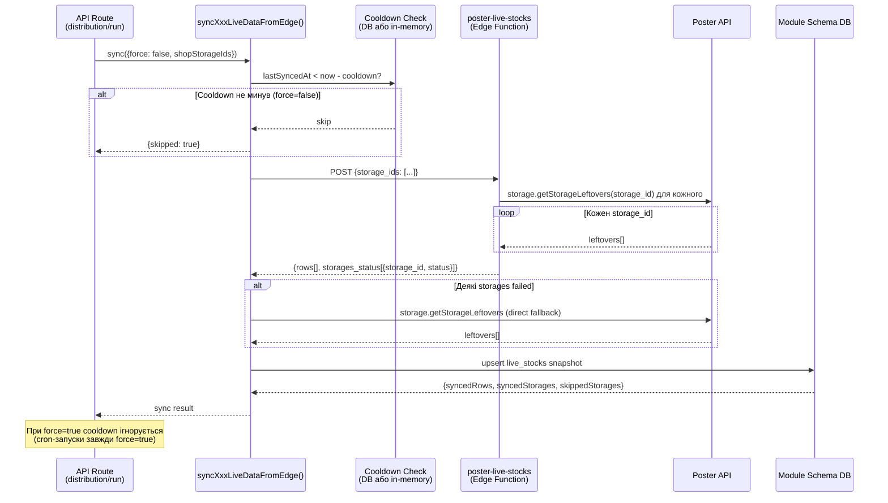
```mermaid
sequenceDiagram
    participant API as API Route<br/>(distribution/run)
    participant SYNC as syncXxxLiveDataFromEdge()
    participant COOLDOWN as Cooldown Check<br/>(DB або in-memory)
    participant EDGE as poster-live-stocks<br/>(Edge Function)
    participant POSTER as Poster API
    participant DB as Module Schema DB

    API->>SYNC: sync({force: false, shopStorageIds})

    SYNC->>COOLDOWN: lastSyncedAt < now - cooldown?

    alt Cooldown не минув (force=false)
        COOLDOWN-->>SYNC: skip
        SYNC-->>API: {skipped: true}
    end

    SYNC->>EDGE: POST {storage_ids: [...]}
    EDGE->>POSTER: storage.getStorageLeftovers(storage_id) для кожного

    loop Кожен storage_id
        POSTER-->>EDGE: leftovers[]
    end

    EDGE-->>SYNC: {rows[], storages_status[{storage_id, status}]}

    alt Деякі storages failed
        SYNC->>POSTER: storage.getStorageLeftovers (direct fallback)
        POSTER-->>SYNC: leftovers[]
    end

    SYNC->>DB: upsert live_stocks snapshot
    DB-->>SYNC: {syncedRows, syncedStorages, skippedStorages}
    SYNC-->>API: sync result

    Note over API: При force=true cooldown ігнорується<br/>(cron-запуски завжди force=true)
```

---

## 8. Scheduled Cron Jobs

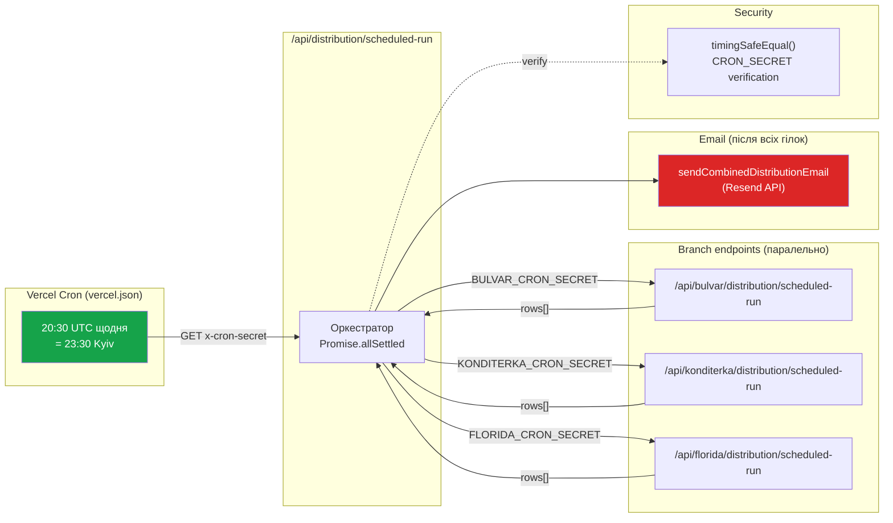
```mermaid
graph LR
    subgraph Vercel["Vercel Cron (vercel.json)"]
        CRON1["20:30 UTC щодня<br/>= 23:30 Kyiv"]
    end

    subgraph CombinedRun["/api/distribution/scheduled-run"]
        ORCH["Оркестратор<br/>Promise.allSettled"]
    end

    subgraph Branches["Branch endpoints (паралельно)"]
        BULVAR_SCHED["/api/bulvar/distribution/scheduled-run"]
        KONDITERKA_SCHED["/api/konditerka/distribution/scheduled-run"]
        FLORIDA_SCHED["/api/florida/distribution/scheduled-run"]
    end

    subgraph EmailResult["Email (після всіх гілок)"]
        COMBINED_EMAIL["sendCombinedDistributionEmail<br/>(Resend API)"]
    end

    CRON1 -->|"GET x-cron-secret"| ORCH

    ORCH -->|"BULVAR_CRON_SECRET"| BULVAR_SCHED
    ORCH -->|"KONDITERKA_CRON_SECRET"| KONDITERKA_SCHED
    ORCH -->|"FLORIDA_CRON_SECRET"| FLORIDA_SCHED

    BULVAR_SCHED -->|"rows[]"| ORCH
    KONDITERKA_SCHED -->|"rows[]"| ORCH
    FLORIDA_SCHED -->|"rows[]"| ORCH

    ORCH --> COMBINED_EMAIL

    subgraph Auth["Security"]
        SEC["timingSafeEqual()<br/>CRON_SECRET verification"]
    end

    ORCH -.->|"verify"| SEC

    style CRON1 fill:#16a34a,color:#fff
    style COMBINED_EMAIL fill:#dc2626,color:#fff
```

**Примітки:**
- Pizza та Graviton НЕ мають scheduled cron — запускаються вручну
- Sadova розподіл запускається вручну через UI
- Секрет перевіряється через `timingSafeEqual` (захист від timing attacks)
- Кожна гілка має свій окремий secret (`BULVAR_CRON_SECRET`, etc.) або спільний `CRON_SECRET`

---

## 9. Page Map — сторінки та їх API

```mermaid
graph TD
    subgraph Root["Кореневі сторінки"]
        HOME["/"]
        LOGIN["/login"]
        OPS["/ops"]
        HUB["/hub"]
        BI["/bi"]
        OWNER["/owner"]
        PRODUCTION["/production"]
        ANALYTICS["/analytics"]
        FOODCOST["/foodcost"]
        FINANCE["/finance"]
        FORECASTING["/forecasting"]
        WORKSHOPS["/workshops"]
        HR["/hr"]
        SUPPLY["/supply-chief"]
    end

    subgraph PizzaPages["Pizza Module"]
        PIZZA_PAGE["/pizza"]
        PIZZA_PROD["/pizza/production"]
        PIZZA_ANALYTICS["/pizza/analytics"]
        PIZZA_ORDER["/pizza/order-form"]
        PIZZA_PERSONNEL["/pizza/personnel"]
    end

    subgraph PizzaAPI["Pizza API"]
        P_SUMMARY["GET /api/pizza/summary"]
        P_ORDERS["GET /api/pizza/orders"]
        P_DIST_RUN["POST /api/pizza/distribution/run"]
        P_DIST_RESULTS["GET /api/pizza/distribution/results"]
        P_DIST_STATUS["GET /api/pizza/distribution/status"]
        P_DIST_STATS["GET /api/pizza/distribution-stats"]
        P_SHOP_STATS["GET /api/pizza/shop-stats"]
        P_SYNC["POST /api/pizza/sync-stocks"]
        P_PROD_DETAIL["GET /api/pizza/production-detail"]
        P_RESERVATIONS["GET+POST /api/pizza/reservations"]
        P_RESERVE_CONFIRM["POST /api/pizza/reservations/{id}/confirm"]
        P_RESERVE_VERSION["POST /api/pizza/reservations/{id}/create-version"]
        P_FINANCE["GET /api/pizza/finance"]
        P_ANALYTICS_API["GET /api/pizza/analytics"]
    end

    subgraph GravitonPages2["Graviton Module"]
        G_OVERVIEW2["/graviton"]
        G_DIST2["/graviton/distribution"]
        G_DEBT2["/graviton/debt"]
        G_STORES2["/graviton/stores"]
        G_STORE_SLUG2["/graviton/stores/{slug}"]
        G_ANALYTICS2["/graviton/analytics"]
        G_DELIVERY2["/graviton/delivery"]
    end

    subgraph BranchPages["Branch Modules"]
        KONDITERKA_P["/konditerka"]
        KONDITERKA_PROD_P["/konditerka/production"]
        BULVAR_P["/bulvar"]
        BULVAR_PROD_P["/bulvar/production"]
        FLORIDA_P["/florida"]
        FLORIDA_PROD_P["/florida/production"]
        SADOVA_P["/sadova"]
        BAKERY_P["/bakery, /bakery/*"]
    end

    PIZZA_PAGE --> P_SUMMARY
    PIZZA_PAGE --> P_DIST_RESULTS
    PIZZA_PAGE --> P_DIST_STATS
    PIZZA_PROD --> P_PROD_DETAIL
    PIZZA_PROD --> P_DIST_RUN
    PIZZA_PROD --> P_SYNC
    PIZZA_PROD --> P_RESERVATIONS
    PIZZA_PROD --> P_RESERVE_CONFIRM
    PIZZA_ANALYTICS --> P_ANALYTICS_API
    PIZZA_ORDER --> P_ORDERS

    G_OVERVIEW2 --> |"/api/graviton/deficit"| G_DEFICIT_API["deficit"]
    G_OVERVIEW2 --> |"/api/graviton/metrics"| G_METRICS_API["metrics"]
    G_OVERVIEW2 --> |"/api/graviton/production-daily"| G_PROD_DAILY_API["production-daily"]
    G_DIST2 --> |"/api/graviton/distribution/run"| G_DIST_RUN_API["distribution/run"]
    G_DIST2 --> |"/api/graviton/plan-d1,d2,d3"| G_PLANS_API["plans"]
    G_DEBT2 --> |"/api/graviton/confirm-delivery"| G_DEBT_API["confirm-delivery"]
    G_STORES2 --> |"/api/graviton/shops"| G_SHOPS_API["shops"]
    G_STORE_SLUG2 --> |"/api/graviton/critical-d2,d3"| G_CRIT_API["critical"]
    G_DELIVERY2 --> |"/api/graviton/confirm-delivery"| G_CONFIRM_API["confirm-delivery"]

    KONDITERKA_P --> |"/api/konditerka/summary"| K_API["konditerka API"]
    BULVAR_P --> |"/api/bulvar/*"| B_API["bulvar API (catch-all)"]
    FLORIDA_P --> |"/api/florida/*"| F_API["florida API (catch-all)"]
    SADOVA_P --> |"/api/sadova/metrics,shops"| S_API["sadova API"]
```

---

## 10. Component Hierarchy

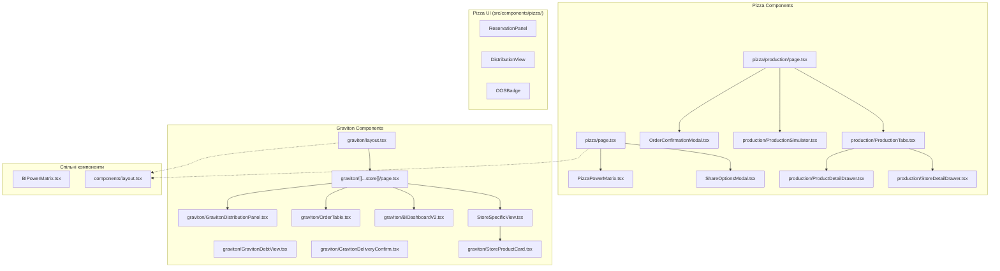
```mermaid
graph TD
    subgraph PizzaComponents["Pizza Components"]
        PizzaPage["pizza/page.tsx"]
        PizzaProduction["pizza/production/page.tsx"]
        PizzaPowerMatrix["PizzaPowerMatrix.tsx"]
        OrderConfirmModal["OrderConfirmationModal.tsx"]
        ShareOptionsModal["ShareOptionsModal.tsx"]
        ProductDetailDrawer["production/ProductDetailDrawer.tsx"]
        ProductionSimulator["production/ProductionSimulator.tsx"]
        ProductionTabs["production/ProductionTabs.tsx"]
        StoreDetailDrawer["production/StoreDetailDrawer.tsx"]

        PizzaPage --> PizzaPowerMatrix
        PizzaPage --> ShareOptionsModal
        PizzaProduction --> ProductionTabs
        PizzaProduction --> ProductionSimulator
        ProductionTabs --> ProductDetailDrawer
        ProductionTabs --> StoreDetailDrawer
        PizzaProduction --> OrderConfirmModal
    end

    subgraph GravitonComponents["Graviton Components"]
        GravitonLayout["graviton/layout.tsx"]
        GravitonOverview["graviton/[[...store]]/page.tsx"]
        GravitonDistPanel["graviton/GravitonDistributionPanel.tsx"]
        GravitonDebtView["graviton/GravitonDebtView.tsx"]
        GravitonDeliveryConfirm["graviton/GravitonDeliveryConfirm.tsx"]
        OrderTable["graviton/OrderTable.tsx"]
        StoreProductCard["graviton/StoreProductCard.tsx"]
        BIDashboardV2["graviton/BIDashboardV2.tsx"]
        StoreSpecificView["StoreSpecificView.tsx"]

        GravitonLayout --> GravitonOverview
        GravitonOverview --> GravitonDistPanel
        GravitonOverview --> BIDashboardV2
        GravitonOverview --> StoreSpecificView
        StoreSpecificView --> StoreProductCard
        GravitonOverview --> OrderTable
    end

    subgraph SharedComponents["Спільні компоненти"]
        BIPowerMatrix["BIPowerMatrix.tsx"]
        Layout["components/layout.tsx"]
    end

    subgraph PizzaUIComponents["Pizza UI (src/components/pizza/)"]
        PizzaUI["ReservationPanel"]
        PizzaUI2["DistributionView"]
        PizzaUI3["OOSBadge"]
    end

    PizzaPage -.-> Layout
    GravitonLayout -.-> Layout
```

---

## 11. Булвар catch-all pattern

Bulvar та Florida використовують єдиний catch-all route handler замість окремих файлів.

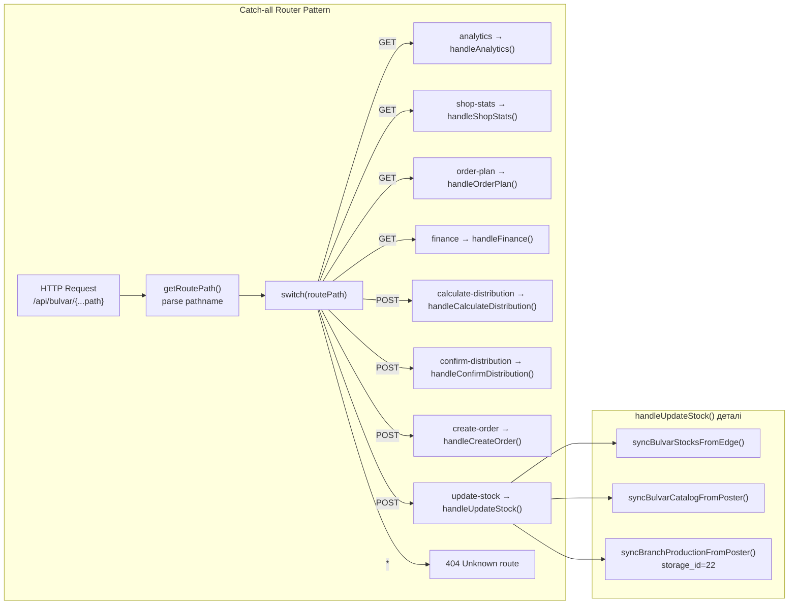
```mermaid
graph LR
    subgraph CatchAll["Catch-all Router Pattern"]
        REQUEST["HTTP Request<br/>/api/bulvar/{...path}"]
        EXTRACT["getRoutePath()<br/>parse pathname"]
        SWITCH["switch(routePath)"]

        GET_ANALYTICS["analytics → handleAnalytics()"]
        GET_SHOP_STATS["shop-stats → handleShopStats()"]
        GET_ORDER_PLAN["order-plan → handleOrderPlan()"]
        GET_FINANCE["finance → handleFinance()"]

        POST_CALC_DIST["calculate-distribution → handleCalculateDistribution()"]
        POST_CONFIRM_DIST["confirm-distribution → handleConfirmDistribution()"]
        POST_CREATE_ORDER["create-order → handleCreateOrder()"]
        POST_UPDATE_STOCK["update-stock → handleUpdateStock()"]

        NOT_FOUND["404 Unknown route"]

        REQUEST --> EXTRACT
        EXTRACT --> SWITCH

        SWITCH -->|"GET"| GET_ANALYTICS
        SWITCH -->|"GET"| GET_SHOP_STATS
        SWITCH -->|"GET"| GET_ORDER_PLAN
        SWITCH -->|"GET"| GET_FINANCE
        SWITCH -->|"POST"| POST_CALC_DIST
        SWITCH -->|"POST"| POST_CONFIRM_DIST
        SWITCH -->|"POST"| POST_CREATE_ORDER
        SWITCH -->|"POST"| POST_UPDATE_STOCK
        SWITCH -->|"*"| NOT_FOUND
    end

    subgraph UpdateStock["handleUpdateStock() деталі"]
        EDGE_SYNC["syncBulvarStocksFromEdge()"]
        CATALOG_SYNC["syncBulvarCatalogFromPoster()"]
        PROD_SYNC["syncBranchProductionFromPoster()<br/>storage_id=22"]

        POST_UPDATE_STOCK --> EDGE_SYNC
        POST_UPDATE_STOCK --> CATALOG_SYNC
        POST_UPDATE_STOCK --> PROD_SYNC
    end
```

---

## 12. Graviton Distribution Run — детальний flow

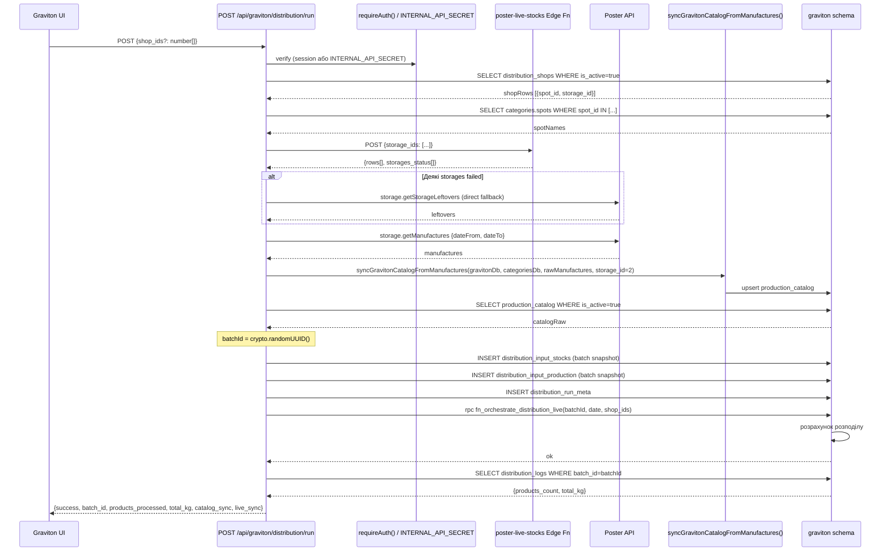
```mermaid
sequenceDiagram
    participant UI as Graviton UI
    participant API as POST /api/graviton/distribution/run
    participant AUTH as requireAuth() / INTERNAL_API_SECRET
    participant EDGE as poster-live-stocks Edge Fn
    participant POSTER as Poster API
    participant CATALOG as syncGravitonCatalogFromManufactures()
    participant DB as graviton schema

    UI->>API: POST {shop_ids?: number[]}
    API->>AUTH: verify (session або INTERNAL_API_SECRET)

    API->>DB: SELECT distribution_shops WHERE is_active=true
    DB-->>API: shopRows [{spot_id, storage_id}]

    API->>DB: SELECT categories.spots WHERE spot_id IN [...]
    DB-->>API: spotNames

    API->>EDGE: POST {storage_ids: [...]}
    EDGE-->>API: {rows[], storages_status[]}

    alt Деякі storages failed
        API->>POSTER: storage.getStorageLeftovers (direct fallback)
        POSTER-->>API: leftovers
    end

    API->>POSTER: storage.getManufactures {dateFrom, dateTo}
    POSTER-->>API: manufactures

    API->>CATALOG: syncGravitonCatalogFromManufactures(gravitonDb, categoriesDb, rawManufactures, storage_id=2)
    CATALOG->>DB: upsert production_catalog

    API->>DB: SELECT production_catalog WHERE is_active=true
    DB-->>API: catalogRaw

    Note over API: batchId = crypto.randomUUID()

    API->>DB: INSERT distribution_input_stocks (batch snapshot)
    API->>DB: INSERT distribution_input_production (batch snapshot)
    API->>DB: INSERT distribution_run_meta

    API->>DB: rpc fn_orchestrate_distribution_live(batchId, date, shop_ids)
    DB->>DB: розрахунок розподілу
    DB-->>API: ok

    API->>DB: SELECT distribution_logs WHERE batch_id=batchId
    DB-->>API: {products_count, total_kg}

    API-->>UI: {success, batch_id, products_processed, total_kg, catalog_sync, live_sync}
```

---

## 13. Konditerka Distribution — специфіка з fallback режимом

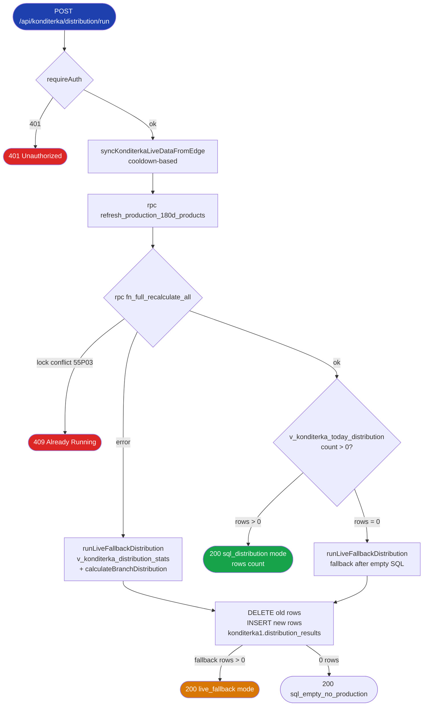
```mermaid
flowchart TD
    START([POST /api/konditerka/distribution/run]) --> AUTH{requireAuth}
    AUTH -->|401| UNAUTHORIZED([401 Unauthorized])
    AUTH -->|ok| SYNC_EDGE[syncKonditerkaLiveDataFromEdge\ncooldown-based]

    SYNC_EDGE --> REFRESH_CATALOG[rpc refresh_production_180d_products]
    REFRESH_CATALOG --> RPC{rpc fn_full_recalculate_all}

    RPC -->|lock conflict 55P03| CONFLICT([409 Already Running])

    RPC -->|error| LIVE_FALLBACK1[runLiveFallbackDistribution\nv_konditerka_distribution_stats\n+ calculateBranchDistribution]

    RPC -->|ok| CHECK_ROWS{v_konditerka_today_distribution\ncount > 0?}

    CHECK_ROWS -->|rows > 0| SUCCESS_SQL([200 sql_distribution mode\nrows count])

    CHECK_ROWS -->|rows = 0| LIVE_FALLBACK2[runLiveFallbackDistribution\nfallback after empty SQL]

    LIVE_FALLBACK1 --> INSERT_RESULTS[DELETE old rows\nINSERT new rows\nkonditerka1.distribution_results]
    LIVE_FALLBACK2 --> INSERT_RESULTS

    INSERT_RESULTS -->|fallback rows > 0| SUCCESS_FB([200 live_fallback mode])
    INSERT_RESULTS -->|0 rows| EMPTY([200 sql_empty_no_production])

    style START fill:#1e40af,color:#fff
    style SUCCESS_SQL fill:#16a34a,color:#fff
    style SUCCESS_FB fill:#d97706,color:#fff
    style CONFLICT fill:#dc2626,color:#fff
    style UNAUTHORIZED fill:#dc2626,color:#fff
```

---

## 14. Poster API — методи що використовуються

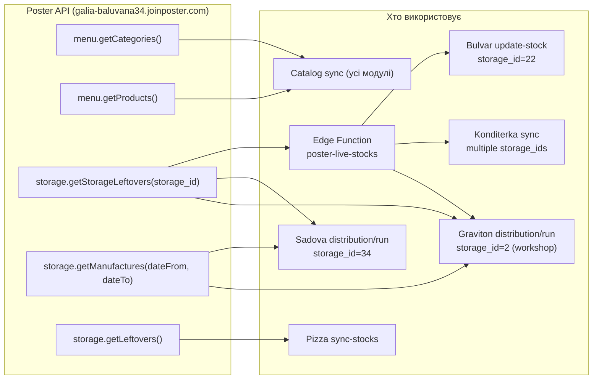
```mermaid
graph LR
    subgraph PosterAPI["Poster API (galia-baluvana34.joinposter.com)"]
        M1["menu.getCategories()"]
        M2["menu.getProducts()"]
        S1["storage.getStorageLeftovers(storage_id)"]
        S2["storage.getManufactures(dateFrom, dateTo)"]
        S3["storage.getLeftovers()"]
    end

    subgraph Users["Хто використовує"]
        GRAVITON_USE["Graviton distribution/run\nstorage_id=2 (workshop)"]
        SADOVA_USE["Sadova distribution/run\nstorage_id=34"]
        BULVAR_USE["Bulvar update-stock\nstorage_id=22"]
        KONDITERKA_USE["Konditerka sync\nmultiple storage_ids"]
        PIZZA_USE["Pizza sync-stocks"]
        CATALOG_USE["Catalog sync (усі модулі)"]
        EDGE_USE["Edge Function\nposter-live-stocks"]
    end

    S1 --> GRAVITON_USE
    S1 --> SADOVA_USE
    S1 --> EDGE_USE
    S2 --> GRAVITON_USE
    S2 --> SADOVA_USE
    S3 --> PIZZA_USE
    M1 --> CATALOG_USE
    M2 --> CATALOG_USE
    EDGE_USE --> GRAVITON_USE
    EDGE_USE --> KONDITERKA_USE
    EDGE_USE --> BULVAR_USE
```

---

## 15. Security модель

```mermaid
graph TD
    subgraph Secrets["Environment Secrets"]
        SUPABASE_SERVICE["SUPABASE_SERVICE_ROLE_KEY<br/>(bypass RLS)"]
        CRON_S["CRON_SECRET / BULVAR_CRON_SECRET\nKONDITERKA_CRON_SECRET\nFLORIDA_CRON_SECRET"]
        INTERNAL_S["INTERNAL_API_SECRET<br/>(Graviton distribution/run)"]
        POSTER_T["POSTER_TOKEN"]
        RESEND_K["RESEND_API_KEY (per module)"]
    end

    subgraph Verification["Перевірка"]
        TIMING["timingSafeEqual()\n(захист від timing attacks)"]
        SUPABASE_V["supabase.auth.getUser()"]
        RBAC["getUserRole()\nowner / restricted"]
    end

    subgraph Logging["Security Logging"]
        SEC_LOG["logSecurityEvent()\nsecurity_events table"]
        AUTH_FAIL["AUTH_FAILURE events"]
        FORBIDDEN_EV["FORBIDDEN events"]
    end

    CRON_S -->|"header: x-cron-secret"| TIMING
    INTERNAL_S -->|"Bearer або x-internal-api-secret"| TIMING
    POSTER_T -->|"URL param: token"| POSTER_T

    SUPABASE_V --> RBAC
    RBAC -->|"denied"| FORBIDDEN_EV
    SUPABASE_V -->|"failed"| AUTH_FAIL

    AUTH_FAIL --> SEC_LOG
    FORBIDDEN_EV --> SEC_LOG
```

---

## Додаток: Карта модулів → схем БД → storage_id

| Модуль | Supabase Schema | Workshop storage_id | Poster account |
|--------|----------------|---------------------|----------------|
| Pizza | `pizza1` | — (ingredient-based) | galia-baluvana34 |
| Graviton | `graviton` | `2` | galia-baluvana34 |
| Konditerka | `konditerka1` | `48` (factory) | galia-baluvana34 |
| Bulvar | `bulvar1` | `22` | galia-baluvana34 |
| Florida | `florida1` | конфіг з env | galia-baluvana34 |
| Sadova | `sadova1` | `34` (env: SADOVA_WORKSHOP_STORAGE_ID) | galia-baluvana34 |
| Спільна | `categories` | — | — |
| Публічна | `public` | — | — |

---

*Документ згенеровано: 2026-03-31. Версія системи: після security audit + reservation system (Phase 1).*
