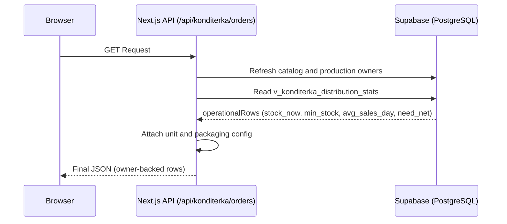

# Architecture & Data Flow

## 1. Overview
The "Operator" system acts as a real-time data aggregator and specialized calculator for production and distribution logistics.

## 2. Core Data Flow: Konditerka Orders
This is the most critical flow in the system, ensuring that production planners see the current owner model from Supabase.

## 3. Database Schema Mapping
- **`konditerka1`**: Dedicated schema for desserts and ice cream.
  - `leftovers`: Raw Poster leftover snapshot by storage and ingredient.
  - `product_leftovers_map`: Product-to-leftover identity mapping.
  - `production_180d_products`: Catalog and unit whitelist for visible cards.
  - `v_konditerka_distribution_stats`: The operational baseline view combining products, spots, historical sales, and mapped stock.
  - Poster store revenue ranking from `spots.getSpots` + `dash.getProductsSales`, used only when both sales and stock are zero.
- **`pizza1`**: Production and stock data related to the pizza line.
- **`public`**: Shared functions and orchestrator RPC cards.
  - `f_plan_konditerka_production_ndays`: Simulates production outcomes over $N$ days with specific capacity.

## 4. Business Logic Invariants
- **Stock Filtering**: Storage locations with names containing `Склад Кондитерка` or `цех` are excluded from retail stock totals to prevent factory inventory from masking retail shortages.
- **Unit Conversion**: The system automatically converts grams to kilograms (and vice-versa) based on the Konditerka unit helpers in `src/lib/konditerka-dictionary.ts`.
- **Average Sales**: Konditerka `avg_sales_day` comes from a fixed 14-day transaction window, `SUM(num) / 14.0`, with no legacy fallback when the window is empty.
- **Zero-demand Allocation**: When both sales and stock are zero, distribution uses a weighted allocation based on the 14-day Poster store revenue rank, not round-robin or alphabetical order.
- **Owner Read Model**: Konditerka read routes consume the Supabase view and mapping layer. For zero-demand fallback allocation they also consult the Poster 14-day store ranking helper. If live sync fails, the UI must not fabricate stock values on the client.

## 5. Pizza runtime clean architecture

The pizza domain now has a dedicated runtime architecture document that covers
owner APIs, Mermaid request flow diagrams, OpenAPI-style contracts, and Clean
Architecture boundaries.

See [Pizza runtime clean architecture](./pizza-runtime-clean-architecture.md).

## 6. Pizza owner-source split
The pizza domain now uses a documented owner-source split:

- operational pizza routes: Supabase owner data
- pizza sales analytics: Poster owner data
- runtime architecture, Mermaid flows, and OpenAPI contracts: [Pizza runtime clean architecture](./pizza-runtime-clean-architecture.md)
- pizza OOS invariant: zero stock only, not below-minimum stock
- pizza presentation invariant: Ukrainian-only user-facing strings
- `/pizza` initial load invariant: render the shell first, then fill KPI and
  matrix data from `/api/pizza/orders`

## 7. Konditerka runtime docs
Konditerka now has a dedicated documentation set for the current owner flow:

- Mermaid runtime map: [Konditerka Runtime Architecture - Mermaid](./konditerka-architecture-mermaid.md)
- Clean Architecture: [Konditerka Clean Architecture](./konditerka-clean-architecture.md)
- OpenAPI / Swagger contract: [Konditerka Operational API](./konditerka-openapi.yaml)

Current Konditerka owner rules:

- raw leftovers live in `konditerka1.leftovers`
- catalog visibility is controlled by `konditerka1.production_180d_products`
- product-to-leftover identity is normalized by `konditerka1.product_leftovers_map`
- `v_konditerka_distribution_stats` is the visible operational read model
- Konditerka distribution allocates the full production pool to stores only;
  the owner layer does not emit a warehouse residual row
- the product matrix hides cards with zero total stock
- a card reappears automatically when the mapped stock becomes positive
- weight items are rendered to two decimal places, piece items as integers

## 8. Bulvar runtime docs

Bulvar has a dedicated docs bundle for the current owner flow, the standardized UI shell, and the open API contract:

- Mermaid runtime map: [Bulvar Runtime Architecture - Mermaid](./bulvar-architecture-mermaid.md)
- Clean Architecture: [Bulvar Clean Architecture](./bulvar-clean-architecture.md)
- OpenAPI / Swagger contract: [Bulvar Operational API](./bulvar-openapi.yaml)
- Change Log: [Bulvar Change Log](./bulvar-change-log.md)

Current Bulvar owner rules:

- `bulvar1.v_bulvar_distribution_stats_x3` is the canonical operational read model
- `bulvar1.production_180d_products` is the catalog whitelist for visible products
- `bulvar1.effective_stocks` is the normalized live stock snapshot produced by the edge sync
- `BulvarProductionTabs`, `BulvarAnalyticsDashboard`, `BulvarPowerMatrix`, and the Bulvar order table now follow the same light card layout used by Florida and Konditerka
- `POST /api/bulvar/update-stock` refreshes the Bulvar catalog, normalized live stock snapshot, and production snapshot
- the API must not recompute `min_stock` or `need_net` in the UI layer
- live stock matching prefers `ingredient_id` and only falls back to normalized names when the identifier is missing or inconsistent
- `кг` values remain decimal-friendly while `шт` values stay integer-formatted

## 9. Bakery runtime docs

The bakery surface now has a dedicated documentation set for craft bread
sales, closing OOS, and XLSX export:

- Mermaid / Clean Architecture: [Bakery runtime clean architecture](./bakery-runtime-clean-architecture.md)
- Swagger / OpenAPI: [Bakery OpenAPI](./bakery-openapi.yaml)

Current bakery owner rules:

- `/bakery/sales` reads fresh sales only, with `discount = 0`
- a single selected business day enables the end-of-day OOS overlay
- the closing OOS sheet in Excel uses the next morning snapshot from
  `bakery1.balance_snapshots`
- technical storages such as `storage_id = 56` (`Замовник1`) are not retail
  spots and must not appear in the store pivot
- Excel export must reuse the same sales loader as the UI, otherwise the
  workbook and the screen can drift
