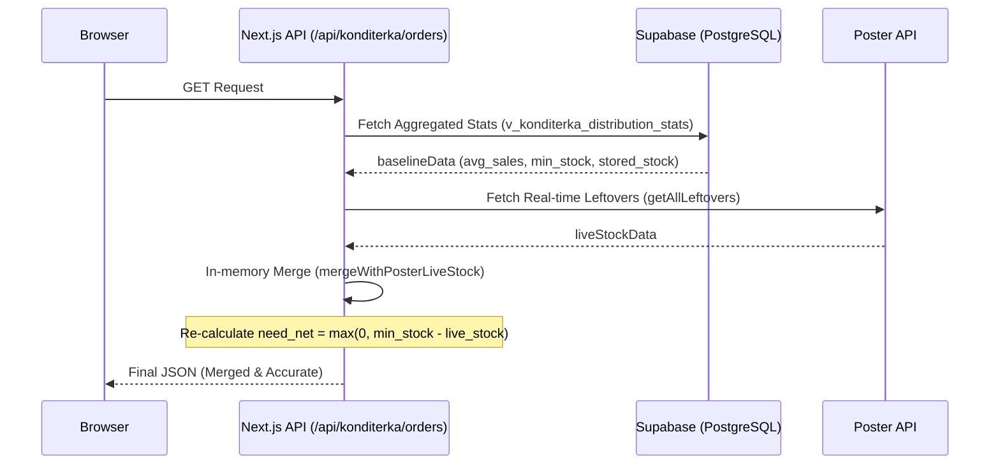

# Architecture & Data Flow

## 1. Overview
The "Operator" system acts as a real-time data aggregator and specialized calculator for production and distribution logistics.

## 2. Core Data Flow: Konditerka Orders
This is the most critical flow in the system, ensuring that production planners see live stock levels.

## 3. Database Schema Mapping
- **`konditerka1`**: Dedicated schema for desserts and ice cream.
  - `v_konditerka_distribution_stats`: The primary baseline view combining products, spots, and historical sales.
- **`pizza1`**: Production and stock data related to the pizza line.
- **`public`**: Shared functions and orchestrator RPC cards.
  - `f_plan_konditerka_production_ndays`: Simulates production outcomes over $N$ days with specific capacity.

## 4. Business Logic Invariants
- **Stock Filtering**: Storage locations with names containing "Склад Кондитерка" or "цех" are excluded from retail stock totals to prevent factory inventory from masking retail shortages.
- **Unit Conversion**: The system automatically converts grams to kilograms (and vice-versa) based on the `KONDITERKA_UNITS_MAP` in `src/lib/konditerka-dictionary.ts`.
- **Merge Fallback**: If the Poster API is unreachable or the token is missing, the system falls back to the `stock_now` value stored in the database view, providing a degraded but functional experience.
