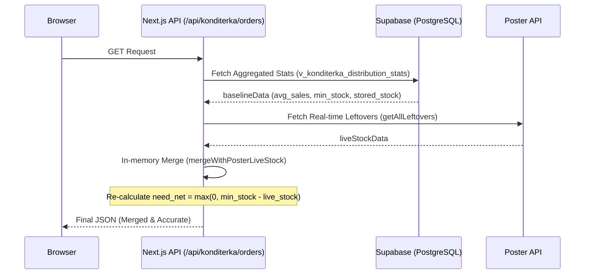

# Architecture & Data Flow

## 1. Overview
The "Operator" system acts as a real-time data aggregator and specialized calculator for production and distribution logistics.

## 2. Core Data Flow: Konditerka Orders
This is the most critical flow in the system, ensuring that production planners see live stock levels.

## 3. Database Schema Mapping
- **`konditerka1`**: Dedicated schema for desserts and ice cream.
  - `v_konditerka_distribution_stats`: The primary baseline view combining products, spots, and historical sales.
- **`pizza1`**: Production and stock data related to the pizza line.
- **`public`**: Shared functions and orchestrator RPC cards.
  - `f_plan_konditerka_production_ndays`: Simulates production outcomes over $N$ days with specific capacity.

## 4. Business Logic Invariants
- **Stock Filtering**: Storage locations with names containing "Склад Кондитерка" or "цех" are excluded from retail stock totals to prevent factory inventory from masking retail shortages.
- **Unit Conversion**: The system automatically converts grams to kilograms (and vice-versa) based on the `KONDITERKA_UNITS_MAP` in `src/lib/konditerka-dictionary.ts`.
- **Merge Fallback**: If the Poster API is unreachable or the token is missing, the system falls back to the `stock_now` value stored in the database view, providing a degraded but functional experience.

## 5. Poster2 Integration Foundation
The second Poster account integration is documented as a separate ingest contour in:
- [Poster2 Ingest Overview](/D:/Programs/Начальник%20виробництва1111/docs/poster2-ingest/README.md)
- [Poster2 Clean Architecture](/D:/Programs/Начальник%20виробництва1111/docs/poster2-ingest/clean-architecture.md)
- [Poster2 Operations](/D:/Programs/Начальник%20виробництва1111/docs/poster2-ingest/operations.md)
- [Poster2 OpenAPI Contract](/D:/Programs/Начальник%20виробництва1111/docs/poster2-ingest/openapi.yaml)

## 6. Konditerka runtime docs
Konditerka has a dedicated documentation set for the current owner flow:

- Mermaid runtime map: [Konditerka Runtime Architecture - Mermaid](./konditerka-architecture-mermaid.md)
- Clean Architecture: [Konditerka Clean Architecture](./konditerka-clean-architecture.md)
- OpenAPI / Swagger contract: [Konditerka Operational API](./konditerka-openapi.yaml)

Current Konditerka owner rules:

- raw leftovers live in `konditerka1.leftovers`
- catalog visibility is controlled by `konditerka1.production_180d_products`
- product-to-leftover identity is normalized by `konditerka1.product_leftovers_map`
- `v_konditerka_distribution_stats` is the visible operational read model
- Konditerka distribution allocates the full production pool to stores only; the owner layer does not emit a warehouse residual row
- the product matrix hides cards with zero total stock
- a card reappears automatically when the mapped stock becomes positive
- weight items are rendered to two decimal places, piece items as integers
- the top `Факт залишок` KPI shows the combined total with a separate `Морозиво` subtotal

## 7. Bulvar runtime docs

Bulvar now has the same documentation split for its owner-layer flow:

- Mermaid runtime map: [Bulvar Runtime Architecture - Mermaid](./bulvar-architecture-mermaid.md)
- Clean Architecture: [Bulvar Clean Architecture](./bulvar-clean-architecture.md)
- OpenAPI / Swagger contract: [Bulvar Operational API](./bulvar-openapi.yaml)

Current Bulvar owner rules:

- `v_bulvar_distribution_stats_x3` is the canonical operational read model
- `distribution_results` is the persisted output of the daily run
- `POST /api/bulvar/update-stock` refreshes the upstream snapshot
- `POST /api/bulvar/distribution/run` only orchestrates sync + owner RPC
- the product grid hides zero-stock cards
- `orders`, `summary`, and `production-detail` are read-only surfaces

## 8. Bakery runtime docs

Bakery has a separate sales contour that follows the same owner-layer pattern:

- Mermaid runtime map: [Bakery Runtime Clean Architecture](./bakery-runtime-clean-architecture.md)
- OpenAPI / Swagger contract: [Bakery Operational API](./bakery-openapi.yaml)

Current Bakery owner rules:

- the sales pivot is store x bread
- fresh sales are filtered with `discount = 0`
- the pivot uses `categories.sold_products_detailed` as the sales fact table
- `categories.transactions` provides the store mapping
- `categories.products` provides the craft-bread catalog
- `categories.spots` provides the store names
- OOS is shown only for one exact day
- the close-of-day view comes from the next morning snapshot in `bakery1.balance_snapshots`
- if the morning snapshot is missing, the loader falls back to `bakery1.daily_oos`
- Excel export must use the same loader as the UI so the workbook matches the screen
