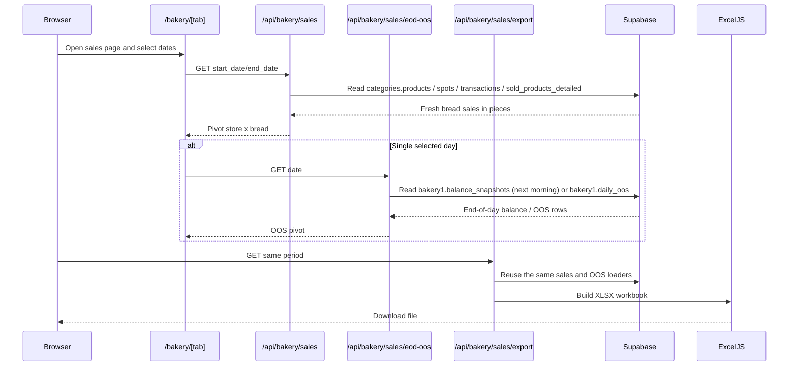

# Bakery Runtime Clean Architecture

This document records the bakery sales contour that was added back into the project.
The goal is to keep sales pivoting, OOS detection, and Excel export in the owner layer
and avoid duplicating the business rules in the UI.

## Runtime flow

## Clean Architecture

### Presentation

- `/bakery/[tab]` with the `sales` tab inside the shared analytics shell
- `src/components/analytics/CraftBreadSales.tsx`

Presentation responsibilities:

- render the pivot table only
- let the user pick a date range
- show OOS only when one concrete day is selected
- trigger export without recalculating the business rules in the browser

### Application

- `src/app/api/bakery/sales/route.ts`
- `src/app/api/bakery/sales/eod-oos/route.ts`
- `src/app/api/bakery/sales/export/route.ts`
- `src/app/api/bakery/oos-balance/route.ts`

Application responsibilities:

- validate query parameters
- enforce auth
- call the shared loader functions
- return pivot-shaped JSON or XLSX

### Domain / owner layer

- `src/lib/bakery-sales-pivot.ts`
- `src/lib/bakery-oos.ts`

Owner rules:

- fresh sales are filtered with `discount = 0`
- the pivot rows are stores, the pivot columns are breads
- the canonical source for sales is `categories.sold_products_detailed`
- `categories.transactions` provides the store mapping for each transaction
- `categories.products` provides the craft-bread catalog
- `categories.spots` provides the store names
- the single-day OOS view uses the next morning snapshot as the close-of-day proxy
- if the next-morning snapshot is missing, the loader falls back to `bakery1.daily_oos`
- Excel export must use the same pivot loader as the UI

### Infrastructure

- Supabase Postgres
- Poster sync jobs that populate `categories.*`
- `bakery1.balance_snapshots`
- `bakery1.daily_oos`

Infrastructure responsibilities:

- keep the upstream sales and stock facts current
- do not encode presentation rules

## Invariants

- The sales pivot is always store x bread.
- No revenue or чек counts are shown in the pivot.
- OOS is shown only when the user selects one exact day.
- The XLSX export must match the on-screen pivot for the same period.

