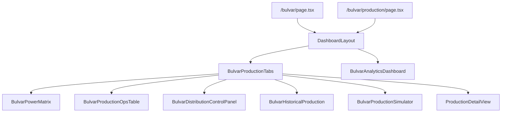
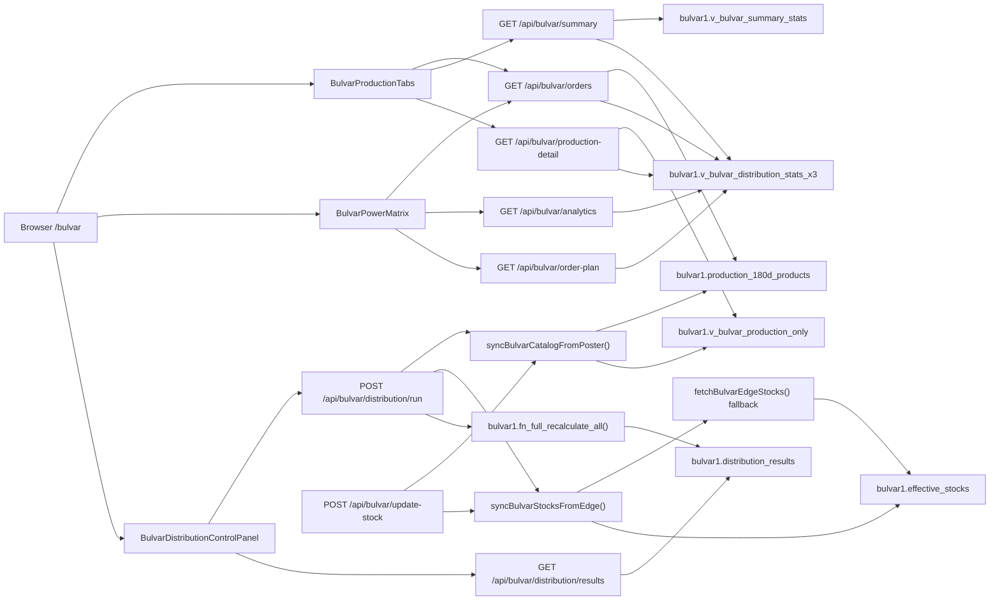
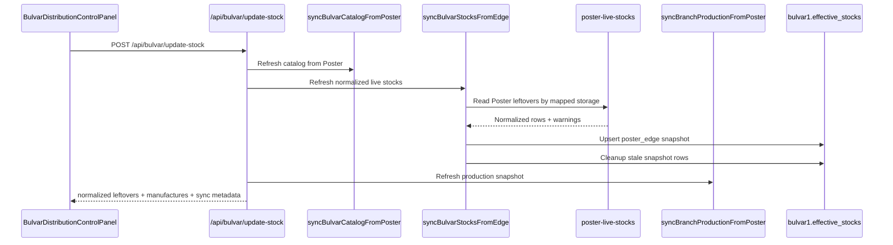

# Bulvar Runtime Architecture - Mermaid

> Source of truth for the Bulvar operational flow after moving distribution math into Supabase owner views and normalizing the live edge stock snapshot.
> Date: 2026-04-05.

This document covers the current Bulvar owner flow:

- the `/bulvar` page renders inside the shared `DashboardLayout`
- the `/bulvar/production` analytics surface uses the same light-panel shell as Florida and Konditerka
- `BulvarProductionTabs` owns the top shell, metrics cards, and tab state
- `BulvarAnalyticsDashboard` owns the production analytics card shell
- `BulvarPowerMatrix` owns the main matrix/cards view
- `BulvarProductionOpsTable` owns the planning and export control panel
- `BulvarDistributionControlPanel` owns the distribution run actions
- product visibility comes from `bulvar1.production_180d_products`
- the normalized operational stock snapshot comes from `bulvar1.effective_stocks`
- the operational read model comes from `bulvar1.v_bulvar_distribution_stats_x3`
- production facts come from `bulvar1.v_bulvar_production_only`
- summary KPIs come from `bulvar1.v_bulvar_summary_stats`
- `GET /api/bulvar/production-180d` refreshes and exposes the 180-day catalog
- `GET /api/bulvar/trends` reads `bulvar1.v_bulvar_trends_14d`
- `GET /api/bulvar/finance` reads the finance dashboard views
- `GET/POST /api/bulvar/distribution/scheduled-run` orchestrates the email flow
- the distribution runner only orchestrates sync + RPC and persists rows into `bulvar1.distribution_results`
- UI routes must not merge raw Poster leftovers or recompute `min_stock` in the child layer

## Unit and visibility rules

- `кг` items are rendered to two decimals in the UI.
- `шт` items are rendered as integers.
- Product cards are hidden when total stock is zero.
- A product becomes visible again as soon as any store gets a positive stock value.
- Bulvar distribution rows are read from the owner view; the API must not recalculate `min_stock` or `need_net`.
- The distribution runner must not emit a custom fallback distribution path.
- `POST /api/bulvar/update-stock` is the only place that refreshes the operational snapshot from Poster.
- `POST /api/bulvar/distribution/run` only orchestrates input sync and owner-layer recalculation.
- The light-card presentation shell is shared with Florida/Konditerka to keep the operator UX consistent across workshops.
- Live stock matching prefers `ingredient_id` and only falls back to a normalized ingredient name when the identifier is missing.

## Operational owner chain

`Poster API -> update-stock sync -> bulvar1.effective_stocks + bulvar1.production_180d_products -> Supabase views / RPC -> ERP UI`

The ERP UI must only render owner-backed data. It may not merge raw Poster leftovers into the operational matrix.

