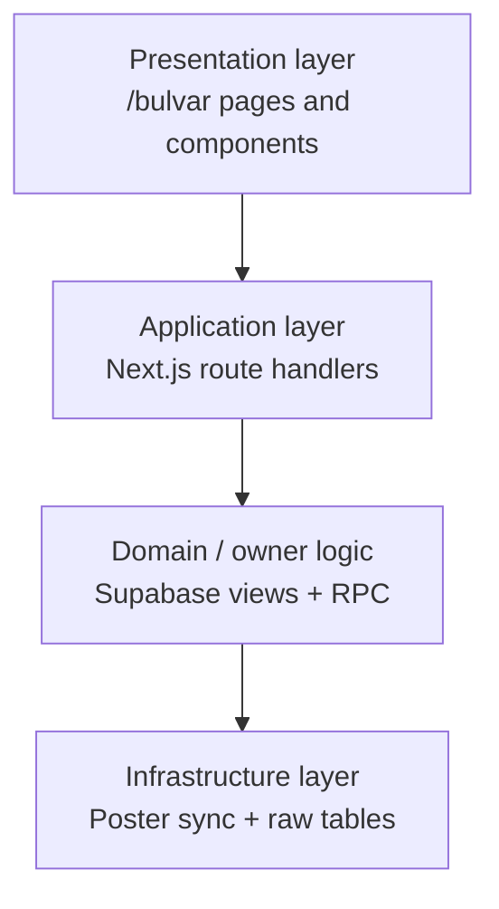

# Bulvar Clean Architecture

Bulvar is an operational domain. The goal is to keep distribution math, stock rules, and business-date alignment in the owner layer and avoid compensating for broken data in the UI.

## Layers

## Presentation Layer

Presentation includes:

- `/bulvar`
- `/bulvar/production`
- `BulvarProductionTabs.tsx`
- `BulvarPowerMatrix.tsx`
- `BulvarDistributionControlPanel.tsx`
- `BulvarProductionOrderTable.tsx`
- `BulvarOrderFormTable.tsx`
- `BulvarProductionDetailModal.tsx`
- `BulvarDistributionModal.tsx`

Presentation responsibilities:

- render only owner-backed read models
- show `кг` values with two decimals where the UI asks for weights
- show `шт` values as integers
- hide product cards when total stock is zero
- keep alphabetical sorting as a presentation concern only
- do not merge Poster leftovers into the matrix
- do not recompute `min_stock` or `need_net` in the UI

## Application Layer

Application includes the route handlers under `src/app/api/bulvar/*`.

Application use cases:

- `LoadBulvarOrders`
- `LoadBulvarSummary`
- `LoadBulvarProductionDetail`
- `RefreshBulvarStockSnapshot`
- `RunBulvarDistribution`
- `ReadBulvarDistributionResults`
- `LoadBulvarAnalytics`
- `LoadBulvarOrderPlan`

Application responsibilities:

- call the owner views and RPC functions
- normalize payloads for the UI contract
- keep the manual run path orchestration-only
- never fallback to child-layer recalculation when the owner view is available
- keep `POST /api/bulvar/distribution/run` thin and deterministic

## Domain / Owner Layer

Owner sources:

- `bulvar1.production_180d_products`
- `bulvar1.v_bulvar_production_only`
- `bulvar1.v_bulvar_distribution_stats_x3`
- `bulvar1.v_bulvar_summary_stats`
- `bulvar1.distribution_results`
- `bulvar1.fn_full_recalculate_all()`
- `bulvar1.fn_run_distribution_v3(...)`

Core domain rules:

- the product catalog is the whitelist for visible cards
- `v_bulvar_distribution_stats_x3` is the canonical operational read model
- `avg_sales_day`, `min_stock`, and `need_net` come from the owner view, not the UI
- `distribution_results` is the persisted output of the daily run
- the runner may sync inputs before the RPC, but the allocation math must remain in Supabase
- the manual distribution path must not emit a custom fallback algorithm
- `production-detail` is a read-only view of the production and demand state
- `summary` is a read-only KPI aggregation

## Infrastructure Layer

Infrastructure responsibilities:

- pull production snapshots from Poster
- refresh `production_180d_products`
- maintain `v_bulvar_production_only`
- maintain `v_bulvar_summary_stats`
- maintain `v_bulvar_distribution_stats_x3`
- persist rows into `distribution_results`

Infrastructure does not decide visibility rules, row order, or quantity formatting.

## Owner-Source Matrix

| Surface | Owner source | Notes |
|---|---|---|
| `/api/bulvar/orders` | `v_bulvar_distribution_stats_x3` + `production_180d_products` | Main operational read for the matrix |
| `/api/bulvar/summary` | `v_bulvar_summary_stats` + `v_bulvar_distribution_stats_x3` | KPI header read |
| `/api/bulvar/production-detail` | `v_bulvar_production_only` + `v_bulvar_distribution_stats_x3` + `production_180d_products` | Production fact + demand detail |
| `/api/bulvar/production-180d` | `production_180d_products` + `refresh_production_180d_products()` | 180-day catalog read |
| `/api/bulvar/trends` | `v_bulvar_trends_14d` | 14-day trend read |
| `/api/bulvar/finance` | `v_gb_finance_overview` + `v_gb_top_products_analytics` | Finance dashboard payload |
| `/api/bulvar/update-stock` | Poster sync + production refresh | Refreshes the upstream snapshots |
| `/api/bulvar/distribution/run` | `fn_full_recalculate_all()` + `distribution_results` | Orchestrates sync then owner-layer recalculation |
| `/api/bulvar/distribution/scheduled-run` | `distribution_results` + `distribution_email_log` + `fn_full_recalculate_all()` | Cron email orchestration |
| `/api/bulvar/distribution/results` | `distribution_results` | Delivery and Excel-facing read model |
| `/api/bulvar/calculate-distribution` | Branch rows + in-memory split | Manual distribution preview |
| `/api/bulvar/confirm-distribution` | Request payload only | Manual confirmation stub |
| `/api/bulvar/create-order` | Request payload only | Manual order acceptance stub |
| `/api/bulvar/analytics` | `v_bulvar_distribution_stats_x3` | Dashboard metrics |
| `/api/bulvar/order-plan` | `v_bulvar_distribution_stats_x3` | Planning table |
| `/api/bulvar/shop-stats` | `v_bulvar_distribution_stats_x3` | Per-store drilldown |

## Invariants

- Zero-stock product cards are hidden from the product grid.
- The same product reappears automatically when any store stock becomes positive.
- No child-layer policy recomputes `min_stock` when `v_bulvar_distribution_stats_x3` is available.
- `distribution_results` is the only persisted output of the distribution run.
- Manual distribution run is orchestration only.
- `кг` UI metrics use two decimals, piece items are integers.
