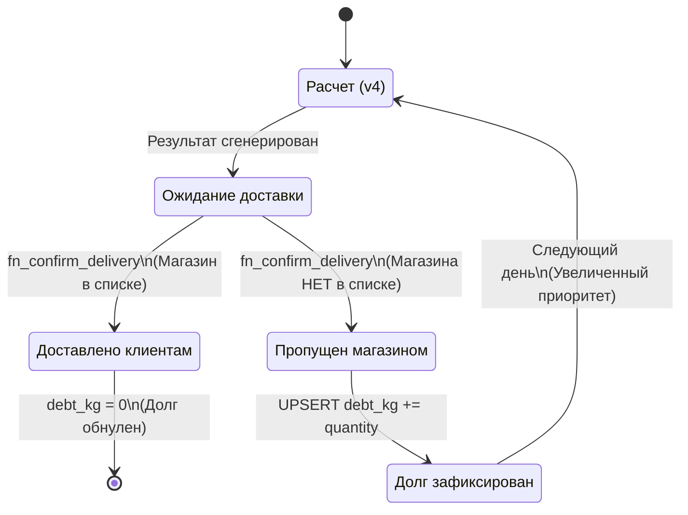
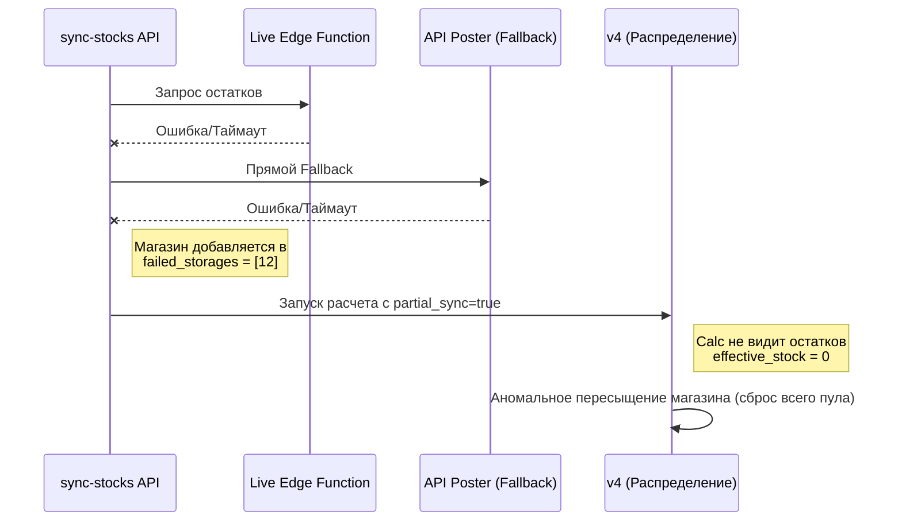
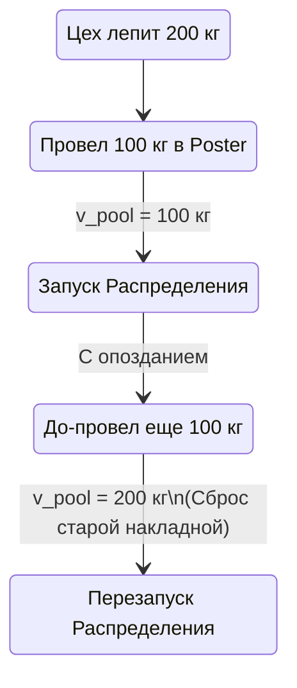
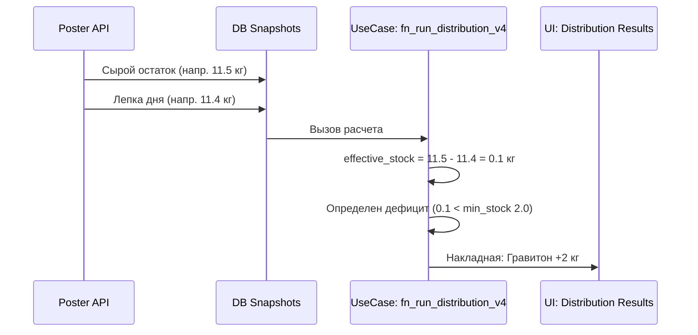

# Глубокий разбор алгоритма распределения и "долгов" (Graviton)

Данный документ описывает внутреннее устройство алгоритма логистики цеха Гравитон, детализируя 3-этапное распределение (`fn_run_distribution_v4`) и механизм управления долгами за недовоз (`fn_confirm_delivery`). Все описания приведены на русском языке согласно продуктовым требованиям.

---

## 1. Clean Architecture (Архитектура алгоритма)

Система логистики строго отвязана от UI и работает на уровне Use Cases внутри PostgreSQL, предоставляя интерфейсы (Interface Adapters) через Next.js API.

```mermaid
flowchart TD
    subgraph Infrastructure
        DB[(Supabase PostgreSQL)]
    end

    subgraph Interface Adapters
        API1[POST /api/graviton/distribution/run]
        API2[POST /api/graviton/confirm-delivery]
    end

    subgraph Use Cases
        V4[fn_run_distribution_v4]
        CD[fn_confirm_delivery]
        ORC[fn_orchestrate_distribution_live]
    end

    subgraph Entities
        DR[distribution_results]
        DD[delivery_debt]
        DBA[distribution_base]
        ST[distribution_input_stocks]
    end

    API1 --> ORC
    API2 --> CD
    
    ORC --> V4
    V4 --> DR
    V4 --> DD
    V4 --> DBA
    V4 --> ST

    CD --> DD
    CD --> DR

    Use Cases --> Infrastructure
```

- **Entities**: Хранят текущее состояние. `delivery_debt` — накопленный недовес. `distribution_results` — результаты расчетов.
- **Use Cases**: Основная бизнес-логика. Расчет математики (v4), фиксация доставки и выявление пропущенных магазинов.
- **Interface Adapters**: API роуты, которые вызывают функции базы данных, не принимая логических решений.

---

## 2. Логика распределения: `fn_run_distribution_v4`

Функция оперирует ресурсом (`pool` произведенной продукции) и распределяет его между выбранными магазинами в 3 этапа. В расчете используется накопленный логистический `debt_kg`.

### 2.1 Подготовка данных

Алгоритм собирает метрики магазина: целевой минимум (`min_stock`) и средние продажи (`avg_sales_day`), джоинит живые остатки (`effective_stock`) и долг из предыдущих дней (`debt_kg`).

### 2.2 Этапы работы алгоритма

```mermaid
flowchart TD
    Start[Начало расчета] --> Prep[Сбор метрик и остатков\n(temp_calc_g)]
    
    Prep --> Stage1[Этап 1: Раздача по 1 шт\n'нулевым' магазинам]
    
    Stage1 --> Condition1{Остался\npool?}
    Condition1 -- Нет --> Save[Сохранение результата]
    
    Condition1 -- Да --> Stage2[Этап 2: Покрытие min_stock + ДОЛГ]
    Stage2 --> NeedCalc["temp_need = GREATEST(0,\nmin_stock + debt_kg - effective_stock)"]
    
    NeedCalc --> Condition2{Хватает\npool?}
    Condition2 -- Да --> GiveFull[Раздача 100% потребности]
    Condition2 -- Нет --> GiveProp[Пропорциональная\nраздача (к-т K)]
    
    GiveFull --> Condition3{Остался\npool?}
    GiveProp --> Condition3
    
    Condition3 -- Нет --> Save
    Condition3 -- Да --> Stage3[Этап 3: Top-up насыщение]
    Stage3 --> Mult["Множитель\n(от 2x до 4x min_stock)"]
    Mult --> Save
    
    Save --> End[Конец]
```

- **Этап 1**: Спасение магазинов без остатков. Выдача по 1 единице. Сортировка по популярности товара, если товара критически мало.
- **Этап 2**: Основной балансирующий этап. В формуле `temp_need = min_stock + debt_kg - stock` переменная `debt_kg` сильно увеличивает запрос магазина, если ему вчера ничего не привезли. Такие магазины "стягивают" на себя остатки.
- **Этап 3**: Раздача излишков успешным магазинам до 4-кратного размера `min_stock`.

---

## 3. Механизм Долгов: `fn_confirm_delivery`

Логика `delivery_debt` фиксирует логистические ошибки (поломанная машина, нет места). Она позволяет системе саморегулироваться на следующий день.



1. **Если довезли**: `debt_kg` магазина по этому продукту становится `0` (полностью обнуляется), статусы переводятся в `delivered`.
2. **Если пропустили**: Запланированное, но не довезенное количество прибавляется к текущему долгу в таблице `graviton.delivery_debt`. Статус в `distribution_results` меняется на `skipped` (для истории).

**Важно (Идемпотентность):** Долг не обнуляется при пересчетах. Только команда `confirm-delivery` управляет долгом.

---

## 4. Swagger / OpenAPI (Interface Layer)

Ключевые контракты для взаимодействия системы с пользовательским интерфейсом.

```yaml
openapi: 3.0.3
info:
  title: Graviton Core Distribution API
  version: 1.0.0
paths:
  /api/graviton/distribution/run:
    post:
      summary: Запуск полного расчёта (v4)
      description: |
        Вызывает fn_orchestrate_distribution_live для расчета распределения.
        Управляется параметром shop_ids (null для полного распределения всей сети).
      requestBody:
        content:
          application/json:
            schema:
              type: object
              properties:
                shop_ids:
                  type: array
                  items:
                    type: integer
                  nullable: true
                  example: null
      responses:
        "200":
          description: Успешный расчет
          content:
            application/json:
              example:
                success: true
                batch_id: "uuid"
                products_processed: 12
        "500":
          description: Ошибка базы данных

  /api/graviton/confirm-delivery:
    post:
      summary: Подтверждение доставки и расчет долгов
      description: |
        Вызывает fn_confirm_delivery. Магазинам в массиве обнуляется долг, 
        пропущенным - накапливается.
      requestBody:
        required: true
        content:
          application/json:
            schema:
              type: object
              required: [delivered_spot_ids]
              properties:
                delivered_spot_ids:
                  type: array
                  items:
                    type: integer
                  description: "Список ID магазинов, куда физически приехала доставка"
                  example: [1, 6, 17]
      responses:
        "200":
          description: Успешное выполнение
          content:
            application/json:
              example:
                success: true
                delivered_rows: 15
                debt_rows_added: 8
```

---

## 5. Бизнес-риски и Диагностика потоков данных (Слепые зоны алгоритма)

Система Гравитон физически зависит от качества данных Infrastructure-слоя. В случае сбоя внешних систем, бизнес-логика (Use Cases) не имеет иммунитета к искаженным данным. В этом разделе задокументированы потенциальные "слепые зоны" глазами администратора и логиста.

### 5.1. Уязвимость: "Нулевые остатки" (Ошибки Edge Functions)

Алгоритм жестко интерпретирует отсутствие связи как отсутствие товара (`effective_stock = 0`).


**Лекарство:** Интеграция блокирующего механизма. Если `partial_sync = true`, распределение не должно уходить "в слепую".

### 5.2. Уязвимость: Забывчивый пекарь (Асинхронность производства)

Алгоритм раздает только то количество `quantity`, которое было проведено в кассе на момент нажатия кнопки.


**Лекарство:** Строгий регламент закрытия смены в цеху перед генерацией логистических накладных. Избегание "до-проводок" после генерации накладной.

### 5.3. Эффект "Мертвых дней" (Спираль смерти для min_stock)

Математика `min_stock` полностью опирается на `avg_sales_day` (средние дневные продажи за X дней). Если магазин закрыт (ремонт, война), его продажи искусственно падают.


**Лекарство:** MView (или cron), обновляющий таблицу `distribution_base`, должен уметь "высекать" (игнорировать) те дни, когда магазин физически не работал (выручка по чекам = 0).

### 5.4. Механизм долгов (Human Error)

Так как долги считаются от разницы "ожидалось - привезли", логист должен подтверждать доставку предельно точно. Если галочка снята ошибочно — система в следующий раз накинет виртуальный вес на "пропущенный" магазин и обескровит другие точки.

---

### Swagger (API Диагностики)

При проверке `sync-stocks` перед расчетом крайне важно обращать внимание на ключи валидации `partial_sync` и `failed_storages`, чтобы выявить слепую зону до старта расчетов:

```yaml
  /api/graviton/sync-stocks:
    get:
      summary: Получение снапшота данных до распределения
      responses:
        "200":
          description: Успешная синхронизация (включая частичную)
          content:
            application/json:
              example:
                success: true
                partial_sync: true
                failed_storages: [15, 23]
                manufactures_warning: false
```

### 5.5. Архитектурный парадокс Хаба: Изоляция витрины от цеха

Критический бизнес-клинч заключается в физическом устройстве цеха и магазина Гравитон: в системе Poster они **делят один логический склад (Storage)**. Как следствие, выпеченная продукция автоматически и мгновенно "надувает" остаток самого магазина.

#### Контекст Clean Architecture
В текущей реализации произошла расфокусировка бизнес-правил:
1. **Interface Adapters (UI / `BIDashboard.tsx`)** понимает этот парадокс и производит вычет (`stock - production`) исключительно для **визуализации**. 
2. **Use Cases (`fn_run_distribution_v4`)** принимает на вход грязные данные (остаток + пул производства в одном флаконе) и считает, что магазин Гравитон перенасыщен товаром. 

В дни **ПРОФИЦИТА** алгоритм отдает нужное количество машин, а весь излишком "оседает" как "Остаток на складе", в итоге магазин не страдает. 
Но в дни **ДЕФИЦИТА** возникает математическое ограбление витрины:

```mermaid
flowchart TD
    subgraph Poster [Физический склад: 105 кг]
        OS[Старый остаток: 5 кг]
        NP[Новое производство: 100 кг]
    end

    subgraph OtherShops [Сеть магазинов]
        Req[Потребность сети: 150 кг]
    end

    Poster --> SQL[SQL: effective_stock = 105 кг\nПотребность Гравитона = 0]
    SQL --> Excel[Накладная]
    
    Excel -- Забирает все 100 кг --> OtherShops
    Excel -- Оставляет 5 кг --> Showcase[Витрина Гравитона:\n5 кг\n(Хотя min_stock = 30 кг)]
    
    style Showcase fill:#ffcccc,stroke:#cc0000,stroke-width:2px
    style SQL fill:#fff3cd,stroke:#ffcc00,stroke-width:2px
```

**Решение (Fix Applied):**
Бизнес-правило `Факт. остаток (Poster) - Сегодняшнее производство = Чистый остаток Магазина` внедрено в SQL-ядро. 
При формировании временной таблицы `temp_calc_g` для Хаба (код 5) поле `effective_stock` теперь вычисляется с учетом вычета `v_pool`.



## 6. Clean Architecture: Infrastructure & Use Cases

Подсистема Graviton спроектирована по принципам чистой архитектуры:

1. **Entities**: Продукты, Магазины, Результаты распределения. Схемы в Supabase (`graviton.*`).
2. **Use Cases**: SQL-функции `fn_run_distribution_v4` и `fn_orchestrate_distribution_live`. Вся бизнес-логика (дележ товара, приоритеты) инкапсулирована на уровне БД для скорости и атомарности.
3. **Interface Adapters**: API-роуты Next.js (`/api/graviton/distribution/run`). Они являются триггерами и мостами между внешним миром и ядром.
4. **Frameworks & Drivers**: UI на React (BI Dashboard), Poster API для импорта данных.

### Принцип "Чистого Остатка" (Hub Isolation)
Согласно Clean Architecture, бизнес-правила не должны зависеть от особенностей внешних систем (Poster). Поскольку Poster объединяет склад цеха и склад магазина, мы "изолируем" сущность Магазина внутри Use Case, вычитая производственные данные из общего остатка.

## 7. Swagger API Specs (Internal Distribution)

Для диагностики результатов распределения используется внутренняя спецификация:

```yaml
openapi: 3.0.0
info:
  title: Graviton Distribution API
  version: 1.1.0
paths:
  /api/graviton/distribution/results:
    get:
      summary: Получение результатов последнего распределения
      parameters:
        - name: batch_id
          in: query
          schema:
            type: string
            format: uuid
      responses:
        '200':
          description: Список накладных по магазинам
          content:
            application/json:
              schema:
                type: array
                items:
                  type: object
                  properties:
                    spot_name: { type: string }
                    product_name: { type: string }
                    quantity_to_ship: { type: number, description: "С чистым учетом Хаба" }
```
