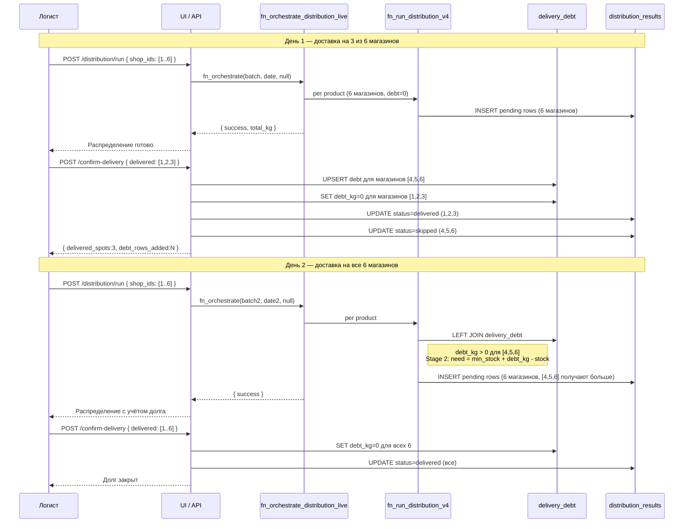
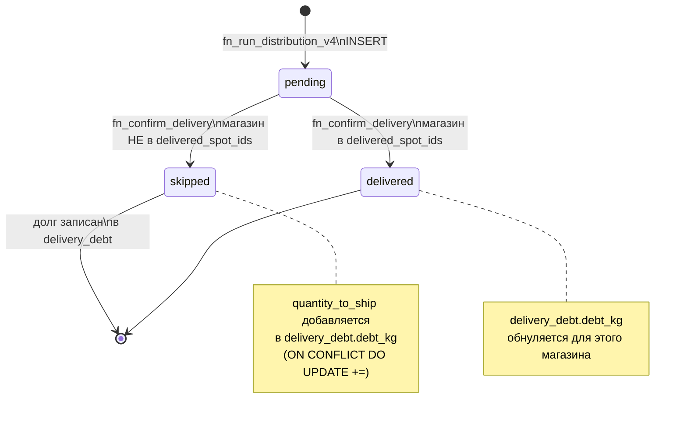
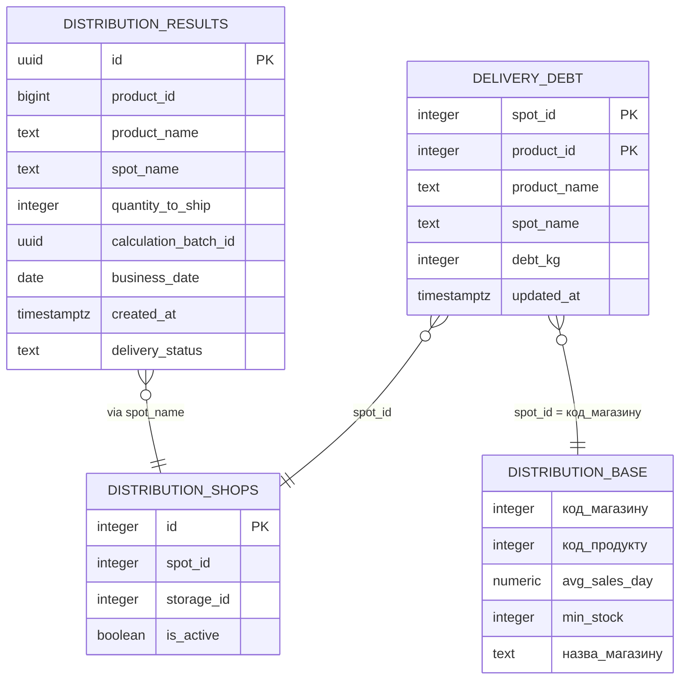
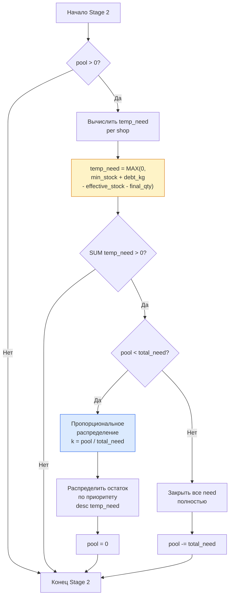

# Graviton — Delivery Debt Layer

Механизм накопления и зачёта долга доставки для цеха Гравитон.

---

## 1. Clean Architecture

```
┌─────────────────────────────────────────────────────────────────────┐
│  FRAMEWORKS & DRIVERS (Infrastructure)                              │
│                                                                     │
│  • Supabase PostgreSQL  — хранение данных                           │
│  • Poster API           — живые остатки складов                     │
│  • Next.js API Routes   — HTTP layer                                │
└───────────────────────────┬─────────────────────────────────────────┘
                            │
┌───────────────────────────▼─────────────────────────────────────────┐
│  INTERFACE ADAPTERS                                                 │
│                                                                     │
│  POST /api/graviton/confirm-delivery   — подтвердить доставку       │
│  GET  /api/graviton/confirm-delivery   — текущий долг + pending     │
│  POST /api/graviton/distribution/run   — запуск распределения       │
└───────────────────────────┬─────────────────────────────────────────┘
                            │
┌───────────────────────────▼─────────────────────────────────────────┐
│  USE CASES (Application Business Rules)                             │
│                                                                     │
│  fn_confirm_delivery(date, delivered_spot_ids)                      │
│    → накапливает долг для непроехавших магазинов                    │
│    → обнуляет долг для доставленных магазинов                       │
│    → меняет статусы: pending → delivered / skipped                  │
│                                                                     │
│  fn_run_distribution_v4(product_id, batch_id, …)                   │
│    → читает долг из delivery_debt                                   │
│    → Stage 2: need = min_stock + debt_kg - (stock + qty)            │
│    → Stage 3: top-up до 4x min_stock                                │
│                                                                     │
│  fn_orchestrate_distribution_live(batch_id, date, shop_ids)         │
│    → оркестрирует запуск по всем продуктам                          │
└───────────────────────────┬─────────────────────────────────────────┘
                            │
┌───────────────────────────▼─────────────────────────────────────────┐
│  ENTITIES (Enterprise Business Rules)                               │
│                                                                     │
│  delivery_debt          — долг доставки (spot_id, product_id, kg)   │
│  distribution_results   — результаты расчёта (pending/delivered/    │
│                           skipped)                                  │
│  distribution_base      — нормы магазинов (avg_sales, min_stock)    │
│  distribution_input_*   — снимки производства и остатков            │
└─────────────────────────────────────────────────────────────────────┘
```

**Правило зависимостей:** стрелки направлены внутрь. Entities ничего не знают о Use Cases. Use Cases ничего не знают об API Routes или Supabase-специфике.

---

## 2. Mermaid Diagrams

### 2.1 Sequence — полный цикл доставки



### 2.2 State — жизненный цикл строки distribution_results



### 2.3 ER — схема таблиц delivery debt слоя



### 2.4 Flowchart — логика Stage 2 с долгом



---

## 3. Swagger / OpenAPI

```yaml
openapi: 3.0.3
info:
  title: Graviton Delivery Debt API
  version: 1.0.0
  description: |
    Управление долгом доставки для цеха Гравитон.
    Позволяет логисту подтвердить факт доставки и просмотреть накопленный долг.

servers:
  - url: /api/graviton

tags:
  - name: delivery
    description: Подтверждение доставки и управление долгом

paths:
  /confirm-delivery:

    post:
      tags: [delivery]
      summary: Подтвердить доставку
      description: |
        Фиксирует факт физической доставки.
        - Магазины в `delivered_spot_ids` → долг обнуляется, строки → `delivered`
        - Магазины НЕ в списке → их pending суммируется в `delivery_debt`, строки → `skipped`

        Идемпотентен для одной и той же даты — повторный вызов суммирует долг,
        а не дублирует. Пересчёт распределения (`/distribution/run`) не трогает долг.
      requestBody:
        required: true
        content:
          application/json:
            schema:
              type: object
              properties:
                business_date:
                  type: string
                  format: date
                  example: "2026-03-28"
                  description: Дата распределения. По умолчанию — сегодня (Kyiv TZ).
                delivered_spot_ids:
                  type: array
                  items:
                    type: integer
                  example: [1, 2, 3]
                  description: |
                    spot_id магазинов, которые физически получили товар.
                    Пустой массив [] означает — никто не получил, всё уходит в долг.
      responses:
        "200":
          description: Доставка подтверждена
          content:
            application/json:
              schema:
                $ref: '#/components/schemas/ConfirmDeliveryResponse'
              example:
                success: true
                business_date: "2026-03-28"
                delivered_spots: 3
                delivered_rows: 15
                debt_rows_added: 8
        "500":
          $ref: '#/components/responses/ServerError'

    get:
      tags: [delivery]
      summary: Получить текущий долг и pending распределение
      description: |
        Возвращает текущее состояние долга по всем магазинам и
        pending строки распределения за указанную дату.
        Используется для UI логиста — чекбоксы магазинов с суммами.
      parameters:
        - name: date
          in: query
          required: false
          schema:
            type: string
            format: date
            example: "2026-03-28"
          description: Дата распределения. По умолчанию — сегодня (Kyiv TZ).
      responses:
        "200":
          description: Текущее состояние
          content:
            application/json:
              schema:
                $ref: '#/components/schemas/DeliveryStateResponse'
              example:
                success: true
                date: "2026-03-28"
                active_shop_ids: [1, 2, 3, 4, 5, 6]
                pending_distribution:
                  - spot_name: "Білоруська"
                    product_id: 101
                    product_name: "Батон нарізний"
                    quantity_to_ship: 15
                    delivery_status: "pending"
                accumulated_debt:
                  - spot_id: 4
                    spot_name: "Компас"
                    product_id: 101
                    product_name: "Батон нарізний"
                    debt_kg: 5
                    updated_at: "2026-03-27T18:00:00Z"
        "500":
          $ref: '#/components/responses/ServerError'

components:
  schemas:

    ConfirmDeliveryResponse:
      type: object
      properties:
        success:
          type: boolean
        business_date:
          type: string
          format: date
        delivered_spots:
          type: integer
          description: Количество магазинов в delivered_spot_ids
        delivered_rows:
          type: integer
          description: Строк distribution_results помечено как delivered
        debt_rows_added:
          type: integer
          description: Строк добавлено/обновлено в delivery_debt

    DeliveryStateResponse:
      type: object
      properties:
        success:
          type: boolean
        date:
          type: string
          format: date
        active_shop_ids:
          type: array
          items:
            type: integer
        pending_distribution:
          type: array
          items:
            $ref: '#/components/schemas/PendingRow'
        accumulated_debt:
          type: array
          items:
            $ref: '#/components/schemas/DebtRow'

    PendingRow:
      type: object
      properties:
        spot_name:
          type: string
        product_id:
          type: integer
        product_name:
          type: string
        quantity_to_ship:
          type: integer
        delivery_status:
          type: string
          enum: [pending]

    DebtRow:
      type: object
      properties:
        spot_id:
          type: integer
        spot_name:
          type: string
        product_id:
          type: integer
        product_name:
          type: string
        debt_kg:
          type: integer
        updated_at:
          type: string
          format: date-time

    ErrorResponse:
      type: object
      properties:
        success:
          type: boolean
          example: false
        error:
          type: string
          example: "fn_confirm_delivery failed: ..."

  responses:
    ServerError:
      description: Внутренняя ошибка сервера
      content:
        application/json:
          schema:
            $ref: '#/components/schemas/ErrorResponse'

  securitySchemes:
    supabaseAuth:
      type: http
      scheme: bearer
      description: Supabase JWT token

security:
  - supabaseAuth: []
```

---

## 4. Сценарии использования

### Сценарий A — штатный: частичная доставка

```
1. Утро: запустить /distribution/run (без shop_ids = все 6 магазинов)
2. Логист смотрит план доставки → едем на [1,2,3]
3. После физической доставки: POST /confirm-delivery { delivered_spot_ids: [1,2,3] }
4. Система: debt += plan[4,5,6]
```

### Сценарий B — изменение плана ДО доставки

```
1. Рассчитали на 6 магазинов
2. Пришла инфо: машина только на 5
3. Пересчитать: POST /distribution/run { shop_ids: [1,2,3,4,5] }
   → долг НЕ тронут (пересчёт не трогает delivery_debt)
4. После доставки: POST /confirm-delivery { delivered_spot_ids: [1,2,3,4,5] }
5. Долг магазина 6 продолжает накапливаться
```

### Сценарий C — следующий день, все 6 едут

```
1. POST /distribution/run → fn_run_distribution_v4 читает debt_kg для [4,5,6]
   Stage 2: need = min_stock + debt_kg - live_stock
   → магазины [4,5,6] получают приоритет
2. POST /confirm-delivery { delivered_spot_ids: [1,2,3,4,5,6] }
   → debt_kg = 0 для всех
```

---

## 5. Гарантии безопасности

| Гарантия | Механизм |
|---|---|
| Не ломает текущее распределение | `delivery_debt` пустая → `debt_kg=0` → Stage 2 идентичен оригиналу |
| Идемпотентность confirm | `ON CONFLICT (spot_id, product_id) DO UPDATE` += |
| Пересчёт не трогает долг | `fn_run_distribution_v4` только читает `delivery_debt`, не пишет |
| Отрицательный долг невозможен | `CHECK (debt_kg >= 0)` в схеме таблицы |
| Rollback | Описан в конце migration файла — 3 шага |
