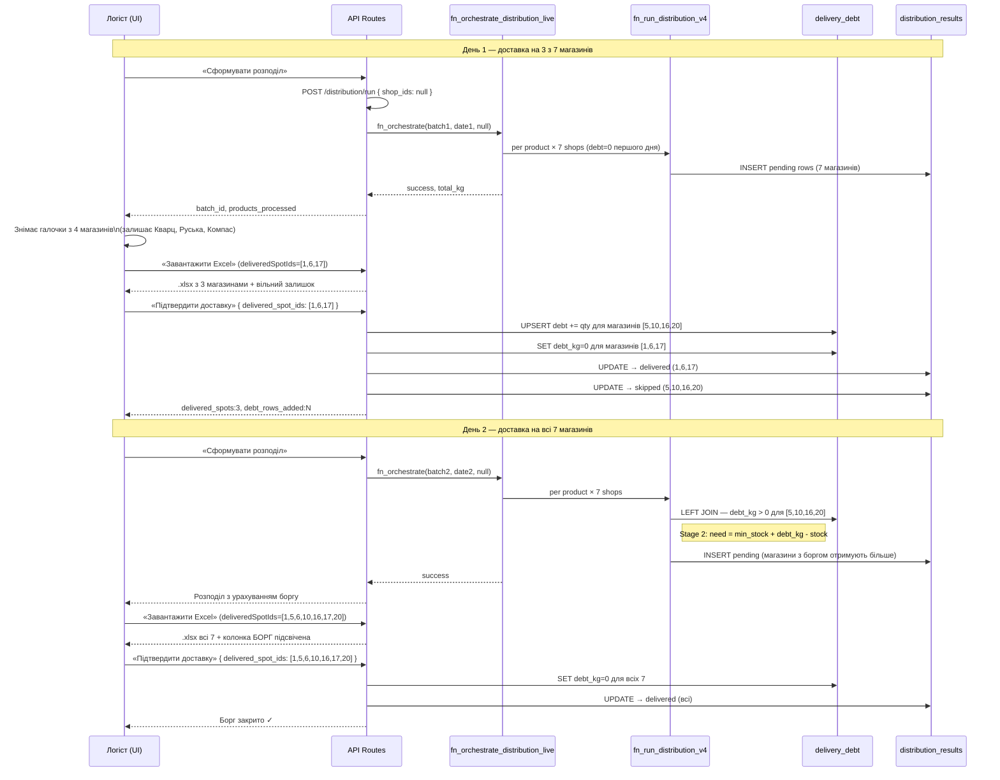
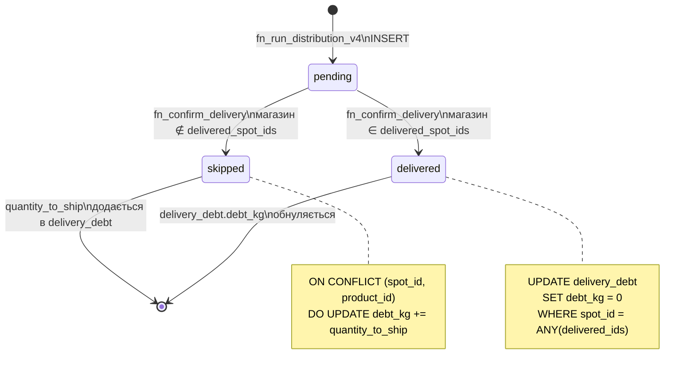
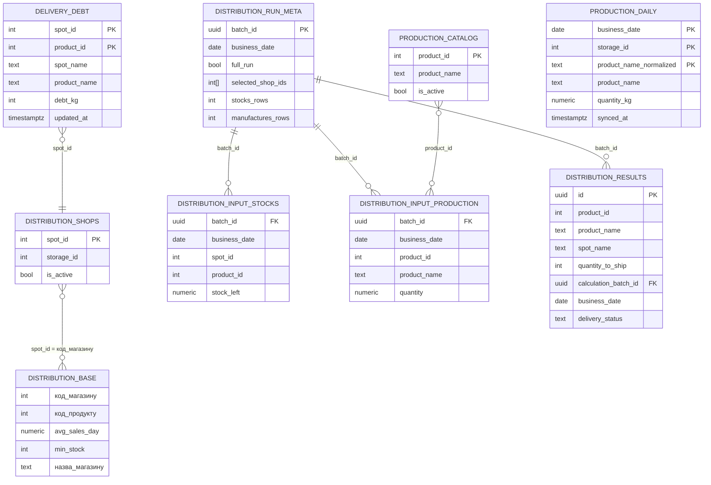
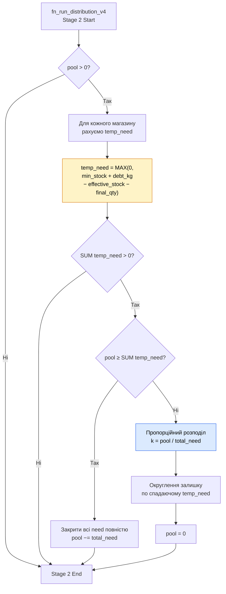

# Graviton — Distribution Full Architecture

Повний опис системи розподілу продукції цеху Гравітон:
10-крокова логіка, Clean Architecture шари, Mermaid діаграми, OpenAPI контракти.

> Суміжні документи:
> - [`graviton-delivery-debt-architecture.md`](./graviton-delivery-debt-architecture.md) — детальний опис боргового шару та fn_confirm_delivery
> - [`graviton-live-production-architecture.md`](./graviton-live-production-architecture.md) — sync-stocks та виробничий кеш

---

## 1. Бізнес-сценарій (10 кроків)

```
Крок 1   Розподіл запускається ЗАВЖДИ по всіх 7 магазинах (null shop_ids)
         → fn_orchestrate_distribution_live → fn_run_distribution_v4
         → graviton.distribution_results (status=pending)

Крок 2   Логіст вибирає магазини, які ФІЗИЧНО отримують товар сьогодні
         (наприклад: Кварц, Руська, Компас — 3 з 7)

Крок 3   Логіст натискає «Підтвердити доставку»
         POST /api/graviton/confirm-delivery { delivered_spot_ids: [1, 6, 17] }

Крок 4   Excel формується тільки для вибраних 3 магазинів + "Вільні залишки"
         Дані кількостей — з distribution_results (крок 1)
         Борг — з delivery_debt (якщо є з попередніх днів)

Крок 5   По 4 пропущених магазинах формується борг
         fn_confirm_delivery → INSERT/UPSERT delivery_debt (+=quantity_to_ship)
         distribution_results: pending → skipped для пропущених
         distribution_results: pending → delivered для доставлених

Крок 6   Борг фіксується в Supabase:
         graviton.delivery_debt (spot_id, product_id, debt_kg)
         Колонка "Борг" в Excel = debt_kg для цього spot+product

Крок 7   Наступного дня: логіст запускає новий розподіл по всіх 7 магазинах
         fn_run_distribution_v4 JOIN delivery_debt:
           Stage 2: need = min_stock + debt_kg - (stock + already_allocated)
         → магазини з боргом отримують пріоритет

Крок 8   Логіст підтверджує доставку для всіх 7 магазинів

Крок 9   Excel показує кількість розподілу + колонку БОРГ (з бека delivery_debt)
         Борг підсвічується amber кольором в Excel

Крок 10  fn_confirm_delivery SET debt_kg = 0 для всіх 7 delivered_spot_ids
         Борг очищено — починаємо чистий цикл
```

---

## 2. Clean Architecture

```
┌─────────────────────────────────────────────────────────────────────────┐
│  FRAMEWORKS & DRIVERS (Infrastructure)                                  │
│                                                                         │
│  • Supabase PostgreSQL (schema: graviton, categories)                   │
│  • Poster POS API — live stocks (storage.getStorageLeftovers)           │
│                     live production (storage.getManufactures)           │
│  • Supabase Edge Function — poster-live-stocks (batch fetch)            │
│  • Next.js 16 App Router — API Routes + React Client Components         │
│  • ExcelJS — генерація .xlsx файлів                                     │
└───────────────────────────┬─────────────────────────────────────────────┘
                            │
┌───────────────────────────▼─────────────────────────────────────────────┐
│  INTERFACE ADAPTERS (API Routes)                                        │
│                                                                         │
│  POST /api/graviton/distribution/run                                    │
│    → приймає shop_ids (null = всі), запускає повний цикл                │
│                                                                         │
│  POST /api/graviton/confirm-delivery                                    │
│    → фіксує факт доставки, записує борг                                 │
│                                                                         │
│  GET  /api/graviton/confirm-delivery?date=                              │
│    → поточний борг + pending рядки для UI                               │
│                                                                         │
│  GET  /api/graviton/shops                                               │
│    → активні магазини з distribution_shops + categories.spots           │
│                                                                         │
│  POST /api/graviton/sync-stocks                                         │
│    → синхронізує залишки та виробництво з Poster                        │
│    → зберігає в production_daily (кеш)                                  │
│                                                                         │
│  GET  /api/graviton/production-daily?date=                              │
│    → кеш виробництва з БД (миттєве завантаження)                        │
└───────────────────────────┬─────────────────────────────────────────────┘
                            │
┌───────────────────────────▼─────────────────────────────────────────────┐
│  USE CASES (Application Business Rules — PostgreSQL Functions)          │
│                                                                         │
│  fn_orchestrate_distribution_live(batch_id, date, shop_ids)             │
│    → обходить всі продукти каталогу                                     │
│    → для кожного викликає fn_run_distribution_v4                        │
│                                                                         │
│  fn_run_distribution_v4(product_id, batch_id, …)                       │
│    Stage 1: закрити критичний дефіцит (stock < min_stock)               │
│    Stage 2: пріоритетний поповнення з урахуванням боргу                 │
│             need = min_stock + debt_kg - (effective_stock + qty)        │
│    Stage 3: top-up до 4x min_stock (рівномірно)                        │
│                                                                         │
│  fn_confirm_delivery(date, delivered_spot_ids[])                        │
│    A: UPSERT delivery_debt += quantity_to_ship (для пропущених)         │
│    B: SET debt_kg = 0 (для доставлених)                                 │
│    C: UPDATE distribution_results → delivered / skipped                 │
└───────────────────────────┬─────────────────────────────────────────────┘
                            │
┌───────────────────────────▼─────────────────────────────────────────────┐
│  ENTITIES (Enterprise Business Rules — Tables)                          │
│                                                                         │
│  graviton.distribution_results    — результати розподілу (pending/…)   │
│  graviton.delivery_debt           — борг по магазину + продукту         │
│  graviton.distribution_base       — норми: avg_sales, min_stock         │
│  graviton.distribution_shops      — активні магазини мережі             │
│  graviton.distribution_input_stocks    — знімок залишків на момент run  │
│  graviton.distribution_input_production — знімок виробництва на момент  │
│  graviton.distribution_run_meta   — метадані партії                     │
│  graviton.production_catalog      — каталог продуктів цеху              │
│  graviton.production_daily        — кеш виробництва за день             │
└─────────────────────────────────────────────────────────────────────────┘
```

**Правило залежностей:** стрілки спрямовані всередину.
Entities нічого не знають про Use Cases або API.
Use Cases не знають про Next.js або Supabase SDK.

---

## 3. Mermaid Diagrams

### 3.1 Sequence — повний 2-денний цикл



### 3.2 State — lifecycle рядка distribution_results



### 3.3 ER — ключові таблиці graviton schema



### 3.4 Flowchart — fn_run_distribution_v4 логіка Stage 2 з боргом



### 3.5 Component — UI архітектура вкладки Розподіл

```mermaid
graph TD
    PAGE["distribution/page.tsx\n(orchestrates state)"]

    CONFIRM["GravitonDeliveryConfirm\n───────────────────\n• завантажує shops + борг\n• вибір магазинів (чекбокси)\n• кнопки: Run / Export / Confirm\n• показує виробництво сьогодні"]

    PANEL["GravitonDistributionPanel (ref)\n───────────────────\n• таблиця результатів розподілу\n• runDistribution(null) — завжди всі\n• exportExcel(deliveredSpotIds)\n• фільтрує рядки по вибраним"]

    PAGE -->|onRunDistribution(null)| CONFIRM
    PAGE -->|onExportExcel(ids)| CONFIRM
    PAGE -->|onActionStateChange| PANEL
    CONFIRM -->|panelRef.runDistribution(null)| PANEL
    CONFIRM -->|panelRef.exportExcel(deliveredIds)| PANEL

    API1["/api/graviton/shops"]
    API2["/api/graviton/confirm-delivery (GET)"]
    API3["/api/graviton/distribution/run (POST)"]
    API4["graviton.distribution_results\n(Supabase client)"]
    API5["graviton.delivery_debt\n(Supabase client)"]

    CONFIRM --> API1
    CONFIRM --> API2
    CONFIRM --> API3
    PANEL --> API4
    PANEL --> API5
```

---

## 4. OpenAPI / Swagger

```yaml
openapi: 3.0.3
info:
  title: Graviton Distribution API
  version: 2.0.0
  description: |
    Повний API для розподілу продукції Гравітон:
    запуск розрахунку, підтвердження доставки, управління боргом.
    Всі ендпоінти потребують Supabase JWT авторизацію.

servers:
  - url: /api/graviton

security:
  - supabaseJWT: []

tags:
  - name: distribution
    description: Розрахунок розподілу
  - name: delivery
    description: Підтвердження доставки та борг
  - name: shops
    description: Список активних магазинів
  - name: production
    description: Виробничий кеш

paths:

  /distribution/run:
    post:
      tags: [distribution]
      summary: Запустити розподіл
      description: |
        Синхронізує залишки та виробництво з Poster POS,
        потім запускає fn_orchestrate_distribution_live.
        ЗАВЖДИ запускається по всіх активних магазинах (shop_ids: null).
        Повертає batch_id для подальшого завантаження результатів.
      requestBody:
        required: true
        content:
          application/json:
            schema:
              type: object
              properties:
                shop_ids:
                  type: array
                  nullable: true
                  items:
                    type: integer
                  description: |
                    null або відсутній = всі активні магазини (рекомендовано).
                    Масив spot_id = частковий запуск (тільки для налагодження).
                  example: null
            example:
              shop_ids: null
      responses:
        "200":
          description: Розподіл успішно розраховано
          content:
            application/json:
              schema:
                $ref: '#/components/schemas/DistributionRunResponse'
              example:
                success: true
                batch_id: "46b64604-4b22-46d7-9cc2-6ef81689d716"
                business_date: "2026-03-31"
                full_run: true
                products_processed: 12
                total_kg: 234.5
                live_sync:
                  stocks_rows: 84
                  manufactures_rows: 8
                  partial_sync: false
                  failed_storages: []
        "500":
          $ref: '#/components/responses/ServerError'

  /confirm-delivery:
    post:
      tags: [delivery]
      summary: Підтвердити доставку
      description: |
        Фіксує факт фізичної доставки за вибраними магазинами.
        - Магазини в `delivered_spot_ids` → debt_kg = 0, рядки → delivered
        - Магазини НЕ в списку → debt_kg += quantity_to_ship, рядки → skipped
        Ідемпотентний: повторний виклик з тими ж магазинами безпечний.
      requestBody:
        required: true
        content:
          application/json:
            schema:
              type: object
              required: [delivered_spot_ids]
              properties:
                business_date:
                  type: string
                  format: date
                  description: Дата розподілу. Default — сьогодні (Europe/Kyiv).
                  example: "2026-03-31"
                delivered_spot_ids:
                  type: array
                  items:
                    type: integer
                  description: spot_id магазинів, які отримали товар.
                  example: [1, 6, 17]
      responses:
        "200":
          description: Доставка підтверджена
          content:
            application/json:
              schema:
                $ref: '#/components/schemas/ConfirmDeliveryResponse'
              example:
                success: true
                business_date: "2026-03-31"
                delivered_spots: 3
                delivered_rows: 18
                debt_rows_added: 14
        "500":
          $ref: '#/components/responses/ServerError'

    get:
      tags: [delivery]
      summary: Поточний стан боргу та pending розподілу
      description: |
        Повертає борг по всіх магазинах та pending рядки за дату.
        Використовується UI для відображення чекбоксів магазинів
        та значків боргу перед підтвердженням доставки.
      parameters:
        - name: date
          in: query
          schema:
            type: string
            format: date
          description: Дата. Default — сьогодні (Europe/Kyiv).
      responses:
        "200":
          description: Поточний стан
          content:
            application/json:
              schema:
                $ref: '#/components/schemas/DeliveryStateResponse'
        "500":
          $ref: '#/components/responses/ServerError'

  /shops:
    get:
      tags: [shops]
      summary: Список активних магазинів Гравітон
      description: |
        Повертає всі магазини з graviton.distribution_shops (is_active=true)
        з назвами з categories.spots. Сортування за алфавітом (uk).
      responses:
        "200":
          description: Список магазинів
          content:
            application/json:
              schema:
                $ref: '#/components/schemas/ShopsResponse'
              example:
                success: true
                shops:
                  - spot_id: 20
                    storage_id: 44
                    spot_name: "Білоруська"
                    is_active: true
                  - spot_id: 5
                    storage_id: 2
                    spot_name: "Гравітон"
                    is_active: true

  /production-daily:
    get:
      tags: [production]
      summary: Кеш виробництва за день
      description: |
        Повертає збережені дані виробництва з graviton.production_daily.
        Зберігається після кожного sync-stocks.
        Використовується для миттєвого відображення при відкритті
        сторінки Огляд без звернення до Poster API.
      parameters:
        - name: date
          in: query
          schema:
            type: string
            format: date
          description: Дата. Default — сьогодні (Europe/Kyiv).
        - name: storage_id
          in: query
          schema:
            type: integer
          description: ID складу. Default — 2 (цех Гравітон).
      responses:
        "200":
          description: Кеш виробництва
          content:
            application/json:
              schema:
                $ref: '#/components/schemas/ProductionDailyResponse'

  /sync-stocks:
    post:
      tags: [production]
      summary: Синхронізація залишків та виробництва з Poster
      description: |
        Звертається до Poster API (storage.getStorageLeftovers + storage.getManufactures),
        оновлює dashboard_deficit через Supabase functions,
        зберігає виробництво в graviton.production_daily (кеш).
      responses:
        "200":
          description: Синхронізація виконана
          content:
            application/json:
              example:
                success: true
                timestamp: "2026-03-31T08:30:00.000Z"
                partial_sync: false
                manufactures: []
                live_stocks: []

components:
  schemas:

    DistributionRunResponse:
      type: object
      properties:
        success:
          type: boolean
        batch_id:
          type: string
          format: uuid
        business_date:
          type: string
          format: date
        full_run:
          type: boolean
        products_processed:
          type: integer
        total_kg:
          type: number
        live_sync:
          type: object
          properties:
            stocks_rows:
              type: integer
            manufactures_rows:
              type: integer
            partial_sync:
              type: boolean
            failed_storages:
              type: array
              items:
                type: integer

    ConfirmDeliveryResponse:
      type: object
      properties:
        success:
          type: boolean
        business_date:
          type: string
          format: date
        delivered_spots:
          type: integer
        delivered_rows:
          type: integer
        debt_rows_added:
          type: integer

    DeliveryStateResponse:
      type: object
      properties:
        success:
          type: boolean
        date:
          type: string
          format: date
        active_shop_ids:
          type: array
          items:
            type: integer
        pending_distribution:
          type: array
          items:
            type: object
            properties:
              spot_name:
                type: string
              product_id:
                type: integer
              product_name:
                type: string
              quantity_to_ship:
                type: integer
              delivery_status:
                type: string
                enum: [pending]
        accumulated_debt:
          type: array
          items:
            type: object
            properties:
              spot_id:
                type: integer
              spot_name:
                type: string
              product_id:
                type: integer
              product_name:
                type: string
              debt_kg:
                type: integer
              updated_at:
                type: string
                format: date-time

    ShopsResponse:
      type: object
      properties:
        success:
          type: boolean
        shops:
          type: array
          items:
            type: object
            properties:
              spot_id:
                type: integer
              storage_id:
                type: integer
              spot_name:
                type: string
              is_active:
                type: boolean

    ProductionDailyResponse:
      type: object
      properties:
        success:
          type: boolean
        data:
          type: array
          items:
            type: object
            properties:
              storage_id:
                type: integer
              product_name:
                type: string
              product_name_normalized:
                type: string
              quantity_kg:
                type: number
        synced_at:
          type: string
          format: date-time

    ErrorResponse:
      type: object
      properties:
        success:
          type: boolean
          example: false
        error:
          type: string

  responses:
    ServerError:
      description: Internal server error
      content:
        application/json:
          schema:
            $ref: '#/components/schemas/ErrorResponse'

  securitySchemes:
    supabaseJWT:
      type: http
      scheme: bearer
      description: Supabase JWT token (від авторизованого користувача)
```

---

## 5. Інваріанти системи

| Інваріант | Де забезпечується |
|-----------|-------------------|
| Розподіл завжди по всіх магазинах | `GravitonDeliveryConfirm` → `onRunDistribution(null)` |
| Excel тільки по вибраних магазинах | `exportExcel(deliveredSpotIds)` → нормалізація назв + фільтрація |
| Борг не може бути від'ємним | `CHECK (debt_kg >= 0)` в схемі таблиці |
| Борг ідемпотентний | `ON CONFLICT DO UPDATE debt_kg += EXCLUDED.debt_kg` |
| Пересчёт не зачіпає борг | `fn_run_distribution_v4` тільки читає `delivery_debt`, не пише |
| Назви магазинів нормалізуються | `norm = name.lower().replace("магазин", "").replace('"', "").trim()` |
| Кеш виробництва зберігається | `sync-stocks` → upsert `production_daily` після кожного Poster-sync |

---

## 6. Відомі імена магазинів (маппінг)

| spot_id | storage_id | categories.spots.name | distribution_base.назва_магазину |
|---------|------------|----------------------|----------------------------------|
| 1       | 3          | Кварц                | Магазин "Кварц"                  |
| 5       | 2          | Гравітон             | Магазин "Гравітон"               |
| 6       | 6          | Руська               | Магазин "Руська"                 |
| 10      | 25         | Садгора              | Магазин "Садгора"                |
| 16      | 39         | Хотинська            | Магазин "Хотинська"              |
| 17      | 53         | Компас               | Магазин "Компас"                 |
| 20      | 44         | Білоруська           | Магазин "Білоруська"             |

> **Важливо:** `categories.spots.name` повертає коротку назву (без "Магазин").
> `distribution_results.spot_name` та `distribution_base.назва_магазину` — повна назва з лапками.
> Для порівняння використовується нормалізація: `name.toLowerCase().replace(/магазин\s*/gi, "").replace(/["'«»]/g, "").trim()`.

---

## 7. Файли системи

```
src/
├── app/
│   ├── graviton/
│   │   ├── layout.tsx                         — хедер + таббар (Огляд/Розподіл/Магазини/Аналітика)
│   │   ├── page.tsx                           — Огляд (BIDashboardV2)
│   │   ├── distribution/
│   │   │   └── page.tsx                       — Розподіл (orchestrates DeliveryConfirm + Panel)
│   │   └── stores/
│   │       ├── page.tsx                       — список магазинів
│   │       └── [slug]/page.tsx                — деталі по магазину
│   └── api/graviton/
│       ├── distribution/run/route.ts          — POST запуск розподілу
│       ├── confirm-delivery/route.ts          — POST/GET підтвердження + борг
│       ├── shops/route.ts                     — GET список магазинів
│       ├── sync-stocks/route.ts               — POST sync з Poster
│       └── production-daily/route.ts          — GET кеш виробництва
│
├── components/graviton/
│   ├── BIDashboardV2.tsx                      — Огляд: зроблено сьогодні + потрібно зробити
│   ├── GravitonDistributionPanel.tsx          — таблиця розподілу + runDistribution/exportExcel
│   └── GravitonDeliveryConfirm.tsx            — вибір магазинів + підтвердження доставки
│
└── lib/
    ├── distribution-export.ts                 — генерація Excel (ExcelJS, 6 колонок + борг)
    └── graviton-catalog.ts                    — нормалізація назв + sync каталогу

supabase/migrations/
├── 20260328_graviton_delivery_debt.sql        — delivery_debt таблиця + fn_confirm_delivery
├── 20260328_graviton_delivery_status_skipped.sql — delivery_status колонка
└── 20260328_graviton_production_daily.sql     — production_daily кеш таблиця
```
