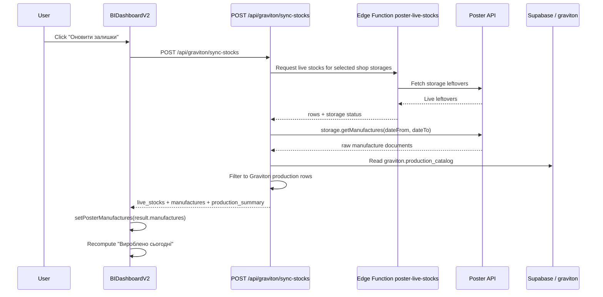
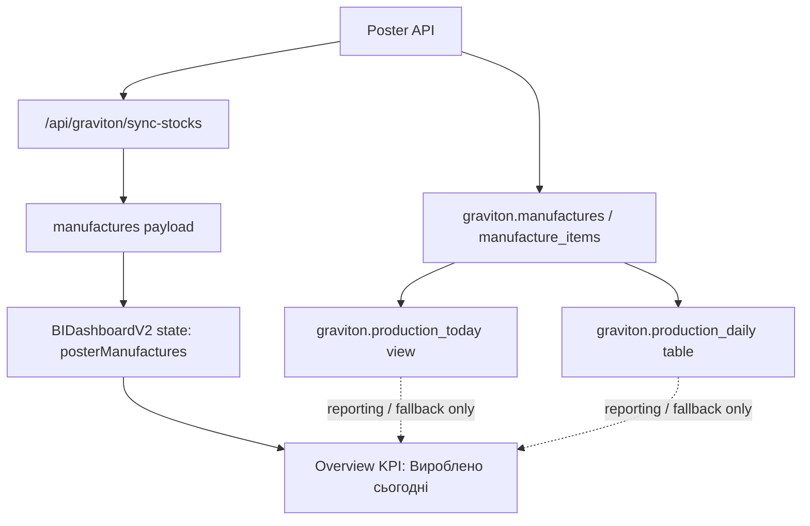
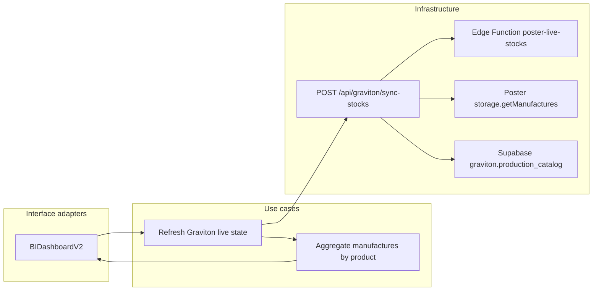

# Graviton live production architecture

This document describes the current runtime source of truth for the
**"Вироблено сьогодні"** block on `/graviton`. It also explains how live
stocks and live production move through the Graviton module, which API
contract the UI uses, and which layers own each responsibility.

The key rule is simple: the runtime production signal for the Graviton
overview comes from `POST /api/graviton/sync-stocks` and its
`manufactures` payload. The overview must not rely on temporary fallback
sources such as `production_daily` or `production_today` for the primary
live display.

## Runtime overview

The Graviton module has two different production-related data paths:

- **Runtime live path** for the `/graviton` overview:
  `sync-stocks -> manufactures -> posterManufactures -> UI`.
- **Database reporting path** for historical or derived sources:
  `graviton.manufactures`, `graviton.manufacture_items`,
  `graviton.production_today`, and `graviton.production_daily`.

For the overview screen, the runtime live path is the owner layer.

## Mermaid diagrams

### Live request sequence

This sequence shows what happens when the user clicks
**"Оновити залишки"** on `/graviton`.



### Responsibility map

This diagram shows which layer owns which part of the flow.



### Clean architecture dependency flow

This diagram maps the runtime behavior to application layers.



## Current API contract

The `/graviton` overview relies on `POST /api/graviton/sync-stocks`.
The response must include the `manufactures` array because the UI uses it
as the live production source.

### Swagger / OpenAPI

```yaml
openapi: 3.0.3
info:
  title: Graviton live sync API
  version: 1.0.0
  description: >
    Runtime synchronization endpoint for Graviton. The `/graviton`
    overview uses `manufactures` from this response as the primary live
    production source.
paths:
  /api/graviton/sync-stocks:
    post:
      summary: Refresh Graviton live stocks and live production
      description: >
        Fetches live shop leftovers through the edge function and fetches
        live production through Poster `storage.getManufactures`.
      responses:
        '200':
          description: Successful runtime sync
          content:
            application/json:
              schema:
                type: object
                required:
                  - success
                  - timestamp
                  - live_stocks
                  - manufactures
                  - production_summary
                properties:
                  success:
                    type: boolean
                    example: true
                  timestamp:
                    type: string
                    format: date-time
                  live_stocks:
                    type: array
                    items:
                      $ref: '#/components/schemas/LiveStockRow'
                  manufactures:
                    type: array
                    items:
                      $ref: '#/components/schemas/ManufactureRow'
                  production_summary:
                    $ref: '#/components/schemas/ProductionSummary'
                  manufactures_warning:
                    type: boolean
                  partial_sync:
                    type: boolean
                  failed_storages:
                    type: array
                    items:
                      type: integer
        '500':
          description: Sync failed
components:
  schemas:
    LiveStockRow:
      type: object
      properties:
        storage_id:
          type: integer
        ingredient_id:
          type: integer
        ingredient_name:
          type: string
        ingredient_name_normalized:
          type: string
        stock_left:
          type: number
        unit:
          type: string
    ManufactureRow:
      type: object
      properties:
        storage_id:
          type: integer
        product_id:
          type: integer
        product_name:
          type: string
        product_name_normalized:
          type: string
        quantity:
          type: number
    ProductionSummary:
      type: object
      properties:
        total_kg:
          type: number
        storage_id:
          type: integer
          nullable: true
        items_count:
          type: integer
```

## Clean architecture notes

The runtime design is intentionally split by responsibility.

### Entities

The core entities are:

- live stock row
- manufacture row
- production summary
- Graviton catalog product

These are business data structures. They should not depend on UI state or
view-specific formatting.

### Use cases

The main use cases are:

1. Refresh live leftovers for active Graviton shops.
2. Refresh live production for the Graviton workshop from Poster.
3. Recompute the overview KPI for produced kilograms.
4. Merge runtime production into dashboard calculations.

These use cases belong to the application flow, not to individual UI
widgets.

### Interface adapters

The interface adapters are:

- `src/components/graviton/BIDashboardV2.tsx`
- `src/app/api/graviton/sync-stocks/route.ts`

`BIDashboardV2` owns the user interaction. The route owns the transport
contract between UI and external systems.

### Infrastructure

The infrastructure layer contains:

- Poster API
- Edge Function `poster-live-stocks`
- Supabase schemas `graviton` and `categories`

This layer fetches, filters, and persists raw operational data.

## Source-of-truth rules

The following rules define the intended ownership model.

- Use `POST /api/graviton/sync-stocks` as the primary live source for the
  `/graviton` overview.
- Use `result.manufactures` as the primary runtime source for
  **"Вироблено сьогодні"**.
- Treat `graviton.production_today` as a reporting or fallback source,
  not as the primary runtime source for the overview.
- Treat `graviton.production_daily` as persistence or support data, not
  as the owner of the live KPI.
- Keep the live owner-flow aligned end-to-end:
  button -> route -> Poster -> manufactures -> UI state -> KPI.

## Current implementation status

The current runtime implementation follows the correct live owner-flow on
the `/graviton` page:

- **Refresh button** calls `POST /api/graviton/sync-stocks`
- response `manufactures` is stored in local state
- overview totals are aggregated from `posterManufactures`

Database-backed routes such as `/api/graviton/production-daily` still
exist, but they are no longer the active owner path for the main overview
screen.

## Next steps

If you change the Graviton production flow again, keep these checks in
sync:

1. Verify that `sync-stocks` still returns `manufactures`.
2. Verify that `BIDashboardV2` still aggregates from `posterManufactures`.
3. Verify that any database reporting source is documented as fallback or
   reporting-only unless it becomes the new owner layer by design.
