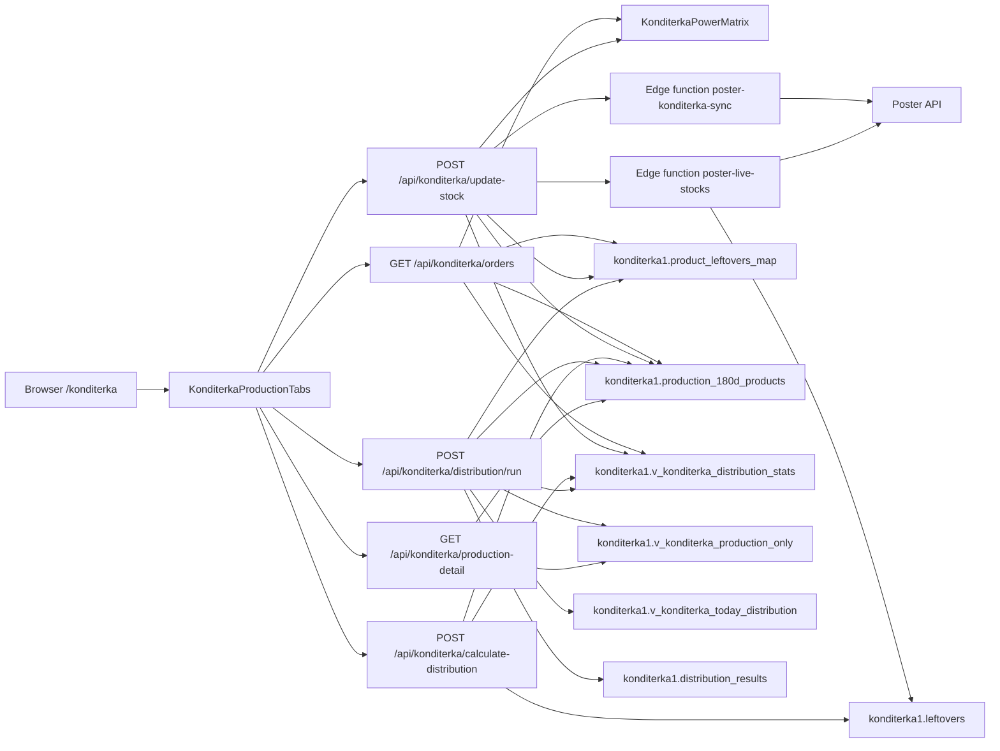
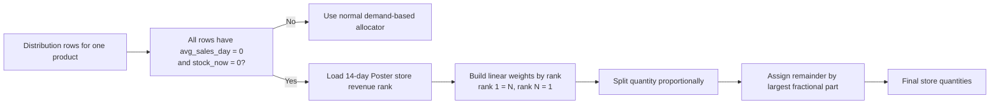

# Konditerka Runtime Architecture - Mermaid

> Source of truth for the Konditerka operational flow after leftovers mapping,
> Kyiv-date sales windows, unit-aware quantities, pack recalculation from
> current stock, weighted zero-demand allocation from Poster revenue rank, and
> zero-stock card suppression.
> Date: 2026-04-02.

## Scope

This document covers the current Konditerka owner flow:

- live leftovers sync from Poster
- raw production sync from Poster
- catalog refresh and leftovers mapping
- operational read model in Supabase
- ERP presentation rules for visible cards

## 1. End-to-end topology



## 2. Stock refresh lifecycle

```mermaid
sequenceDiagram
    participant User as Browser
    participant UI as KonditerkaProductionTabs
    participant API as /api/konditerka/update-stock
    participant EdgeProd as poster-konditerka-sync
    participant EdgeStocks as poster-live-stocks
    participant DB as Supabase

    User->>UI: Click "Оновити залишки"
    UI->>API: POST /api/konditerka/update-stock
    API->>EdgeProd: Sync production snapshot
    API->>EdgeStocks: Sync leftovers snapshot
    EdgeStocks->>DB: Upsert konditerka1.leftovers
    API->>DB: Refresh product catalog
    API->>DB: Refresh leftovers mapping
    API->>DB: Recalculate distribution views
    Note over API,DB: Konditerka distribution always allocates the full pool to stores; no warehouse residual row is emitted
    API-->>UI: Fresh leftovers + manufactures payload
    UI->>UI: Rebuild displayData from owner view
    UI->>UI: Recompute kg-pack estimates from current stock and packaging config
    Note over UI: Product cards with totalStock <= 0 are hidden in the matrix
    Note over UI,DB: Cards reappear automatically when stock becomes positive again
```

## 3. Zero-demand weighted allocation



## 4. Unit and visibility rules

- Weight items use two decimal places in UI and calculations.
- Piece items remain whole numbers.
- `v_konditerka_distribution_stats` is the canonical read model for visible cards.
- the 14-day sales window is evaluated against `Europe/Kyiv` business date, not
  database UTC `CURRENT_DATE`
- Raw `leftovers` may contain rows outside the visible catalog, but they must not be shown unless they are mapped into the catalog.
- The product matrix hides cards with zero total stock.
- Product cards are sorted alphabetically in the matrix; this is a presentation
  rule only and does not change totals or visibility.
- When sales and stock are both zero, distribution uses the Poster revenue rank
  only for weighted fallback allocation. It does not affect the matrix sort.
- The card becomes visible again when the same catalog item receives a positive stock value.
- Pack labels in the Konditerka drawer are recomputed from the current in-memory
  stock after the live leftovers overlay, so they stay aligned with the visible
  card totals.
- Konditerka distribution does not emit a warehouse residual row; the full
  produced pool is allocated to stores and any remaining quantity is a bug.

## 5. Operational owner chain

`Poster API -> edge sync -> Supabase raw tables -> mapping -> views -> ERP UI`

The ERP UI must not invent stock values. It may only render or suppress cards
based on the owner data already loaded from the view.
