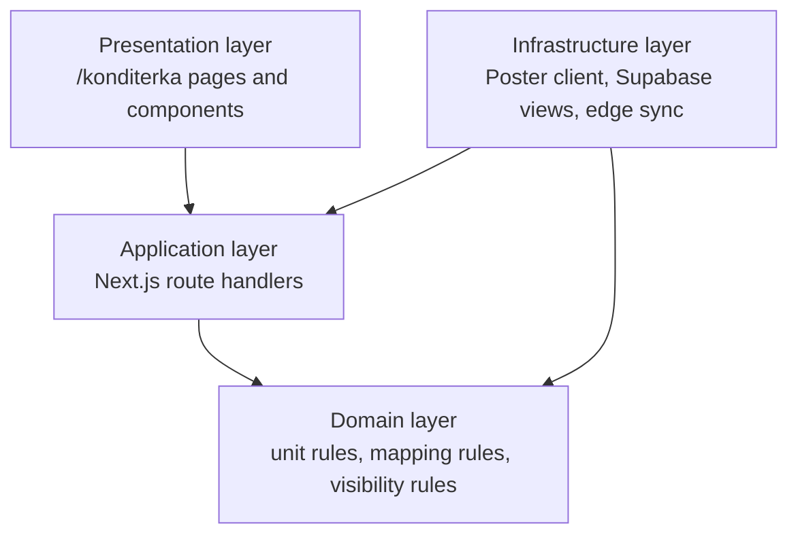

# Konditerka Clean Architecture

## Architectural intent

Konditerka is an operational domain. The goal is to keep stock, production, and
distribution rules in the owner layer and avoid compensating for broken data in
the UI.

The current source-of-truth chain is:

`Poster API -> category scope guard -> edge sync -> Supabase raw tables -> catalog whitelist -> mapping -> views -> API routes -> ERP UI`

## Layer model

## Presentation layer

Presentation includes:

- `/konditerka`
- `/konditerka/production`
- `KonditerkaProductionTabs.tsx`
- `KonditerkaPowerMatrix.tsx`
- `KonditerkaProductionOrderTable.tsx`
- `KonditerkaOrderFormTable.tsx`
- `KonditerkaDistributionModal.tsx`
- `KonditerkaProductionDetailModal.tsx`

Presentation responsibilities:

- render operational cards and tables
- hide zero-stock product cards in the matrix view
- show weight items to one decimal place
- keep piece items as whole numbers
- never own stock persistence logic

## Application layer

Application includes the route handlers under `src/app/api/konditerka/*`.

Key use cases:

- `LoadKonditerkaOrders`
- `RefreshKonditerkaStockSnapshot`
- `RefreshKonditerkaProductionSnapshot`
- `CalculateKonditerkaDistribution`
- `RunKonditerkaDistribution`
- `LoadKonditerkaProductionDetail`
- `ReadKonditerkaDistributionResults`

Application responsibilities:

- enforce auth
- orchestrate sync and read flows
- keep read models consistent after sync
- convert raw service payloads into stable API responses

## Domain layer

Core domain objects:

- `production_180d_products`
- `leftovers`
- `product_leftovers_map`
- `v_konditerka_distribution_stats`
- `v_konditerka_production_only`
- `v_konditerka_today_distribution`

Core domain rules:

- the catalog is the whitelist for visible cards
- the Konditerka catalog whitelist is category-scoped; products outside the
  Konditerka or Morozivo owner scope must not enter
  `konditerka1.production_180d_products`
- leftovers are a raw fact layer, not the visible catalog
- raw leftovers may contain foreign workshop products, but those rows are not
  allowed to promote themselves into the visible Konditerka catalog
- mapping connects catalog product IDs to Poster leftover ingredient IDs
- `avg_sales_day` is derived from the last 14 days of `categories.transactions`
  and `categories.transaction_items` as `SUM(num) / 14.0`, using the
  `Europe/Kyiv` business date as the window boundary, then rounded in the view
  layer
- when the 14-day sales aggregate is missing, the operational read model keeps
  `avg_sales_day = 0` and `min_stock = 0`; it does not rehydrate legacy demand
- the zero-sales / zero-stock fallback distribution rule uses a Poster-based
  14-day store revenue rank from `spots.getSpots` + `dash.getProductsSales`,
  then allocates quantity with descending linear weights and largest remainder
- packaging estimates are computed from kg-normalized values for weight items,
  not from the raw SQL display units
- when live leftovers are overlaid into the presentation model, the UI
  recomputes `stock_now_packs_est`, `min_stock_packs_est`,
  `need_net_packs_est`, and `quantity_to_ship_packs_est` from the current
  stock and packaging config so the drawer does not show stale pack counts
- product card ordering is alphabetic in the matrix and is a presentation-only
  concern
- live production fallback must use the same category scope as the catalog
  refresh path; it must not import all products from workshop storage `48`
- kg items are calculated and rendered to two decimal places
- piece items are calculated and rendered as integers
- a card is visible only when its total stock is greater than zero
- Konditerka distribution must allocate the full production pool to stores only;
  the owner layer must not emit a warehouse residual row.

## Infrastructure layer

Infrastructure responsibilities:

- pull stock snapshots from Poster via `poster-live-stocks`
- pull production snapshots from Poster via `poster-konditerka-sync`
- persist raw leftovers into `konditerka1.leftovers`
- refresh `konditerka1.product_leftovers_map`
- refresh `konditerka1.production_180d_products`
- enforce the same category boundary in
  `syncKonditerkaCatalogFromPoster`, `syncBranchProductionFromPoster` for
  Konditerka callers, and `konditerka1.refresh_production_180d_products()`
- delete foreign rows that were previously inserted into
  `konditerka1.production_180d_products` without category ownership
- maintain `v_konditerka_distribution_stats`
- maintain `v_konditerka_production_only`

Infrastructure does not decide visibility rules or quantity formatting.

## Owner-source matrix

| Surface | Owner source | Notes |
|---|---|---|
| `/api/konditerka/orders` | `v_konditerka_distribution_stats` + `production_180d_products` + packaging config | Main operational read for the matrix |
| `/api/konditerka/update-stock` | `poster-live-stocks`, category-scoped production sync, `leftovers`, `product_leftovers_map`, `v_konditerka_production_only` | Refreshes raw snapshots and recalculates views |
| `/api/konditerka/calculate-distribution` | `v_konditerka_distribution_stats` + `production_180d_products` | Unit-aware branch distribution |
| `/api/konditerka/production-detail` | `v_konditerka_production_only` | Production fact view |
| `/api/konditerka/distribution/run` | `v_konditerka_distribution_stats` + `v_konditerka_production_only` + Poster 14-day store ranking + `distribution_results` | Rebuilds the daily distribution result set and allocates the full pool to stores only |
| `/api/konditerka/distribution/results` | `distribution_results` + `v_konditerka_distribution_stats` | Delivery and Excel-facing read model |
| `/api/konditerka/summary` | `v_konditerka_summary_stats` | KPI header read |

## Invariants

- Zero-stock product cards are hidden from the product grid.
- The same product reappears automatically when its mapped stock becomes positive.
- Operational reads come from Supabase views, not from ad hoc client-side stock invention.
- A foreign product such as `Хачапурі` may exist in raw leftovers, but it must
  not appear in the Konditerka catalog, production fallback, or distribution
  result set.
- Unit conversion is explicit and deterministic.
- Presentation may format numbers, but it must not change business totals.
- Presentation may recompute pack estimates from the current visible stock when
  it overlays a fresh leftovers snapshot, but it must keep the same config and
  unit rules as the owner layer.

## 2026-04-05 Scope Fix

Root cause:

- `konditerka1.refresh_production_180d_products()` previously imported every
  leftover and every workshop production row from storage `48`, even when the
  product did not belong to the Konditerka owner category.
- Konditerka live production fallback previously called
  `syncBranchProductionFromPoster(..., 48)` without a category filter, so the
  fallback path could reintroduce foreign products into distribution.

Implemented fix:

- TypeScript owner-layer callers now pass
  `['кондитерка', 'морозиво']` into Konditerka production sync.
- SQL owner refresh now joins `categories.products` and
  `categories.categories` before inserting into
  `konditerka1.production_180d_products`.
- Migration `20260405_konditerka_catalog_scope_fix.sql` also deletes already
  imported foreign rows with no valid Konditerka category ownership.
