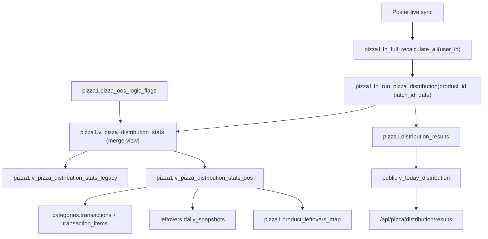
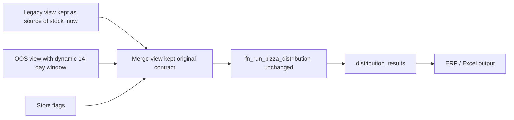

# Pizza OOS rollout architecture

This document describes the live production rollout of the pizza OOS-aware
`avg_sales_day` and `min_stock` logic. It covers the runtime flow, API surface,
layer boundaries, and the final production state after enablement of all 23
stores.

## System flow

The rollout keeps the existing pizza distribution algorithm intact. It changes
only the source of `avg_sales_day` and `min_stock` through a merge-view and a
per-store feature flag.



## Current production state

- `supabase/migrations/20260328_pizza_oos_distribution_layer.sql` is applied
- `pizza1.v_pizza_distribution_stats` is the live merge-view
- `pizza1.v_pizza_distribution_stats_oos` is the live OOS-aware source
- `pizza1.product_leftovers_map` is present in the database
- `pizza1.pizza_oos_logic_flags` is live and enabled for all 23 stores
- the `Садова` duplicate-storage bug was fixed in the owner layer

## Clean Architecture

The rollout is structured to preserve the owner layer and avoid child-layer
compensation.

### Domain rules

The domain rule is:

- `available_day = (morning_stock > 0) OR (sales > 0)`
- `avg_sales_day = sales_14d / available_days_14d`
- `min_stock = ceil(avg_sales_day * 1.5)`
- fallback: if `available_days_14d < 7`, use `sales_14d / 14`

The three-stage pizza distribution algorithm does not change.

### Data layer

The data layer owns source aggregation:

- `categories.transactions`
- `categories.transaction_items`
- `leftovers.daily_snapshots`
- `pizza1.product_leftovers_map`
- `pizza1.pizza_oos_logic_flags`

### Application layer

The application layer orchestrates recalculation:

- `POST /api/pizza/distribution/run`
- `pizza1.fn_full_recalculate_all`
- `pizza1.fn_run_pizza_distribution`

This layer still calls the same view name:

- `pizza1.v_pizza_distribution_stats`

### Interface layer

The interface layer reads already-computed values:

- `/api/pizza/distribution-stats`
- `/api/pizza/orders`
- `/api/pizza/shop-stats`
- `/api/pizza/distribution/results`

No client-side fallback is introduced.

## View strategy

The production view contract stays unchanged:

- `product_id`
- `product_name`
- `spot_name`
- `avg_sales_day`
- `min_stock`
- `stock_now`
- `baked_at_factory`
- `need_net`

The merge strategy is:

1. `v_pizza_distribution_stats_legacy` is the frozen current logic.
2. `v_pizza_distribution_stats_oos` computes the new OOS-aware logic.
3. `v_pizza_distribution_stats` selects legacy or OOS values by store flag.
4. `need_net` is recalculated from the selected `min_stock` and legacy
   `stock_now`.

## API contract

The rollout does not require a new public endpoint. The existing run endpoint
stays the orchestration entry point, and the existing stats endpoint continues
to read the same view name.

```yaml
openapi: 3.0.3
info:
  title: Pizza distribution rollout API
  version: 1.0.0
paths:
  /api/pizza/distribution/run:
    post:
      summary: Run pizza distribution recalculation
      responses:
        '200':
          description: Distribution recalculated successfully
          content:
            application/json:
              schema:
                type: object
                properties:
                  success:
                    type: boolean
                  logId:
                    type: string
                  businessDate:
                    type: string
                    nullable: true
                  reservationApplied:
                    type: boolean
                  warning:
                    type: string
                    nullable: true
        '409':
          description: Calculation is already running
        '422':
          description: Validation failed
        '500':
          description: Internal error
  /api/pizza/distribution-stats:
    get:
      summary: Read merged pizza distribution metrics
      parameters:
        - in: query
          name: product_id
          schema:
            type: integer
          required: false
      responses:
        '200':
          description: Distribution stats rows
          content:
            application/json:
              schema:
                type: array
                items:
                  type: object
                  properties:
                    product_id:
                      type: integer
                    product_name:
                      type: string
                    spot_name:
                      type: string
                    avg_sales_day:
                      type: string
                    min_stock:
                      type: integer
                    stock_now:
                      type: integer
                    baked_at_factory:
                      type: integer
                    need_net:
                      type: integer
```

## Rollout sequence

The rollout that actually happened was:

1. Apply the additive SQL layer.
2. Verify merge-view equals legacy when all flags are off.
3. Detect and fix the duplicate-store owner-layer bug for `Садова`.
4. Enable stores one by one in `pizza1.pizza_oos_logic_flags`.
5. Run the normal pizza distribution job after each enablement.
6. Compare live output against expected OOS-aware behavior.
7. Finish enablement for all 23 stores.

## Failure isolation

The rollback unit is one store.

To disable OOS logic for a store:

```sql
update pizza1.pizza_oos_logic_flags
set
  use_oos_logic = false,
  updated_at = now(),
  updated_by = 'admin',
  note = 'rollback'
where spot_id = <spot_id>;
```

This returns that store to legacy values without changing the distribution
function or API routes.

## Mermaid rollout state


