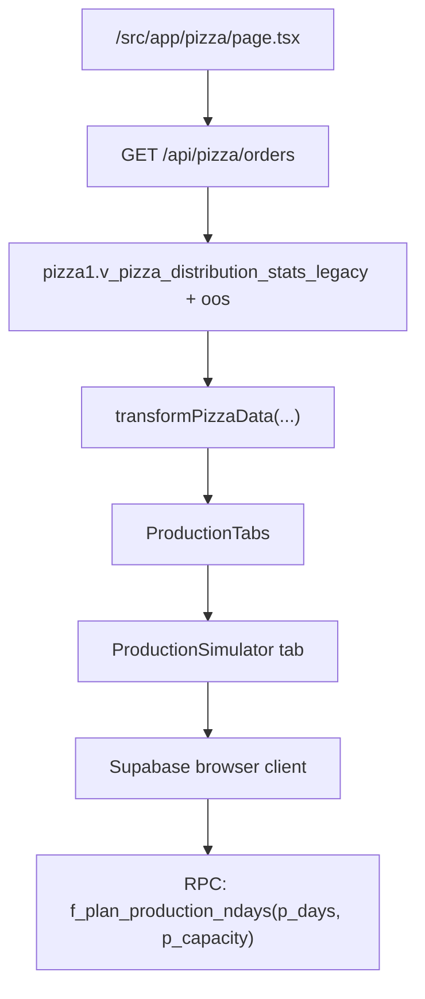
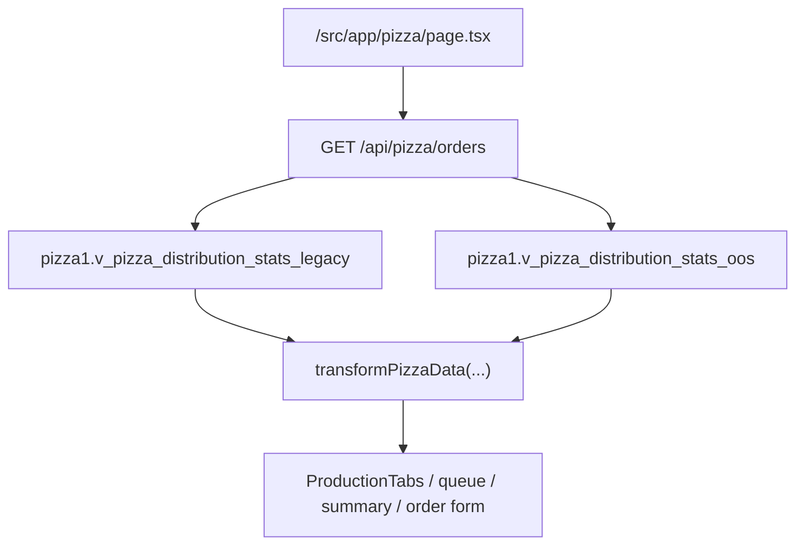
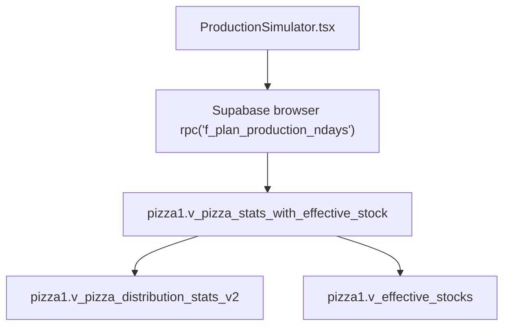
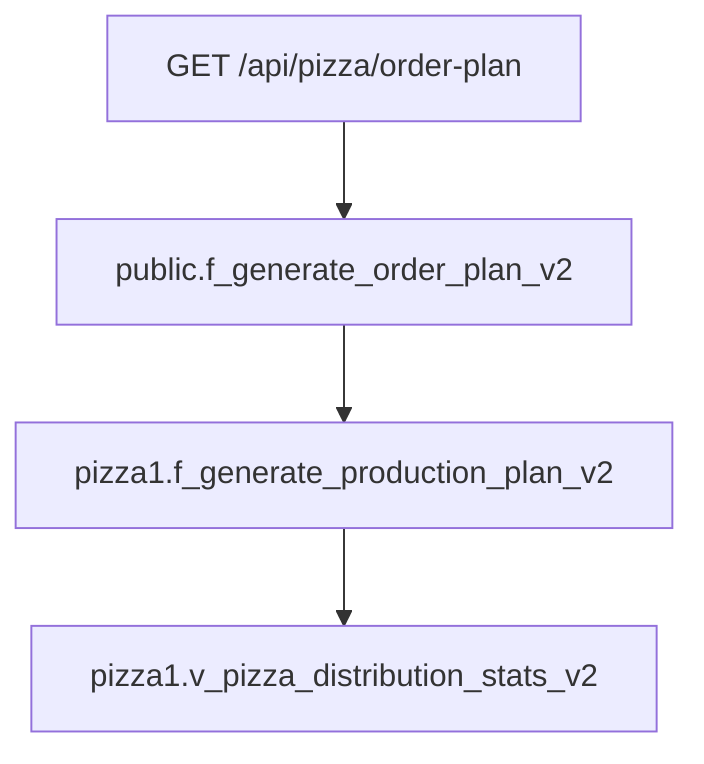
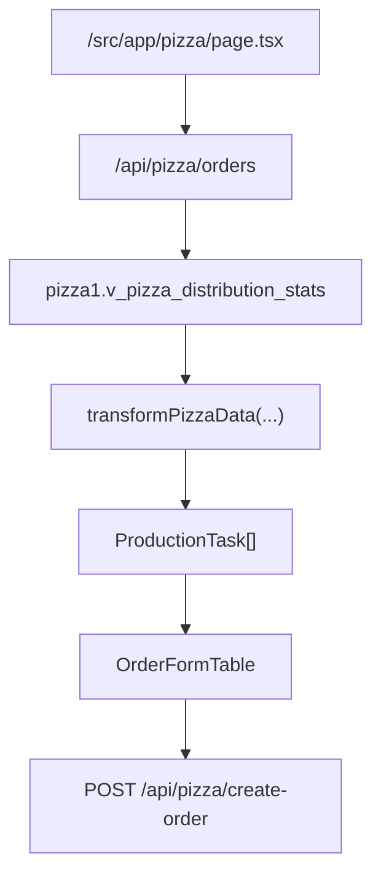
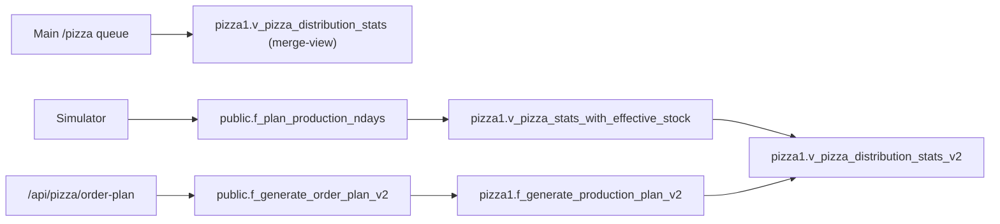

# Pizza production simulator architecture

This document describes the current architecture of the pizza production
simulator as it exists in the codebase and production database contracts on
March 29, 2026.

It focuses on the pizza simulator only. It does not cover the Konditerka,
Florida, or Bulvar simulators except where comparison helps explain the pizza
implementation.

## BLUF

The pizza production simulator is a thin React client over a Supabase RPC:
`f_plan_production_ndays`.

The UI does not call a Next.js API route for the simulator. It talks directly
to Supabase from the browser. The main pizza production page, however, is built
from `/api/pizza/orders`, which reconstructs operational rows from
`pizza1.v_pizza_distribution_stats_legacy` and
`pizza1.v_pizza_distribution_stats_oos`, then transforms those rows into
`ProductionTask[]`.

This creates an architectural split:

- the main pizza production screen is driven by app-owned HTTP handlers and the
  merged production stats view
- the pizza simulator is driven by a database RPC that is not present in the
  repository as a version-controlled SQL artifact

That means the simulator currently depends on a live database contract that was
not initially represented in source control and still points at an older pizza
planning data path than the main `/pizza` screen.

## Runtime owner-source status

The pizza simulator document depends on the broader pizza runtime owner model.
As of March 30, 2026, the runtime split is fixed as follows:

- operational pizza routes use Supabase owner data
- pizza sales analytics uses Poster owner data
- heavy operational routes no longer full-scan `pizza1.v_pizza_distribution_stats`
- batched pizza route reads scope by `product_id`
- runtime product scope prefers `pizza1.product_leftovers_map`
- if grants on `pizza1.product_leftovers_map` are unavailable, runtime falls back
  to the fixed 16-SKU OOS seed already present in the applied SQL migration

The canonical runtime contract is documented in:

- [docs/pizza-runtime-clean-architecture.md](/D:/Начальнник%20виробництва/docs/pizza-runtime-clean-architecture.md)

This matters for the simulator because the simulator is not an isolated screen.
It shares the same domain and business invariants as the operational pizza
runtime, even when the simulator itself uses a separate RPC path.

Two runtime invariants are especially important for simulator-adjacent pizza
screens:

- OOS is defined only as zero stock on a store row
- user-facing pizza screens must remain Ukrainian-only
## What was verified live

This document is not based only on repository code review. On March 29, 2026,
the live SQL definitions were extracted from production through the existing
`exec_sql` RPC using service-role access.

The following owner-layer objects were verified live:

- `public.f_plan_production_ndays`
- `public.f_generate_order_plan_v2`
- `pizza1.f_generate_production_plan_v2`
- `pizza1.v_pizza_stats_with_effective_stock`
- `pizza1.v_pizza_distribution_stats_v2`

This removed the biggest unknown from the simulator analysis: the pizza
simulator function is no longer a black box.

## Current UI entry points

The user-facing pizza production dashboard is:

- [src/app/pizza/page.tsx](/D:/Начальнник%20виробництва/src/app/pizza/page.tsx)

That page:

1. fetches `/api/pizza/orders`
2. transforms the result with `transformPizzaData`
3. passes the transformed queue to `ProductionTabs`

The simulator tab is rendered from:

- [src/components/production/ProductionTabs.tsx](/D:/Начальнник%20виробництва/src/components/production/ProductionTabs.tsx)
- [src/components/production/ProductionSimulator.tsx](/D:/Начальнник%20виробництва/src/components/production/ProductionSimulator.tsx)

`/pizza/production` is not the active simulator page. It is currently a
placeholder analytics page:

- [src/app/pizza/production/page.tsx](/D:/Начальнник%20виробництва/src/app/pizza/production/page.tsx)

## Runtime flow

The current end-to-end flow is:



This is important because the simulator does not consume the same app-owned
HTTP interface as the rest of the pizza production screen.

## Step-by-step owner-layer chain

### Step 1. Main pizza page owner flow

The live pizza page follows this path:



The owner-layer source of truth for the main pizza screen is therefore:

- `pizza1.v_pizza_distribution_stats_legacy`
- `pizza1.v_pizza_distribution_stats_oos`

Header KPI cards on `/pizza` are now derived inside `ProductionTabs` from:

- `ProductionTask[]` returned by `/api/pizza/orders`

This means the screen no longer depends on `/api/pizza/summary` to render
`Виробництво`, `Факт залишок`, `Норма`, and `Індекс заповненостей`.

The baked-count header card is now also derived from `ProductionTask[]`
through the per-product `todayProduction` field. The initial `/pizza` page load
therefore no longer waits on a second header-level request to
`/api/pizza/production-detail`.

The page now renders the shell immediately and shows loading placeholders while
`/api/pizza/orders` is still in flight instead of blocking the whole route on a
full-screen loader.

### Step 2. Pizza simulator owner flow

The simulator follows a different path:



This means the simulator does not consume the merge-view at all.

### Step 3. Adjacent order-plan API flow

The adjacent order-plan API is also separate:



So there are currently two separate planning stacks that both bypass the live
merge-view:

- simulator stack -> `f_plan_production_ndays`
- order-plan stack -> `f_generate_order_plan_v2`

## Current pizza simulator component

The simulator component lives in:

- [src/components/production/ProductionSimulator.tsx](/D:/Начальнник%20виробництва/src/components/production/ProductionSimulator.tsx)

It currently:

- stores `capacity` in local state, default `320`
- stores `days` in local state, default `3`
- exposes a selectable planning horizon of `1..6` days in the UI
- debounces requests by `600ms`
- creates a browser Supabase client with `createClient()`
- calls:
  - `supabase.rpc('f_plan_production_ndays', { p_days: days, p_capacity: capacity })`
- groups the returned rows by `plan_day`
- renders a per-day plan board

The expected RPC result shape is:

- `plan_day`
- `product_name`
- `quantity`
- `risk_index`
- `prod_rank`
- `plan_metadata.deficit`
- `plan_metadata.avg_sales`
- `plan_metadata.was_inflated`

The component itself does not contain production planning logic. It is only a
visual wrapper around the RPC result.

## Live SQL findings

### `public.f_plan_production_ndays`

The simulator function is a `SECURITY DEFINER` PL/pgSQL function that:

- reads from `pizza1.v_pizza_stats_with_effective_stock`
- seeds a temp table with per-store rows:
  - `p_name`
  - `s_name`
  - `stock = floor(effective_stock + 0.3)`
  - `sales = avg_sales_day`
  - `norm = min_stock`
- simulates `N` days forward
- creates a daily SKU plan using a waterfall by SKU rank
- writes results into `temp_final_plan`
- runs a virtual distribution phase back into store-level stock state

The core planning mechanics are:

- top `6` SKU per day
- base batch per SKU:
  - `40` if `total_deficit + daily_avg <= 40`
  - `60` if `<= 60`
  - `80` otherwise
- if total daily plan is below `p_capacity`, remainder is added in `+20`
  blocks by rank
- if total daily plan exceeds `p_capacity`, quantities are cut top-down by
  cumulative running sum
- after planning, the function simulates three virtual allocation phases:
  - close zero-stock stores first
  - fill toward `norm`
  - then fill toward `norm * multiplier` from `2` to `15`

This is a real simulator with internal state mutation, not just a report query.

## Batch-size audit

This section verifies the actual quantity mechanics in
`public.f_plan_production_ndays` against the production rule:

- batch size must be a multiple of `10`
- minimum valid batch is `20`

### Step 1. Base quantity rules

The function assigns `base_qty` strictly by this rule:

- `40`, if `total_deficit + daily_avg <= 40`
- `60`, if `total_deficit + daily_avg <= 60`
- `80`, otherwise

So the simulator never starts a SKU from `20`.

### Step 2. Inflation rules when capacity is sufficient

If the daily base plan fits within `p_capacity`, the function may inflate a SKU
by exactly one `+20` block:

- `qty = base_qty + 20` for enough top-ranked SKUs
- otherwise `qty = base_qty`

So in the non-overflow branch the only reachable quantities are:

- `40`
- `60`
- `80`
- `100`

These quantities are compatible with the production rule:

- all are multiples of `10`
- all are at least `20`

### Step 3. Overflow rules when capacity is exceeded

If the daily base plan exceeds `p_capacity`, the function cuts quantities
top-down by cumulative rank. In this branch the last admitted SKU can receive a
partial remainder:

- `qty = p_capacity - (running_sum - base_qty)`

That means the overflow branch can produce a quantity smaller than `base_qty`.

### Step 4. Reachable partial quantities

If `p_capacity` is passed as a multiple of `10`, and all running sums are
multiples of `20`, then the partial remainder will still be a multiple of `10`.

So with the current UI slider, the overflow branch can return values like:

- `10`
- `20`
- `30`
- `40`
- `50`
- `60`
- `70`

depending on the `base_qty` of the truncated SKU.

This means:

- the simulator does preserve `multiple of 10`
- but it does not guarantee `minimum batch = 20`

The invalid case is a partial remainder of `10`.

### Step 5. When the invalid `10` can happen

The invalid case appears only in the overflow branch:

- `v_current_total > p_capacity`

and only for the last included SKU when the remaining capacity before that SKU
is exactly `10`.

Example pattern:

- previous running sum before SKU = `280`
- current SKU base quantity = `40`
- `p_capacity = 290`
- returned partial quantity = `10`

So the batch policy mismatch is not in the normal branch. It is specifically in
the overflow-cut branch.

### `public.f_generate_order_plan_v2`

The order-plan API function is a much thinner SQL wrapper. It:

- calls `pizza1.f_generate_production_plan_v2(p_days)`
- joins aggregated stock and averages from `pizza1.v_pizza_distribution_stats_v2`
- returns a flatter contract:
  - `p_day`
  - `p_name`
  - `p_avg`
  - `p_stock`
  - `p_min`
  - `p_order`

### `pizza1.f_generate_production_plan_v2`

The lower pizza function behind `f_generate_order_plan_v2`:

- seeds one `virtual_stock` row per product, not per store
- aggregates from `pizza1.v_pizza_distribution_stats_v2`
- keeps only products with `avg_sales_day > 0`
- picks top `5` SKUs per day by risk
- allocates fixed batches:
  - first `4` SKUs -> `80`
  - fifth SKU -> `40`
- subtracts `v_daily_avg` after each day

This is materially different from `f_plan_production_ndays`.

## Primary architecture finding

The simulator and order-plan API are not two interfaces over one domain model.
They are two different domain implementations.

The difference is structural:

- `f_plan_production_ndays`
  - store-level simulation
  - uses `effective_stock`
  - multi-phase virtual redistribution
  - dynamic cut/inflate by total capacity
  - top `6` SKUs
- `f_generate_order_plan_v2`
  - product-level aggregate planning
  - uses summed `stock_now`
  - no store-level redistribution loop
  - fixed `80/80/80/80/40`
  - top `5` SKUs

So today the pizza domain has two separate owner-layer planning mechanics in
production.

## Main pizza production data model

The main pizza page is driven by:

- [src/app/api/pizza/orders/route.ts](/D:/Начальнник%20виробництва/src/app/api/pizza/orders/route.ts)

That route:

1. runs live pizza sync from Poster
2. reads all rows from `pizza1.v_pizza_distribution_stats`
3. returns the raw rows as JSON

Those rows are transformed in:

- [src/lib/transformers.ts](/D:/Начальнник%20виробництва/src/lib/transformers.ts)

`transformPizzaData()` currently maps:

- `stock_now` or `current_stock` to `currentStock`
- `min_stock` or `norm_3_days` to `minStock`
- `need_net` to `deficitKg` and `recommendedKg`
- `avg_sales_day` to `avgSales`

This transformed queue is then used by:

- the current state tab
- the production summary cards
- the order form table
- the logistics/distribution views

## Related APIs and adjacent planning logic

The pizza production surface has adjacent APIs that are relevant to the
simulator:

- [src/app/api/pizza/order-plan/route.ts](/D:/Начальнник%20виробництва/src/app/api/pizza/order-plan/route.ts)
- [src/app/api/pizza/create-order/route.ts](/D:/Начальнник%20виробництва/src/app/api/pizza/create-order/route.ts)
- [src/app/api/pizza/summary/route.ts](/D:/Начальнник%20виробництва/src/app/api/pizza/summary/route.ts)
- [src/app/api/pizza/distribution-stats/route.ts](/D:/Начальнник%20виробництва/src/app/api/pizza/distribution-stats/route.ts)

These routes show that there are already two different planning paths in the
pizza domain:

1. `order-plan`
   - calls `f_generate_order_plan_v2`
   - is app-owned via Next.js API
2. simulator
   - calls `f_plan_production_ndays`
   - bypasses Next.js API and calls Supabase RPC directly from the client

This split is an architectural inconsistency. After live SQL extraction, it is
clear that the inconsistency is not only transport-level. It is also
domain-level.

## Submit-flow is separate from the simulator

The simulator is currently an advisory tab, not an executable planning owner.

The real pizza submit-flow is:



This has two important consequences:

- the simulator output is not consumed by `OrderFormTable`
- the simulator output is not what gets submitted when the user clicks
  `Сформувати`

So today pizza has:

- one advisory planning surface: simulator
- one operational planning surface: order form built from merged queue data

They are not connected.

## Critical finding: simulator still depends on pre-merge pizza views

The original concern was that `f_plan_production_ndays` was missing from the
repo. That remains true in source control, but the bigger live finding is now
clearer:

- the simulator reads `pizza1.v_pizza_stats_with_effective_stock`
- that view reads `pizza1.v_pizza_distribution_stats_v2`
- the adjacent order-plan path also reads `pizza1.v_pizza_distribution_stats_v2`
- the main pizza page reads `pizza1.v_pizza_distribution_stats`

So the simulator and order-plan API are still anchored to the older `v2` pizza
stats layer, while the production queue and OOS rollout are anchored to the
new merge-view.

This is the most important owner-layer mismatch in the pizza production system.

## Minimal owner-layer re-anchor

The safest way to move the simulator onto the live pizza source of truth is not
to rewrite `f_plan_production_ndays` first.

The minimal owner-layer change is:

- keep `public.f_plan_production_ndays` unchanged
- keep its batch logic unchanged
- keep its virtual distribution loop unchanged
- redefine only `pizza1.v_pizza_stats_with_effective_stock`

### Why this is the minimal safe change

Today `f_plan_production_ndays` reads only these inputs from
`pizza1.v_pizza_stats_with_effective_stock`:

- `product_name`
- `spot_name`
- `effective_stock`
- `avg_sales_day`
- `min_stock`

It does not consume:

- `need_net`
- `physical_stock`
- `virtual_stock`
- `baked_at_factory`

So the simulator function does not actually need `v2` directly. It needs only:

- live `avg_sales_day`
- live `min_stock`
- store-level `effective_stock`

That means the cleanest bridge is:

- take `avg_sales_day` and `min_stock` from
  `pizza1.v_pizza_distribution_stats` (merge-view)
- take `effective_stock`, `physical_stock`, and `virtual_stock` from
  `pizza1.v_effective_stocks`
- publish the same column contract through
  `pizza1.v_pizza_stats_with_effective_stock`

### Current definition

Today the view is:

```sql
SELECT
  vp.product_id,
  vp.product_name,
  vp.spot_name,
  vp.avg_sales_day,
  vp.min_stock,
  vp.stock_now,
  COALESCE(ve.effective_stock, vp.stock_now::numeric) AS effective_stock,
  COALESCE(ve.physical_stock, vp.stock_now::numeric) AS physical_stock,
  COALESCE(ve.virtual_stock, 0::bigint) AS virtual_stock,
  vp.baked_at_factory,
  vp.need_net
FROM pizza1.v_pizza_distribution_stats_v2 vp
LEFT JOIN pizza1.v_effective_stocks ve
  ON ve.ingredient_name = vp.product_name
 AND regexp_replace(ve.storage_name, '^Магазин \"(.+)\"$', '\1') = vp.spot_name
```

### Target definition

The target shape should be the same, but the base view should change from
`v_pizza_distribution_stats_v2` to the live merge-view
`v_pizza_distribution_stats`.

Conceptually:

```sql
SELECT
  vp.product_id,
  vp.product_name,
  vp.spot_name,
  vp.avg_sales_day,
  vp.min_stock,
  vp.stock_now,
  COALESCE(ve.effective_stock, vp.stock_now::numeric) AS effective_stock,
  COALESCE(ve.physical_stock, vp.stock_now::numeric) AS physical_stock,
  COALESCE(ve.virtual_stock, 0::bigint) AS virtual_stock,
  vp.baked_at_factory,
  vp.need_net
FROM pizza1.v_pizza_distribution_stats vp
LEFT JOIN pizza1.v_effective_stocks ve
  ON ve.ingredient_name = vp.product_name
 AND regexp_replace(ve.storage_name, '^Магазин \"(.+)\"$', '\1') = vp.spot_name
```

### What this changes

After that one view swap:

- simulator keeps using `effective_stock`
- simulator starts using live merged `avg_sales_day`
- simulator starts using live merged `min_stock`
- no batch logic changes
- no capacity logic changes
- no virtual redistribution changes
- no UI contract changes

### What this avoids

This avoids a riskier first move:

- directly editing `f_plan_production_ndays`
- changing temp-table logic and planning mechanics together with source
  migration

That would mix two changes in one rollout:

- source-of-truth migration
- planning-engine rewrite

The view re-anchor avoids that.

### Source-controlled migration prepared

The repo now contains the minimal re-anchor migration:

- [20260329_pizza_simulator_use_merge_view.sql](/D:/Начальнник%20виробництва/supabase/migrations/20260329_pizza_simulator_use_merge_view.sql)

This migration:

- leaves `public.f_plan_production_ndays` unchanged
- leaves the simulator batch policy unchanged
- redefines only `pizza1.v_pizza_stats_with_effective_stock`
- switches its base from `pizza1.v_pizza_distribution_stats_v2` to
  `pizza1.v_pizza_distribution_stats`

## Source-of-truth mismatch in one picture



This shows that the simulator and order-plan API are coupled to the same old
branch, while the main pizza screen is coupled to the new branch.

## Clean Architecture view

The simulator currently crosses layers like this:

### Interface layer

- [src/components/production/ProductionSimulator.tsx](/D:/Начальнник%20виробництва/src/components/production/ProductionSimulator.tsx)
- [src/components/production/ProductionTabs.tsx](/D:/Начальнник%20виробництва/src/components/production/ProductionTabs.tsx)

This layer owns:

- capacity input
- day horizon input
- loading and error state
- grouping by day
- visual rendering

### Application layer

For the simulator itself, there is effectively no app-owned application layer.
The browser calls the database directly through Supabase RPC.

For the rest of the pizza production screen, the application layer is:

- [src/app/api/pizza/orders/route.ts](/D:/Начальнник%20виробництва/src/app/api/pizza/orders/route.ts)
- [src/app/api/pizza/order-plan/route.ts](/D:/Начальнник%20виробництва/src/app/api/pizza/order-plan/route.ts)
- [src/app/api/pizza/summary/route.ts](/D:/Начальнник%20виробництва/src/app/api/pizza/summary/route.ts)

### Domain layer

The domain logic for the simulator is currently hidden inside the database RPC:

- `f_plan_production_ndays`

The domain logic for the adjacent order-plan API is:

- `f_generate_order_plan_v2`
- `pizza1.f_generate_production_plan_v2`

The domain logic for the page queue is driven by:

- `pizza1.v_pizza_distribution_stats`
- `transformPizzaData`

### Data layer

The queue and distribution pages are anchored on:

- `pizza1.v_pizza_distribution_stats`

The simulator is anchored on:

- `f_plan_production_ndays`
- `pizza1.v_pizza_stats_with_effective_stock`
- `pizza1.v_pizza_distribution_stats_v2`

The adjacent order-plan API is anchored on:

- `f_generate_order_plan_v2`
- `pizza1.f_generate_production_plan_v2`
- `pizza1.v_pizza_distribution_stats_v2`

The gap is no longer only "missing repo SQL". The deeper gap is that pizza has
two competing domain/data backbones in production.

## Architecture risks

The current pizza simulator has these concrete risks.

### Risk 1: two different owner-layer planning engines

The simulator and order-plan API do not share one production planning engine.
That creates inevitable divergence in:

- product selection
- quantity sizing
- capacity handling
- stock simulation
- explanation of "why this SKU was planned"

### Risk 2: simulator is still attached to the old pizza stats branch

`f_plan_production_ndays` reads `pizza1.v_pizza_stats_with_effective_stock`,
which reads `pizza1.v_pizza_distribution_stats_v2`, not the live merge-view.

That means the simulator is not automatically aligned with:

- the OOS rollout flags
- the new OOS-aware `avg_sales_day`
- the new OOS-aware `min_stock`
- the merge-view contract used by `/api/pizza/orders`

### Risk 3: source-controlled SQL is incomplete

The repository still does not contain version-controlled SQL for
`f_plan_production_ndays`. That makes review and change management weaker than
they should be.

### Risk 4: split transport and application model

The pizza domain now has at least three planning-related entry points:

- `ProductionSimulator` -> `f_plan_production_ndays`
- `order-plan` API -> `f_generate_order_plan_v2`
- manual order submission -> `create-order`

These are not clearly unified under one owner-layer abstraction.

### Risk 5: direct browser-to-RPC dependency

The simulator bypasses app-owned API handlers. That makes it harder to:

- centralize auth and logging
- normalize payload shape
- introduce cross-cutting validation
- swap planning backends safely

### Risk 6: manual order submission is not persistent

- [src/app/api/pizza/create-order/route.ts](/D:/Начальнник%20виробництва/src/app/api/pizza/create-order/route.ts)

This route currently only logs the order payload and returns success. It does
not persist a production order in the database.

That means the UI can produce a "successful" order action without a real
durable production-order owner layer behind it.

### Risk 7: simulator does not drive the executable workflow

A user can read one recommendation set in the simulator and submit a different
recommendation set from `OrderFormTable`, because they are generated from
different inputs and different mechanics.

This is not a small UX inconsistency. It means the product currently exposes
two parallel "truths" about pizza production planning.

## What is already stable

Several parts of the pizza production surface are now stable and aligned to the
live OOS rollout:

- `pizza1.v_pizza_distribution_stats` is the live merged production source
- OOS-aware `avg_sales_day` and `min_stock` are live for all 23 stores
- `stock_now` remains legacy-owned and stable
- the three-stage pizza distribution function is unchanged

This matters because any simulator redesign should consume the same live source
of truth rather than rebuild an alternative planning model beside it.

## Recommended next steps

The next steps must happen in this order.

1. Move the live SQL of `f_plan_production_ndays` into source control.
2. Re-anchor `pizza1.v_pizza_stats_with_effective_stock` from
   `v_pizza_distribution_stats_v2` to `v_pizza_distribution_stats`.
3. Regression-check simulator output after the view swap:
   - no invalid batches
   - no runtime errors
   - reasonable daily ranking
4. Only after that, decide whether the adjacent `order-plan` path should also
   be retired or re-anchored.
5. Only after owner-layer unification, decide whether the simulator transport
   should stay direct RPC or move behind `/api/pizza/simulator-plan`.
6. Make `create-order` durable if the simulator is meant to produce executable
   production orders rather than advisory output.
7. If the simulator remains user-facing, explicitly decide whether it should:
   - stay advisory-only and be labeled as such
   - or become the actual source for generated production orders

## Swagger-style contract snapshot

The current simulator contract is implicit, but the front-end expects a result
like this:

```yaml
openapi: 3.0.3
info:
  title: Pizza production simulator contract
  version: 1.0.0
paths:
  /supabase/rpc/f_plan_production_ndays:
    post:
      summary: Generate a pizza production plan for N days
      requestBody:
        required: true
        content:
          application/json:
            schema:
              type: object
              properties:
                p_days:
                  type: integer
                p_capacity:
                  type: integer
      responses:
        '200':
          description: Generated plan rows
          content:
            application/json:
              schema:
                type: array
                items:
                  type: object
                  properties:
                    plan_day:
                      type: integer
                    product_name:
                      type: string
                    quantity:
                      type: integer
                    risk_index:
                      type: number
                    prod_rank:
                      type: integer
                    plan_metadata:
                      type: object
                      properties:
                        deficit:
                          type: number
                        avg_sales:
                          type: number
                        was_inflated:
                          type: boolean
```

## Next steps

If you continue this block, the correct next step is still not a UI edit. The
next step is to decide which planning engine is canonical, then re-anchor the
non-canonical path to the same source-of-truth merge-view.

## March 29, 2026 updates

This section records the owner-layer and ERP-facing changes made after the
initial architecture audit.

### Europejska special scheduling rule

`ПіпїЅпїЅ "пїЅпїЅпїЅпїЅпїЅпїЅпїЅпїЅпїЅпїЅпїЅ"` now has an explicit owner-layer exception in
`public.f_plan_production_ndays`.

This exception exists because the production team works in two `3-day` shift
cycles, and `пїЅпїЅпїЅпїЅпїЅпїЅпїЅпїЅпїЅпїЅпїЅ` must be produced in the fixed cycle slots rather than
being allowed to drift to any day with a high accumulated risk score.

The rule is:

- `пїЅпїЅпїЅпїЅпїЅпїЅпїЅпїЅпїЅпїЅпїЅ` is excluded from the normal daily ranking waterfall
- it is force-slotted on `D3`
- if the horizon is `6` days, it is also force-slotted on `D6`
- it must not be skipped on `D3` and then compensated with an oversized `D6`
  batch

Its quantity is computed per `3-day` cycle from the simulated stock state at
the moment of the slot:

- `daily_avg_net = SUM(sales)`
- `buffer_net = SUM(norm)`
- `stock_net = SUM(stock)`
- `cycle_target = GREATEST(CEIL(daily_avg_net * 3), buffer_net)`
- `cycle_need = GREATEST(0, cycle_target - stock_net)`
- quantity is rounded up to the nearest multiple of `10`
- if the rounded quantity is positive but below `20`, it is raised to `20`

Validated live outcomes after this change:

- with `p_days = 3`, `пїЅпїЅпїЅпїЅпїЅпїЅпїЅпїЅпїЅпїЅпїЅ` appears on `D3`
- with `p_days = 6`, `пїЅпїЅпїЅпїЅпїЅпїЅпїЅпїЅпїЅпїЅпїЅ` appears on `D3` and `D6`
- a tested live result returned `D3 = 30` and `D6 = 90`
- these quantities were confirmed as operationally correct

### ERP naming

The user-facing ERP label was renamed from `пїЅпїЅпїЅпїЅпїЅпїЅпїЅпїЅпїЅ` to
`пїЅпїЅпїЅпїЅ пїЅпїЅпїЅпїЅпїЅпїЅпїЅпїЅпїЅпїЅпїЅ`.

This rename is presentation-only:

- the visible pizza ERP tab now says `пїЅпїЅпїЅпїЅ пїЅпїЅпїЅпїЅпїЅпїЅпїЅпїЅпїЅпїЅпїЅ`
- the internal React state key remains `simulator`

Relevant file:

- [src/components/production/ProductionTabs.tsx](/D:/пїЅпїЅпїЅпїЅпїЅпїЅпїЅпїЅпїЅпїЅ%20пїЅпїЅпїЅпїЅпїЅпїЅпїЅпїЅпїЅпїЅпїЅ/src/components/production/ProductionTabs.tsx)

### Excel export

The pizza planning UI now supports exporting the currently loaded plan to an
Excel workbook.

Relevant files:

- [src/components/production/ProductionSimulator.tsx](/D:/пїЅпїЅпїЅпїЅпїЅпїЅпїЅпїЅпїЅпїЅ%20пїЅпїЅпїЅпїЅпїЅпїЅпїЅпїЅпїЅпїЅпїЅ/src/components/production/ProductionSimulator.tsx)
- [src/lib/pizza-simulator-export.ts](/D:/пїЅпїЅпїЅпїЅпїЅпїЅпїЅпїЅпїЅпїЅ%20пїЅпїЅпїЅпїЅпїЅпїЅпїЅпїЅпїЅпїЅпїЅ/src/lib/pizza-simulator-export.ts)

The export is based on the already loaded RPC result. It does not trigger a
separate planning query.

Workbook contract:

- sheet name: `пїЅпїЅпїЅпїЅ пїЅпїЅпїЅпїЅпїЅпїЅпїЅпїЅпїЅпїЅпїЅ`
- file name prefix: `Plan_Vyrobnytstva_...`
- title row: `пїЅпїЅпїЅпїЅ пїЅпїЅпїЅпїЅпїЅпїЅпїЅпїЅпїЅпїЅпїЅ пїЅпїЅпїЅ ...`
- period row: start and end dates of the exported horizon
- generated-at row: export timestamp in `uk-UA` locale

### Excel layout and date semantics

The workbook layout follows the requested operational format:

- left column stack: `D1`, `D2`, `D3`
- right column stack: `D4`, `D5`, `D6`
- each block contains:
  - `пїЅпїЅпїЅпїЅ`
  - `пїЅпїЅпїЅпїЅпїЅ`
  - `пїЅпїЅпїЅпїЅпїЅ`
- each block ends with the day total

Header colors follow the shift cycle:

- `D1` and `D4` -> red
- `D2` and `D5` -> yellow
- `D3` and `D6` -> green

The user clarified that a plan created today is launched into work starting
tomorrow. The export therefore uses:

- `D1 = tomorrow`
- `D2 = tomorrow + 1 day`
- `D3 = tomorrow + 2 days`
- and so on for the selected horizon

Dates are shown:

- once as the overall export period at the top of the workbook
- once above each day block as `пїЅпїЅпїЅпїЅ: dd.mm.yyyy`

## Pizza analytics surface

A separate pizza analytics surface now exists as an independent ERP section.

Navigation:

- sidebar link: `/pizza/analytics`
- label: `пїЅпїЅпїЅпїЅпїЅпїЅпїЅпїЅ`

Owner-layer API for the new page:

- `/api/pizza/analytics/dashboard`

This route is intentionally separate from the older `/api/pizza/analytics`
contract so that the historical order-form analytics widget is not broken.

The new analytics dashboard reads from:

- `pizza1.v_pizza_distribution_stats`
- `pizza1.v_pizza_summary_stats`

and computes these sections:

- overview KPIs
- SKU analytics
- store analytics
- plan-vs-fact planning gap table
- top risk / top need / top OOS signals

Relevant files:

- [src/app/api/pizza/analytics/dashboard/route.ts](/D:/пїЅпїЅпїЅпїЅпїЅпїЅпїЅпїЅпїЅпїЅ%20пїЅпїЅпїЅпїЅпїЅпїЅпїЅпїЅпїЅпїЅпїЅ/src/app/api/pizza/analytics/dashboard/route.ts)
- [src/app/pizza/analytics/page.tsx](/D:/пїЅпїЅпїЅпїЅпїЅпїЅпїЅпїЅпїЅпїЅ%20пїЅпїЅпїЅпїЅпїЅпїЅпїЅпїЅпїЅпїЅпїЅ/src/app/pizza/analytics/page.tsx)
- [src/components/layout.tsx](/D:/пїЅпїЅпїЅпїЅпїЅпїЅпїЅпїЅпїЅпїЅ%20пїЅпїЅпїЅпїЅпїЅпїЅпїЅпїЅпїЅпїЅпїЅ/src/components/layout.tsx)

## Analytics IA refactor

The pizza information architecture was later split into two separate surfaces:

- `/pizza/production` -> operational production analytics
- `/pizza/analytics` -> sales, trends, and store analytics

This separation follows the enterprise UX principle that operational execution
and analytical reading should not be mixed into one screen.

Relevant files:

- [src/app/pizza/production/page.tsx](/D:/пїЅпїЅпїЅпїЅпїЅпїЅпїЅпїЅпїЅпїЅ%20пїЅпїЅпїЅпїЅпїЅпїЅпїЅпїЅпїЅпїЅпїЅ/src/app/pizza/production/page.tsx)
- [src/app/pizza/analytics/page.tsx](/D:/пїЅпїЅпїЅпїЅпїЅпїЅпїЅпїЅпїЅпїЅ%20пїЅпїЅпїЅпїЅпїЅпїЅпїЅпїЅпїЅпїЅпїЅ/src/app/pizza/analytics/page.tsx)
- [src/components/pizza/PizzaProductionAnalytics.tsx](/D:/пїЅпїЅпїЅпїЅпїЅпїЅпїЅпїЅпїЅпїЅ%20пїЅпїЅпїЅпїЅпїЅпїЅпїЅпїЅпїЅпїЅпїЅ/src/components/pizza/PizzaProductionAnalytics.tsx)
- [src/components/pizza/PizzaSalesAnalytics.tsx](/D:/пїЅпїЅпїЅпїЅпїЅпїЅпїЅпїЅпїЅпїЅ%20пїЅпїЅпїЅпїЅпїЅпїЅпїЅпїЅпїЅпїЅпїЅ/src/components/pizza/PizzaSalesAnalytics.tsx)

## Final analytics layout

`/pizza/analytics` is now intentionally table-first and ERP-oriented rather
than dashboard-first.

The page is structured as:

- title and update timestamp
- top KPI row
- filter/control bar
- primary working table
- right-side SKU detail panel
- bottom signal blocks

This matches the product requirement that analytics should optimize for:

- finding a pizza fast
- narrowing to one store
- comparing rows
- reading risk and coverage
- opening one SKU without losing table context

### Filter bar

The analytics filter bar now supports:

- search by pizza name
- store selector
- sort selector
- view switch:
  - `SKU`
  - `Тренди`
  - `Магазини`

### Main table views

The left working surface now has three modes.

`SKU`

- one row per pizza
- columns:
  - pizza name
  - avg sales
  - stock
  - need
  - coverage
  - risk

`Тренди`

- same row basis as `SKU`
- adds a signal column:
  - `Критично`
  - `Р РёР·РёРє`
  - `Контроль`
  - `Стабільно`

`Магазини`

- one row per store
- columns:
  - store name
  - avg sales
  - stock
  - need
  - fill
  - OOS SKU count

### Right-side detail panel

The selected-SKU detail panel now reads from the same analytics contract and
shows:

- selected pizza
- avg sales/day
- need
- coverage
- risk
- store with highest need
- average fill across stores for that SKU
- production gap
- store-by-store rows for the selected pizza

This preserves table context while exposing one-entity detail, which is the
preferred ERP pattern over opening a separate modal.

## Analytics route contract

The owner-layer analytics route remains:

- `/api/pizza/analytics/dashboard`

It now returns a richer analytical contract than the first dashboard version.

Additional route section:

- `storeSku`

Each `storeSku` row contains:

- `productName`
- `storeName`
- `stock`
- `minStock`
- `avgSales`
- `needNet`
- `fillRate`
- `bakedAtFactory`

This contract exists specifically to support:

- store filtering without another round-trip
- SKU drill-down by store
- aggregate-per-store and aggregate-per-SKU transformations on the client

The route still reads from owner-layer live pizza views:

- `pizza1.v_pizza_distribution_stats`
- `pizza1.v_pizza_summary_stats`

So the analytical surface stays aligned to the same live pizza source of truth
as the operational queue.

## 2026-03-29 Pizza Analytics Finalization

### Finance owner-source correction

The pizza finance analytics route was re-anchored from broken generic finance views to
Poster sales data.

Route:

- `/api/pizza/finance`

Reason:

- `v_gb_finance_overview` and `v_gb_top_products_analytics` did not return pizza rows
  for the active period, so the analytics screen produced invalid zeros or misleading
  aggregates.

New owner-source:

- Poster `menu.getProducts`
- Poster `storage.getStorages`
- Poster `dash.getProductsSales`

Owner logic now:

1. resolve pizza product ids from Poster catalog where category is `ПіпїЅпїЅ`
2. resolve visible pizza spots from product spot visibility
3. resolve spot display names from Poster storages
4. fetch sales from Poster by period
5. build:
   - KPI totals
   - revenue trend
   - quantity trend
   - top pizzas by revenue
   - stores by revenue and quantity

This means the analytics page now reads pizza sales from the live Poster sales layer,
not from the broken generic finance abstraction.

### Period contract

`/api/pizza/finance` supports:

- `range=7`
- `range=14`
- `range=30`
- `range=custom&startDate=YYYY-MM-DD&endDate=YYYY-MM-DD`

Range semantics were aligned so that:

- `7` means exactly 7 calendar days inclusive
- `14` means exactly 14 calendar days inclusive
- `30` means exactly 30 calendar days inclusive

### Dashboard route stabilization

The operational analytics contract remained:

- `/api/pizza/analytics/dashboard`

But the route was simplified to remove timeout-prone work.

Removed from this route:

- live Poster sync on every request
- broad `select('*')` query pattern

Current owner-source:

- `pizza1.v_pizza_distribution_stats`
- `pizza1.v_pizza_summary_stats`

Current route behavior:

- reads only required columns from `v_pizza_distribution_stats`
- reads totals from `v_pizza_summary_stats`
- builds the same operational analytical contract for SKU/store/risk/detail views
- no longer depends on live sync to render the analytics screen

This reduced the chance of `statement timeout` and separated operational stock analytics
from finance sales analytics.

### KPI row final state

Top KPI row on `/pizza/analytics` is now:

- revenue
- sold qty
- average sales per day in pieces
- period

Removed:

- gross margin KPI card

Reason:

- the user explicitly requested removal of the margin card
- average daily sales in pieces is more relevant to the pizza analytics workflow

Average-sales KPI meaning:

- current period average qty/day
- previous period average qty/day
- delta percent vs previous period

### Screen split remains

`/pizza/production`

- operational production analytics
- stock / need / risk / production-focused surface

`/pizza/analytics`

- sales analytics
- pizza sales by day
- top pizzas by revenue
- store comparisons
- analytical period controls

This preserves the architectural split between operational execution and analytical reading.


## 2026-03-29 Pizza Runtime Stabilization

### Problem observed

Pizza operational routes were still executing timeout-prone owner work on every request:

- `/api/pizza/orders`
- `/api/pizza/summary`
- `/api/pizza/production-detail`

Observed runtime symptoms:

- repeated `live sync failed` logs from Poster sync timeout paths
- `statement timeout` on pizza orders query
- slow summary/detail refreshes even when the UI only needed already-materialized stock data

### Owner-layer fix

The stabilization was done at the route owner layer instead of patching client fetchers or adding UI fallbacks.

#### `/api/pizza/orders`

Removed:

- live Poster sync from request path
- `select(*)` from `pizza1.v_pizza_distribution_stats`

Current contract source:

- `pizza1.v_pizza_distribution_stats`

Current selected fields:

- `product_name`
- `spot_name`
- `stock_now`
- `min_stock`
- `avg_sales_day`
- `need_net`
- `baked_at_factory`

Reason:

- `transformPizzaData()` only needs product/store/stock/min/avg/need-style fields
- broad row selection was unnecessary and increased timeout risk

#### `/api/pizza/summary`

Removed:

- live Poster sync from request path
- dependency on `pizza1.v_pizza_summary_stats`

Current owner-source:

- `pizza1.v_pizza_distribution_stats`

Current aggregation logic:

- `total_norm = SUM(min_stock)`
- `total_need = SUM(GREATEST(need_net, 0))`
- `total_baked = SUM(MAX(baked_at_factory) per product)`

Reason:

- summary values stay aligned with the same distribution owner-data used by the pizza workspace
- this removes a second timeout-prone summary path

#### `/api/pizza/production-detail`

Removed:

- live Poster sync from request path

Current read order:

1. `pizza1.v_pizza_production_only`
2. fallback to `pizza1.v_pizza_distribution_stats`

Current grouping rule:

- keep the maximum `baked_at_factory` per `product_name`
- sort descending by `baked_at_factory`

Reason:

- production detail is an owner read-model concern, not a place to run live sync
- fallback remains inside the owner API, not in child UI layers

### Resulting runtime behavior

Expected effect after this stabilization:

- fewer timeout logs on pizza operational screens
- `/api/pizza/orders` no longer fails because of live sync or broad row selection
- `/api/pizza/summary` returns values from the same distribution owner dataset
- `/api/pizza/production-detail` remains available even if the primary production-only view is empty

### Verification

Verified locally:

- `cmd /c npm run build` passed after the route changes
- route contracts remained compatible with current pizza pages and transformers

### Pizza norm coefficient

Pizza summary keeps a business coefficient on norm:

- `total_norm = SUM(min_stock) * 2`

This coefficient is used by the production header cards and directly affects:

- `Norm`
- `Fill index`

This is a business rule and must not be dropped during future route simplification.


## Runtime reference

Operational runtime boundaries, Mermaid flow diagrams, and Swagger-style route
contracts now live in [Pizza runtime clean architecture](./pizza-runtime-clean-architecture.md).

