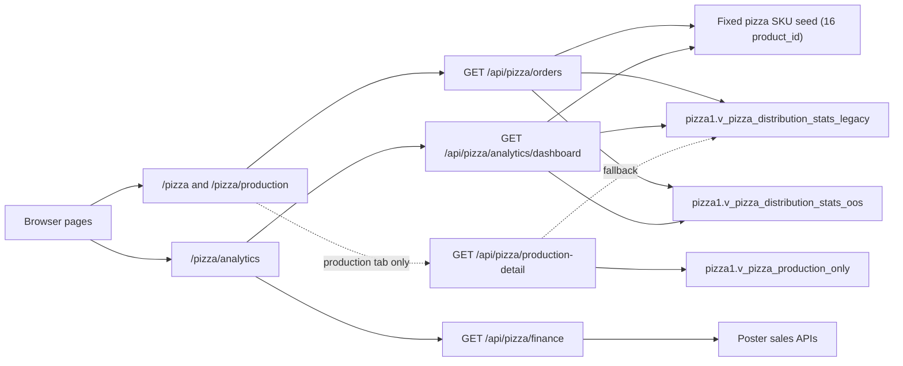
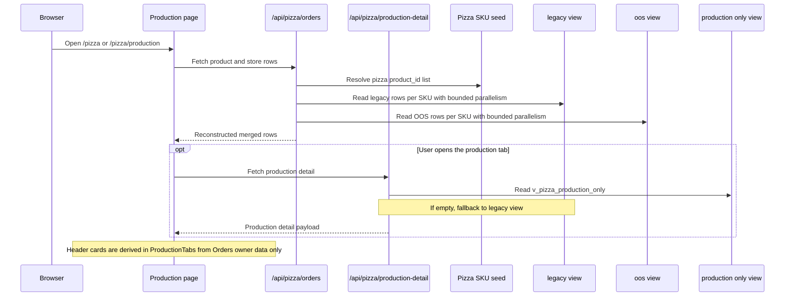

# Pizza runtime clean architecture

This document is the source of truth for the pizza operational runtime,
analytics boundaries, API contracts, and owner data sources. It captures the
current owner-layer behavior after the March 29-30, 2026 stabilization work.

## Overview

The pizza domain now uses separate owner paths for operational reads and sales
analytics.

- Operational production screens read from Supabase pizza owner data.
- Sales analytics reads from Poster directly.
- Read routes do not execute live sync as part of the request path.

This split matters for reliability. The operational workspace must load from
owner data that already exists in Supabase. Finance and sales analytics can use
Poster sales as their own owner source without contaminating production stock
routes.

## Clean architecture boundaries

The pizza module follows this boundary model:

- Presentation layer: page and component trees such as `/pizza`,
  `/pizza/production`, `/pizza/analytics`, `ProductionTabs.tsx`, and
  `PizzaSalesAnalytics.tsx`.
- Application layer: Next.js route handlers under `src/app/api/pizza/*`.
- Domain layer: pizza planning and metric rules such as the norm multiplier,
  forced `D3/D6` production for the special European pizza SKU, and the
  separation between operational and analytical concerns.
- Infrastructure layer: Supabase views in schema `pizza1`, Poster API, and
  helper clients such as `createServiceRoleClient()` and `posterRequest()`.

The critical owner rules are:

- UI components must not compensate for broken owner data.
- Read routes must not run live sync as a side effect.
- Business coefficients must live in the owner route or SQL owner layer.
- Heavy pizza read routes must not full-scan `pizza1.v_pizza_distribution_stats`.
- Runtime operational reads currently reconstruct the merge contract from
  `legacy + oos` because the direct merge-view path is unstable for
  some SKU queries.
- The pizza section presentation contract is Ukrainian-only for user-facing text.
- OOS in pizza means zero stock at a store, not stock below minimum.

## Owner-source matrix

| Route / surface | Business role | Owner source | Fallback | Notes |
|---|---|---|---|---|
| `/api/pizza/orders` | Production queue | `pizza1.v_pizza_distribution_stats_legacy` + `pizza1.v_pizza_distribution_stats_oos` | Fixed 16-SKU seed for per-SKU `product_id` reads | Supabase operational read, route reconstructs merge contract |
| `/api/pizza/summary` | Aggregate fallback only | `pizza1.v_pizza_distribution_stats_legacy` + `pizza1.v_pizza_distribution_stats_oos` | Fixed 16-SKU seed for per-SKU `product_id` reads | `total_norm = SUM(min_stock) * 2`, but `/pizza` header no longer depends on this route |
| `/api/pizza/production-detail` | Production fact | `pizza1.v_pizza_production_only` | `pizza1.v_pizza_distribution_stats_legacy` | Supabase operational read |
| `/api/pizza/analytics/dashboard` | Operational analytics | `pizza1.v_pizza_distribution_stats_legacy` + `pizza1.v_pizza_distribution_stats_oos` | Fixed 16-SKU seed for per-SKU `product_id` reads | Supabase operational read, route reconstructs merge contract |
| `/api/pizza/shop-stats` | Product store drill-down | `pizza1.v_pizza_distribution_stats_legacy` + `pizza1.v_pizza_distribution_stats_oos` | Fixed 16-SKU seed for per-SKU `product_id` reads | Supabase operational read, route reconstructs merge contract |
| `/api/pizza/distribution-stats` | Raw distribution diagnostics | `pizza1.v_pizza_distribution_stats_legacy` + `pizza1.v_pizza_distribution_stats_oos` | Fixed 16-SKU seed for per-SKU `product_id` reads | Supabase operational read, route reconstructs merge contract |
| `/pizza` header cards | Production header UI | `ProductionTask[]` from `/api/pizza/orders` | none | `ProductionTabs.tsx` computes fact stock, norm, fill index, and baked count locally from owner data already loaded by the page |
| `/api/pizza/finance` | Sales / revenue / trends | Poster sales APIs | none | Poster analytical read |

## Runtime topology



## Operational request lifecycle



## Owner rules and invariants

### Operational routes

- `GET /api/pizza/orders` reconstructs the merge contract from per-SKU
  reads over `pizza1.v_pizza_distribution_stats_legacy`,
  `pizza1.v_pizza_distribution_stats_oos`.
- `GET /api/pizza/summary` aggregates over the same reconstructed merge
  contract as `/api/pizza/orders`.
- `GET /api/pizza/production-detail` reads from
  `pizza1.v_pizza_production_only` and falls back to
  `pizza1.v_pizza_distribution_stats_legacy`.
- `GET /api/pizza/analytics/dashboard` reads the same reconstructed merge
  contract as `/api/pizza/orders`.
- None of these read routes runs `syncPizzaLiveDataFromPoster()`.

### Header card derivation

The `/pizza` header cards in `ProductionTabs.tsx` do not depend on
`/api/pizza/summary` or `/api/pizza/production-detail` at render time.

They are derived from already-loaded owner data:

- `Виробництво (Піца)` = sum of `todayProduction` from `ProductionTask[]`
- `Факт залишок` = sum of `totalStockKg` from `ProductionTask[]`
- `Норма` = `SUM(minStockThresholdKg) * 2` from `ProductionTask[]`
- `Індекс заповненостей` = `Факт залишок / Норма * 100`

This avoids silent zero-card regressions when the summary aggregate route is
slow or temporarily unavailable, and it removes a second header-level fetch
waterfall from the initial `/pizza` page load.

### Pizza product-id seed invariant

The runtime uses a fixed 16-SKU pizza seed when `pizza1.product_leftovers_map`
is unavailable because of DB grants.

The current seed is:

- `292, 294, 295, 297, 298, 300, 301, 573, 658, 659, 660, 879, 1054, 1055, 1098, 1099`

This seed matches the applied OOS migration seed and exists only to scope
batched Supabase reads safely.

Preferred owner source for this list:

- `pizza1.product_leftovers_map`

Runtime fallback if grants are missing:

- fixed seed in `src/lib/pizza-distribution-read.ts`

This fallback does not replace business metrics. It only determines which pizza
`product_id` values are queried from the Supabase owner views.

### Adaptive read-splitting invariant

Operational pizza read helpers do not fail the whole route on the first
multi-SKU timeout.

The runtime strategy is:

- try reading a batched `product_id` slice
- if Supabase returns `statement timeout`, split the slice into smaller groups
- continue splitting until the problematic batch is isolated
- only fail the route if a single-SKU read still times out

This keeps the owner contract intact while removing batch-level timeout
coupling between unrelated pizza SKU reads.

### Per-SKU read invariant

Operational pizza reads do not batch multiple pizza SKU into one Supabase
query on the hot path for `/api/pizza/orders`.

The runtime strategy is:

- resolve the active pizza SKU list
- read each SKU individually from `legacy` and `oos`
- run a bounded number of SKU reads in parallel
- merge rows only after both owner sources return for that SKU

This avoids the large latency penalty from one slow multi-SKU batch blocking
the rest of the page.

### Initial load invariant

The `/pizza` page renders the operational shell immediately. It does not hold
the whole route on a full-screen loader until `/api/pizza/orders` completes.

The runtime behavior is:

- render `ProductionTabs` immediately
- show metric and card skeletons while `orders` is loading
- fill header and matrix content from `ProductionTask[]` when the owner payload
  arrives

This keeps the page interactive and makes owner latency visible as loading
state instead of a blank screen.

### Pizza norm coefficient

The pizza summary route must preserve the business coefficient on norm:

- `total_norm = SUM(min_stock) * 2`

This coefficient directly drives:

- the **Norm** card on `/pizza/production`
- the **Fill index** card on `/pizza/production`

### Pizza OOS invariant

Within the pizza domain, OOS is defined strictly as:

- `stock_now == 0` at a store row

This means:

- OOS counters on stores count only zero-stock SKU rows
- red OOS highlights in pizza drawers and operational cards must only mark
  zero-stock positions
- stock below `min_stock` is still a deficit or replenishment signal, but it is
  not OOS

This invariant applies across:

- `/api/pizza/analytics/dashboard`
- `/pizza`
- `/pizza/production`
- product and store detail drawers

### Pizza presentation language invariant

The pizza section is Ukrainian-only in the presentation layer.

This applies to:

- `/pizza`
- `/pizza/production`
- `/pizza/analytics`
- logistics, simulator, drawers, KPI labels, and table headers

English developer naming may remain in internal TypeScript identifiers, but
user-visible strings in pizza surfaces must be Ukrainian.

### Analytics split

The pizza domain uses two separate analytical owners:

- operational analytics: Supabase owner data
- sales analytics: Poster sales APIs

## Swagger-style API contract

```yaml
openapi: 3.0.3
info:
  title: Pizza operational runtime API
  version: 2026-03-30
paths:
  /api/pizza/orders:
    get:
      summary: Get pizza distribution rows for production screens
      description: Reconstructs merged operational rows from legacy, OOS, and flags.
      responses:
        '200':
          description: Product-store rows for production screens
        '500':
          description: Owner read failure
  /api/pizza/summary:
    get:
      summary: Get pizza production header metrics
      description: Aggregates reconstructed merged operational rows.
      responses:
        '200':
          description: Aggregated owner metrics for production header cards
  /api/pizza/production-detail:
    get:
      summary: Get per-product baked quantity for production detail
      responses:
        '200':
          description: Grouped baked quantity by pizza product
  /api/pizza/analytics/dashboard:
    get:
      summary: Get operational analytics for pizza stock and need
      description: Reconstructs merged operational rows from legacy and OOS views.
      responses:
        '200':
          description: SKU, store, and signal analytics
        '500':
          description: Owner read failure
  /api/pizza/finance:
    get:
      summary: Get pizza sales analytics from Poster
      parameters:
        - in: query
          name: range
          schema:
            type: string
            enum: [7, 14, 30, custom]
        - in: query
          name: startDate
          schema:
            type: string
            format: date
        - in: query
          name: endDate
          schema:
            type: string
            format: date
      responses:
        '200':
          description: Revenue, quantity, trend, store, and SKU analytics
```

## Production analytics interaction

On `/pizza/production`, the signal surfaces reuse the existing detail drawers
instead of introducing a parallel detail UI.

- Top Risk cards open the existing product detail drawer.
- Top Need cards open the existing product detail drawer.
- Top OOS Stores cards open the existing store detail drawer.
- The main SKU, Stores, and Plan vs Fact tables follow the same clickable
  behavior.

## Production and analytics separation

The current page responsibilities are:

- `/pizza` and `/pizza/production`: operational execution, production stock,
  norm, fill index, production detail, logistics, and production planning.
- `/pizza/analytics`: sales analytics, trends, stores, top pizzas by revenue,
  period controls, and operational diagnostic tables.

## Decision log

1. Read routes do not run Poster sync.
2. Heavy pizza read routes must not full-scan `pizza1.v_pizza_distribution_stats`.
3. Production header metrics are derived from operational owner data.
4. Pizza norm keeps the `* 2` business coefficient in the owner route.
5. Sales analytics uses Poster sales as its owner source.
6. Operational analytics uses Supabase pizza views as its owner source.
7. Runtime operational routes reconstruct the merge contract from `legacy + oos` because the direct merge-view path is unstable for some SKU queries.
8. Runtime product-id scoping prefers `pizza1.product_leftovers_map` and falls back to the fixed 16-SKU seed when table grants are unavailable.
9. Pizza OOS means `stock_now == 0` and must not be overloaded with the below-minimum deficit rule.
10. Pizza user-facing screens must remain Ukrainian-only.

## Next steps

If you change pizza routes in the future, update this document together with:

- `docs/architecture.md`
- `docs/pizza-production-simulator-architecture.md`

Any change to owner-source, coefficients, route contracts, or runtime fallback
rules must be documented before the refactor is considered complete.
