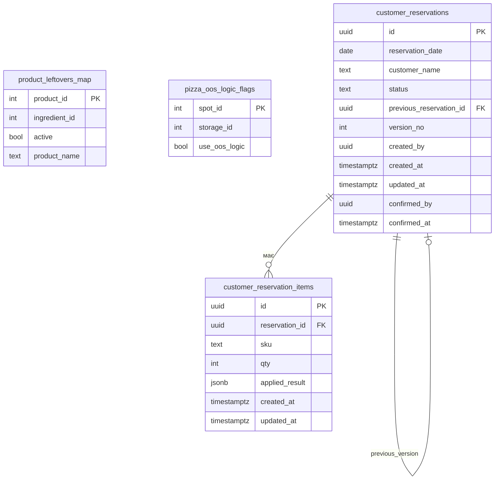
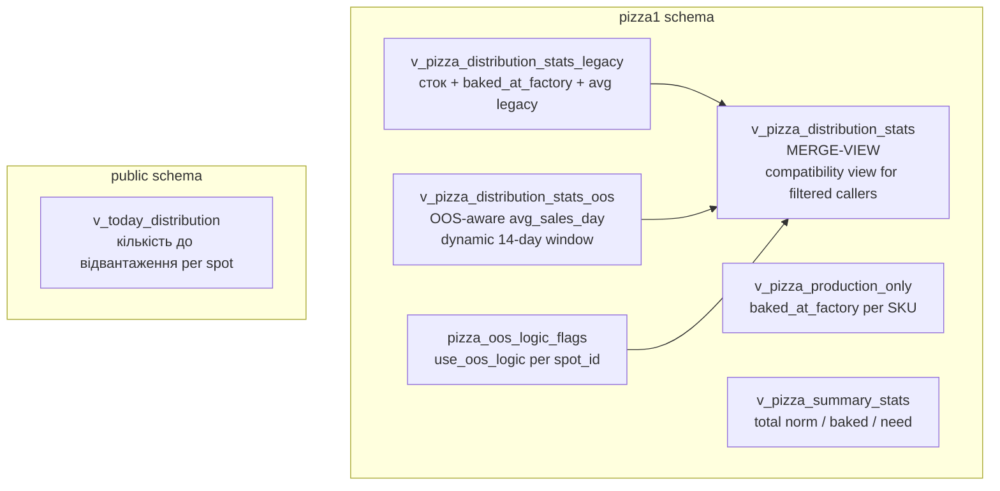
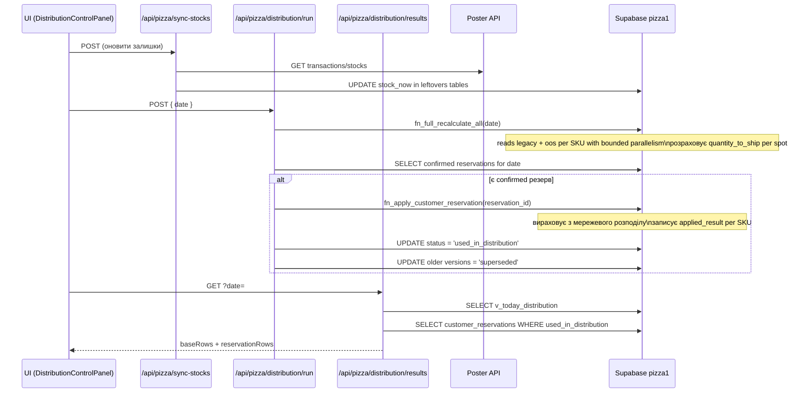
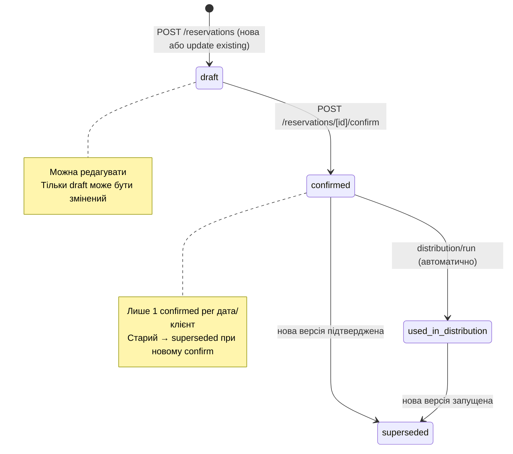
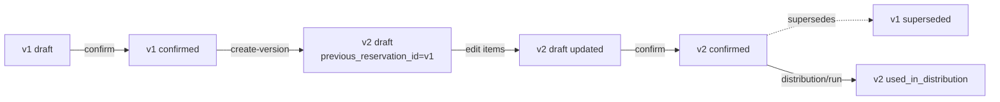
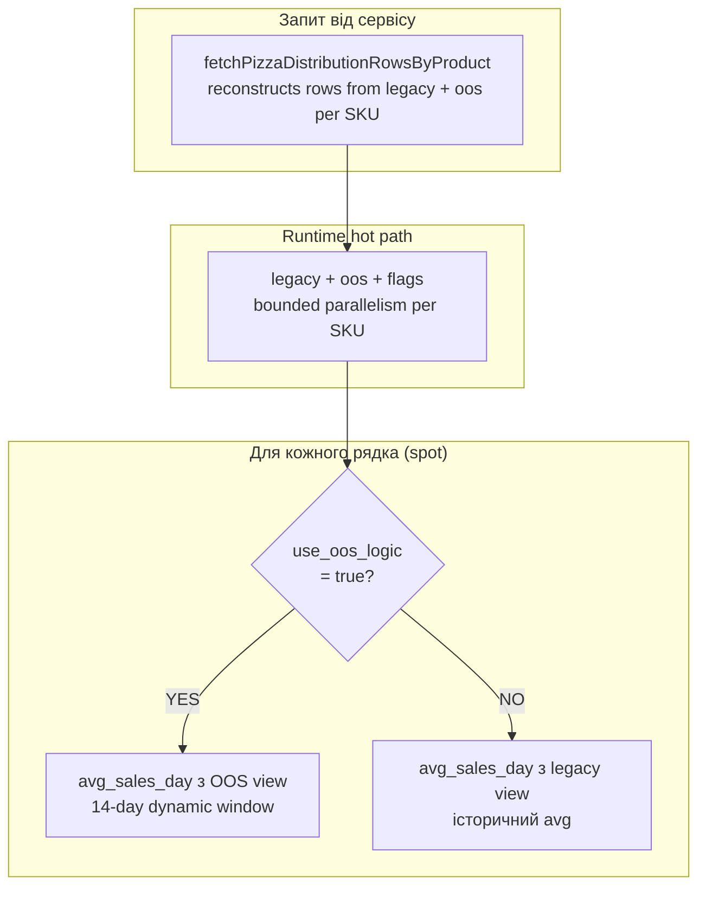

# Pizza System — Current State (2026-04-03)

Документ фіксує поточний технічний стан пицерійного модуля ERP.
Генерується автоматично під час аудиту.

---

## 1. Архітектура бази даних (схема `pizza1`)



### Views



**Merge-view логіка:**
```sql
CASE WHEN f.use_oos_logic = true AND o.avg_sales_day IS NOT NULL
     THEN o.avg_sales_day  -- OOS-aware (14-day rolling, виключає OOS дні)
     ELSE l.avg_sales_day  -- legacy avg
END
```

**OOS формула:**
```
avg_sales_day = sales_14d / available_days_14d
(fallback: / 14 якщо available_days_14d < 7)
```

---

## 2. Flow розподілу (Distribution)



---

## 3. Flow резервування (Reservation)



**Версіонування:**


---

## 4. Operational routing per SKU



**Стан флагів (23/23 магазини = 100% охоплення після шагу 4):**

| Група | Магазини | use_oos_logic |
|-------|----------|---------------|
| Всі 23 | Рівненська, Роша, Квартал, Білоруська, Герцена, Гравітон, Ентузіастів, Компас, Проспект, Садова, Шкільна + ін. | true |

---

## 5. API Route Map

```mermaid
graph LR
    subgraph "Pages"
        PP[/pizza/page.tsx]
        PRP[/pizza/production/page.tsx]
        PAP[/pizza/analytics/page.tsx]
    end

    subgraph "API Routes"
        OR[/api/pizza/orders]
        SS[/api/pizza/sync-stocks]
        SUM[/api/pizza/summary]
        SHO[/api/pizza/shop-stats?pizza=]
        DS[/api/pizza/distribution-stats]
        DR[/api/pizza/distribution/run]
        DRR[/api/pizza/distribution/results]
        PD[/api/pizza/production-detail]
        AN[/api/pizza/analytics/dashboard]
        RES[/api/pizza/reservations]
        CON[/api/pizza/reservations/[id]/confirm]
        CV[/api/pizza/reservations/[id]/create-version]
        FIN[/api/pizza/finance/summary]
    end

    PP --> OR
    PP --> SUM
    PRP --> PD
    PAP --> AN

    OR --> DB[(Supabase\npizza1)]
    SS --> DB
    SUM --> DB
    SHO --> DB
    DS --> DB
    DR --> DB
    DRR --> DB
    PD --> DB
    AN --> DB
    RES --> DB
    CON --> DB
    CV --> DB
    FIN --> DB
```

---

## 6. Шар OOS (Out-of-Stock aware avg_sales_day)

```mermaid
graph TD
    W[Вікно: [today-14d, today) в часовому поясі Kyiv]
    TS[Транзакції з Poster за 14 днів]
    IS[Залишки по днях]

    W --> QQ[Запит до v_pizza_distribution_stats_oos]
    TS --> QQ
    IS --> QQ

    QQ --> |available_days ≥ 7| CALC[avg = sales_14d / available_days_14d]
    QQ --> |available_days < 7| FALL[fallback: avg = sales_14d / 14]
    CALC --> MS[min_stock = ceil_avg × коефіцієнт магазину]
    FALL --> MS
```

---

*Дата фіксації: 2026-04-03*
*Джерело: аудит codebase + перевірка DB*
