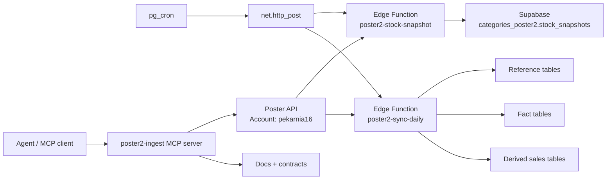
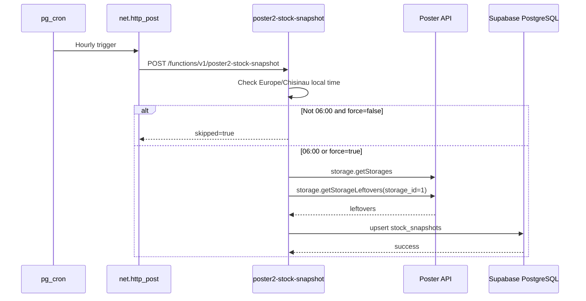
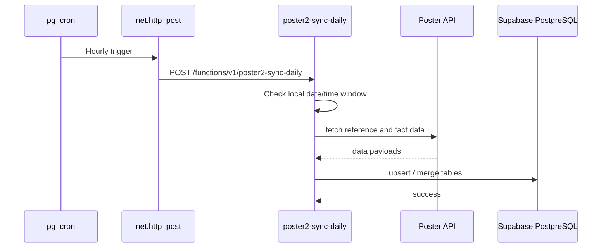

# Poster2 Ingest

`poster2-ingest` is the isolated integration contour for the second Poster account. It is responsible for pulling operational data from Poster, persisting it into Supabase, and keeping the data contract documented so the rest of the system can consume it safely.

This folder is the entry point for everything related to Poster2:
- data ingestion
- scheduling
- Supabase function execution
- schema and migration notes
- MCP handoff for agent work
- operational runbooks and architecture decisions

If you are looking for UI pages, production dashboards, or ERP-facing screens, those live in the main app, not here.

## What This Contour Does

Poster2 currently covers two main jobs:

1. Snapshot the storage leftovers for the Poster account and persist them as a daily inventory snapshot.
2. Run a daily synchronization that pulls the reference tables, transactional data, and derived sales tables needed by downstream analytics.

The current target account is:
- Poster account: `pekarnia16`
- Storage ID: `1`
- Spot ID: `1`
- Supabase schema: `categories_poster2`

## Why It Is Separate

Poster2 is intentionally kept separate from the main application layer because the integration boundary is different from the UI boundary.

That separation gives us:
- a stable contract for external API access
- a clear place for scheduled jobs
- a dedicated schema in Supabase
- easier debugging of sync issues
- cleaner transfer of code and migrations into the main repo later

## High-Level Architecture

## Runtime Flow

Snapshot flow:

Daily sync flow:

## Scheduling

The jobs are hourly triggers with local-time guards inside the function.

Current rules:
- Snapshot job: runs on the hour, writes only at `06:00` local time in `Europe/Chisinau`
- Daily sync job: runs on the hour, writes only in the configured daily window
- Manual forcing is supported for the snapshot function with `force=true`

This avoids DST drift and keeps database scheduling simple.

## Data Coverage

### Snapshot data
The snapshot job stores ingredient leftovers per storage and per date.

Primary key:
- `snapshot_date`
- `storage_id`
- `ingredient_id`

### Daily sync data
The daily sync job currently targets:

Reference tables:
- `spots`
- `storages`
- `categories`
- `products`
- `product_modifications`
- `product_prices`
- `ingredients`
- `clients`
- `employees`

Fact tables:
- `transactions`
- `transaction_items`
- `sold_products_detailed`
- `manufactures`
- `manufacture_items`

Derived tables:
- `daily_sales`
- `hourly_sales`
- `product_sales`
- `category_sales`

## Current Limitations

These API gaps were confirmed from the live Poster account:

- `storage.getIngredients` is unavailable, so ingredient data is backfilled from storage leftovers
- `clients.getClientGroups` is unavailable, so client group tables are not populated yet
- `storage.getWriteOffs` and `storage.getWriteOffProducts` are unavailable
- `storage.getMovements` and `storage.getMovingProducts` are unavailable

The following tables remain deferred until the account exposes the needed endpoints:
- `ingredient_categories`
- `client_groups`
- `client_group_properties`
- `write_offs`
- `write_off_items`
- `movements`
- `movement_items`

## Repository Layout

- [`README.md`](./README.md) - this entry point
- [`openapi.yaml`](./openapi.yaml) - API contract for the Poster2 contour
- [`operations.md`](./operations.md) - runbook and operational steps
- [`clean-architecture.md`](./clean-architecture.md) - architecture boundaries and layers
- [`mcp-server.md`](./mcp-server.md) - agent handoff and MCP usage
- [`poster-api-study.md`](./poster-api-study.md) - notes from exploring the Poster API
- [`audit-2026-03-31.md`](./audit-2026-03-31.md) - audit snapshot of the contour
- [`adr/`](./adr) - architecture decision records

Key runtime artifacts:
- [`supabase/functions/poster2-stock-snapshot/index.ts`](../../supabase/functions/poster2-stock-snapshot/index.ts)
- [`supabase/functions/poster2-sync-daily/index.ts`](../../supabase/functions/poster2-sync-daily/index.ts)
- [`mcp/poster2-ingest-mcp-server.mjs`](../../mcp/poster2-ingest-mcp-server.mjs)
- [`mcp/supabase-project-data-mcp-server.mjs`](../../mcp/supabase-project-data-mcp-server.mjs)
- [`supabase/migrations/20260330_categories_poster2_clone.sql`](../../supabase/migrations/20260330_categories_poster2_clone.sql)
- [`supabase/migrations/20260330_poster2_stock_snapshot_schedule.sql`](../../supabase/migrations/20260330_poster2_stock_snapshot_schedule.sql)
- [`supabase/migrations/20260331_poster2_daily_sync_schedule.sql`](../../supabase/migrations/20260331_poster2_daily_sync_schedule.sql)

## Environment Variables

The contour expects these variables:

- `POSTER_ACCOUNT`
- `POSTER_TOKEN`
- `POSTER_STORAGE_ID`
- `POSTER_SPOT_ID`
- `POSTER_TARGET_SCHEMA`
- `POSTER_TIMEOUT_MS`
- `NEXT_PUBLIC_SUPABASE_URL`
- `NEXT_PUBLIC_SUPABASE_ANON_KEY`
- `SUPABASE_SERVICE_ROLE_KEY`
- `SUPABASE_ALLOWED_TABLES`
- `SUPABASE_ALLOW_MUTATIONS`

Important Supabase-side requirement:
- `categories_poster2` must be included in `PGRST_DB_SCHEMAS`

## Deployment Notes

The self-hosted Supabase Edge Functions are executed through the Coolify runtime.

Operational facts:
- the runtime router is `main/index.ts`
- the deployed function code must exist in the persistent volume, not only in the running container
- the function endpoints are dispatched by function folder name

This means the filesystem layout matters, not just the source code inside Git.

## How To Work On Poster2

Recommended workflow:

1. Update the function or migration code.
2. Update the matching doc files in this folder.
3. Check whether the change affects scheduling, schema, or external API assumptions.
4. If the contract changed, update `openapi.yaml` and the relevant ADR file.
5. Keep `operations.md` aligned with the real deployment steps.

If you add a new sync flow, update these first:
- `README.md`
- `openapi.yaml`
- `operations.md`
- `clean-architecture.md`
- relevant ADRs

## Troubleshooting

If a job does not run:
- confirm the cron schedule exists
- confirm the function can reach the Poster API
- confirm the target schema is exposed by PostgREST
- confirm the env vars are present in the runtime
- confirm the function is deployed into the persistent volume

If writes fail:
- check `PGRST_DB_SCHEMAS`
- verify `POSTER_TOKEN`
- verify the target table names in `categories_poster2`
- inspect the corresponding function logs

If a snapshot is skipped:
- check the local time guard
- verify the server timezone interpretation
- re-run the function with `force=true` if manual recovery is needed

## Decision Record

The main design decisions are:
- keep the ingestion contour separate from UI code
- treat Poster2 as a contract-driven integration
- store raw facts and snapshots before deriving analytics
- schedule hourly, but gate by local business time inside the function
- document every new flow before rollout

## Documentation Rule

Every change in this contour must be reflected in the project documentation:
- Mermaid diagrams for data flow and runtime flow
- Swagger/OpenAPI for API contracts
- Clean Architecture notes for boundaries and dependencies

If code changes but these documents do not change, the work is incomplete.

## Related Docs

- [Clean Architecture](./clean-architecture.md)
- [Operations](./operations.md)
- [MCP Server](./mcp-server.md)
- [OpenAPI](./openapi.yaml)
- [Poster API Study](./poster-api-study.md)
- [Audit Snapshot](./audit-2026-03-31.md)
- [ADR directory](./adr)
