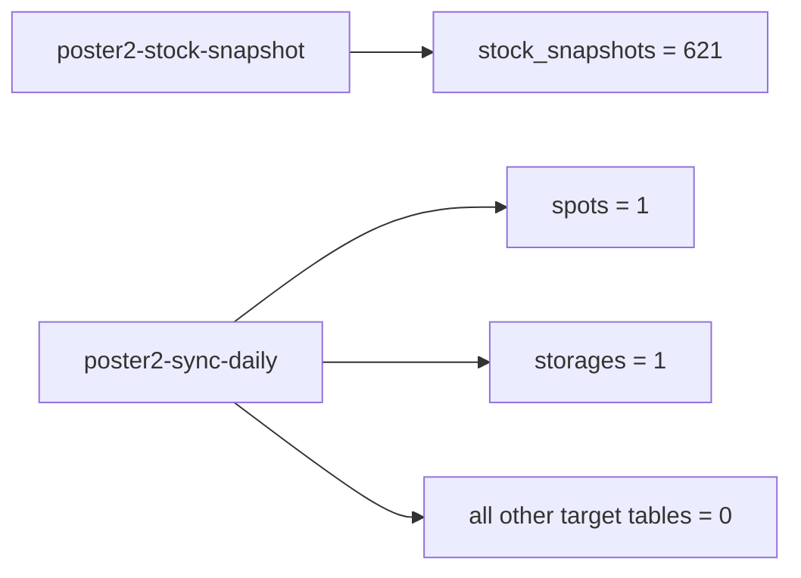

# Poster2 Audit 2026-03-31

## Scope
This audit covers the actual state of schema `categories_poster2` after:
- successful deployment of `poster2-stock-snapshot`
- partial rollout of `poster2-sync-daily`
- introduction of repository-local MCP servers

## MCP Verification
Validated MCP servers:
- `poster2-ingest-project`
- `supabase-project-data`

Confirmed:
- both servers complete MCP `initialize`
- `poster2-ingest-project` returns sync-contract data
- `supabase-project-data` reads `categories_poster2.stock_snapshots` through schema-aware PostgREST profile headers

## Current Data State

## Row Counts
### Non-empty
- `spots`: `1`
- `storages`: `1`
- `stock_snapshots`: `621`

### Empty
- `categories`
- `products`
- `product_modifications`
- `product_prices`
- `ingredients`
- `clients`
- `employees`
- `transactions`
- `transaction_items`
- `sold_products_detailed`
- `manufactures`
- `manufacture_items`
- `daily_sales`
- `hourly_sales`
- `product_sales`
- `category_sales`
- `ingredient_categories`
- `client_groups`
- `client_group_properties`
- `write_offs`
- `write_off_items`
- `movements`
- `movement_items`
- `agent_knowledge`
- `holidays`
- `category_visibility`

## Freshness
- `stock_snapshots.latest_business_date = 2026-03-30`
- `stock_snapshots.rows_on_latest_date = 621`
- `transactions.latest_business_date = null`
- `manufactures.latest_business_date = null`
- `daily_sales.latest_business_date = null`
- `hourly_sales.latest_business_date = null`
- `product_sales.latest_business_date = null`
- `category_sales.latest_business_date = null`

## Confirmed Reference Rows
### `spots`
- `spot_id = 1`
- `name = "пекарня-кондитерська 1"`

### `storages`
- `storage_id = 1`
- `storage_name = "пекарня-кондитерська 1"`
- `spot_id = 1`

## Key Finding
`poster2-sync-daily` has not completed a successful end-to-end load into `categories_poster2`.

Evidence:
- only the earliest lightweight reference rows exist
- categories and all downstream tables remain empty
- the first confirmed failure was on `categories_poster2.categories`

## Root Cause Already Confirmed
The first blocking defect was:
- `categories.id` is `GENERATED ALWAYS AS IDENTITY`
- daily sync tried to insert a non-default value into `categories.id`

Verified database fact:
- `categories.id`: `is_identity = YES`, `identity_generation = ALWAYS`

Related identity facts:
- `transaction_items.id`: `BY DEFAULT`
- `manufacture_items.id`: `BY DEFAULT`

## Operational Interpretation
- snapshot contour is operational
- daily sync contour is deployed but not yet operational
- reference/fact/derived layer must still be considered incomplete

## Required Next Step
Redeploy the corrected `poster2-sync-daily` implementation and rerun a forced sync for one known date window.

Target validation after rerun:
- `categories > 0`
- `products > 0`
- `employees > 0`
- `transactions >= 0`
- `manufactures >= 0`
- derived tables populated when source fact rows exist
