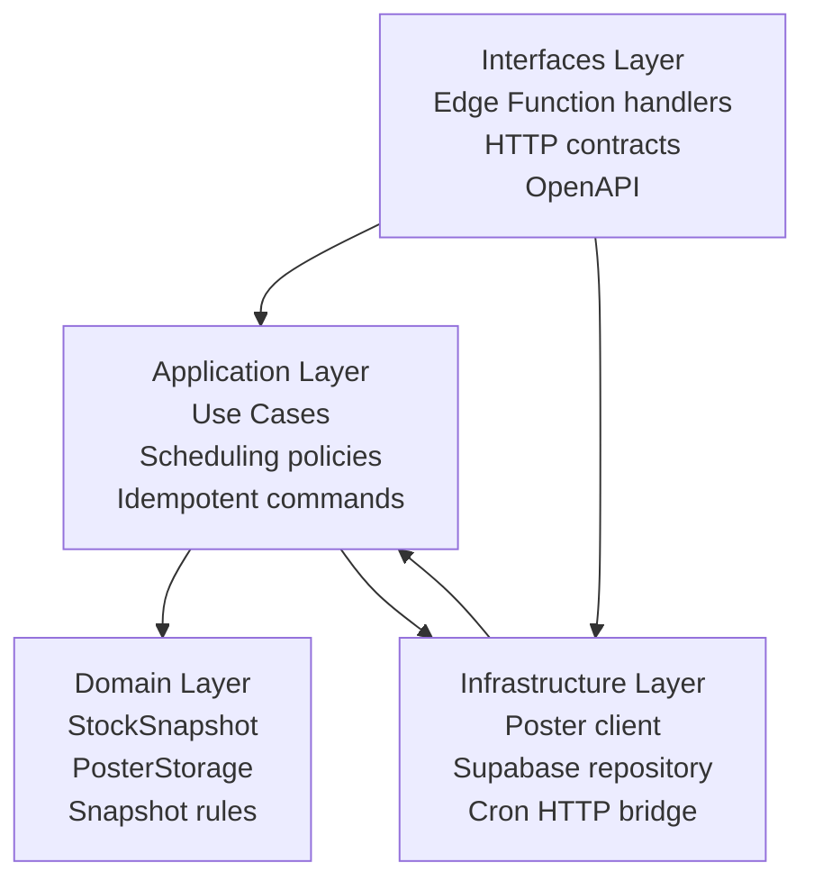
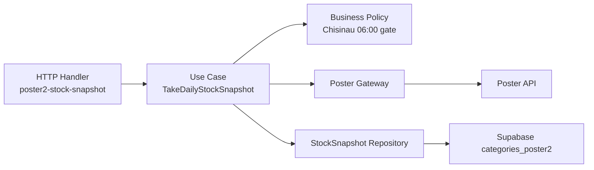

# Clean Architecture: Poster2 Ingest

## Architectural Intent
The ingest contour follows Clean Architecture to prevent scheduling, Poster API access, and storage persistence from leaking directly into UI or business modules.

## Layer Model

## Domain
Core domain objects:
- `StockSnapshot`
- `PosterStorage`
- `PosterLeftover`
- `SnapshotWindow`

Core rules:
- one logical stock fact per `(snapshot_date, storage_id, ingredient_id)`
- business date is evaluated in `Europe/Chisinau`
- snapshot creation must be idempotent
- raw Poster payload is preserved for auditability

Domain invariants:
- `ingredient_id > 0`
- `storage_id` is required
- `snapshot_date` is a business date, not raw UTC timestamp
- duplicate runs overwrite rather than append

## Application
Use cases currently defined:
- `TakeDailyStockSnapshot`
- `RunPoster2DailySync`
- `ExplorePoster2Capabilities`
- `ExposePoster2SyncContract`

Planned use cases:
- `SyncPoster2ReferenceData`
- `SyncPoster2Transactions`
- `SyncPoster2Manufactures`
- `BackfillPoster2Range`

Application responsibilities:
- enforce local-time execution window
- orchestrate calls to Poster and persistence adapters
- decide whether the function should skip or write
- return operational result payloads for monitoring

## Infrastructure
Infrastructure responsibilities:
- execute HTTP requests to Poster API
- map Poster payloads into storage DTOs
- persist data to Supabase via service-role client
- accept cron-triggered HTTP invocations

Infrastructure details for the current contour:
- runtime: Supabase Edge Functions under self-hosted Coolify
- runtime: repository-local `poster2-ingest-project` MCP server over stdio
- scheduler: `pg_cron` + `net.http_post`
- persistence: `categories_poster2.stock_snapshots`
- persistence: `categories_poster2` reference, fact, and derived sales tables
- runtime dispatch: `main/index.ts` resolves `/home/deno/functions/<service-name>`
- deployment source: Coolify persistent volume mounted into `/home/deno/functions`
- REST allowlist dependency: `categories_poster2` must be exposed through `PGRST_DB_SCHEMAS`

## Interfaces
Current interface:
- `POST /functions/v1/poster2-stock-snapshot`
- `POST /functions/v1/poster2-sync-daily`
- `stdio MCP server: poster2-ingest-project`

Interface rules:
- `POST` only
- optional body field `force: boolean`
- function returns `skipped=true` outside the business window
- function returns `rowCount` after successful persistence
- upstream routing is handled by the self-hosted `main/index.ts` function router
- daily sync defaults to the previous Chisinau business day unless `dateFrom/dateTo` are supplied explicitly
- MCP tools return repository context, sync contract, and live Poster discovery results without writing to Supabase

## Component Diagram

## Responsibility Split
- Domain does not know about HTTP, cron, Coolify, or Supabase.
- Application does not know raw container/runtime deployment details.
- Infrastructure does not decide business time rules.
- Interfaces do not hold persistence logic.

## Extension Rules
Any new Poster2 flow must be added with the same layering:
- new use case in application layer
- explicit DTO/repository adapter in infrastructure
- dedicated contract in OpenAPI
- sequence diagram update in documentation
- ADR when the flow changes data ownership or scheduling semantics

## Migration Strategy To Main Repository
When the main project storage becomes available, move:
- function code
- SQL migrations
- OpenAPI contract
- ADR documents
- scheduling documentation

Do not move:
- ad hoc test scripts
- undocumented secrets
- environment-specific URLs without parametrization
