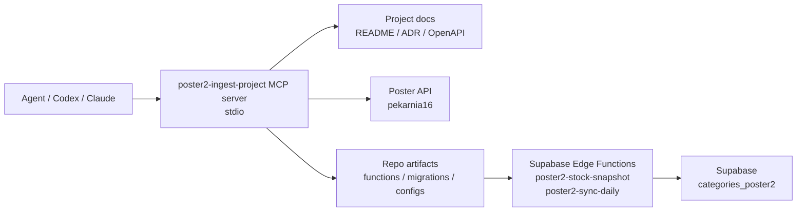

# Poster2 MCP Server

## Purpose
This project now ships two repository-local MCP servers:
- `poster2-ingest-project`
- `supabase-project-data`

`poster2-ingest-project` is the Poster-facing MCP server for agent work around the second Poster account. Its job is not to replace the production Edge Functions. Its job is to give another agent a stable, portable interface for:
- discovering which Poster methods are actually exposed by the target account
- reading the project sync contract without reopening half the repository
- validating table-to-endpoint mappings before editing ingest code
- calling Poster methods directly in a controlled, documented way

This server is intentionally stored inside the repository so it moves with the project during transfer.

## Position In Architecture

## Clean Architecture Placement
- `interfaces`: MCP tool schemas and stdio transport
- `application`: sync contract and discovery workflows exposed to agents
- `infrastructure`: HTTP calls to Poster API and repo path resolution
- `domain`: stable concepts such as account, storage, target schema, implemented vs deferred tables

The MCP server is a research and coordination interface. It does not own production persistence.

## Tools
### `poster_project_context`
Returns:
- account, storage, spot, target schema
- validated runtime constraints
- local file paths for functions, migrations, docs, and `.mcp.json`
- previously validated method availability snapshot

Use it first when a new agent enters the repo.

### `poster_sync_contract`
Returns the maintained mapping:
- `reference`
- `facts`
- `derived`
- `deferred`
- `manual`

Each row states the target table, source method, implementation status, and notes.

### `poster_discover_methods`
Probes curated Poster method groups:
- `reference`
- `clients`
- `sales`
- `inventory`
- `all`

Each result includes:
- method
- params used
- status
- row count when available
- sample keys
- preview rows or error

### `poster_call_method`
Direct Poster GET call for controlled inspection.

Modes:
- `summary`: counts and keys only
- `preview`: a small preview slice
- `raw`: limited normalized payload

## Project Data MCP
`supabase-project-data` is the Supabase-facing MCP server for project data inspection.

Primary tools:
- `tables_list`
- `table_schema`
- `query_database`
- `mutate_database`
- `auth_set_access_token`
- `storage_list_buckets`
- `storage_list_files`

Use it when an agent needs to:
- discover which PostgREST tables are actually exposed
- inspect table schemas without leaving MCP
- run safe read queries against project data
- inspect Storage buckets and files

This server is self-contained and uses direct HTTP calls to PostgREST and Storage APIs, so it is portable across project transfer without MCP SDK installation.

## Environment Contract
Required for live Poster calls:
- `POSTER_TOKEN` or `POSTER_API_TOKEN`

Optional overrides:
- `POSTER_ACCOUNT`
- `POSTER_STORAGE_ID`
- `POSTER_SPOT_ID`
- `POSTER_TARGET_SCHEMA`
- `POSTER_TIMEOUT_MS`

The server still starts without a token. In that state, non-network tools continue to work and live tools return actionable errors.

## Project Configuration
The repository root contains [.mcp.json](/D:/Programs/Начальник%20виробництва1111/.mcp.json) so another agent can attach the server without rebuilding project context manually.

Configured entrypoint:
- [poster2-ingest-mcp-server.mjs](/D:/Programs/Начальник%20виробництва1111/mcp/poster2-ingest-mcp-server.mjs)
- [supabase-project-data-mcp-server.mjs](/D:/Programs/Начальник%20виробництва1111/mcp/supabase-project-data-mcp-server.mjs)

## Transport
Transport is `stdio`, implemented as a self-contained JSON-RPC/MCP process. This was chosen deliberately:
- no extra SDK install is required just to start the server
- transfer to another machine or agent is simpler
- the repo keeps its own agent interface

## Operational Rule
Use this MCP server for discovery, validation, and planning.

Do not use it as a substitute for:
- `poster2-stock-snapshot`
- `poster2-sync-daily`
- `pg_cron`
- production Supabase persistence
