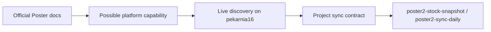

# Poster API Study

## Purpose
This document captures two separate things:
- what the official Poster developer materials establish
- what was verified against the real `pekarnia16` account for this project

This split is important. Poster documentation describes the platform, but actual endpoint availability can vary by account, permissions, or enabled modules. For `poster2-ingest`, live discovery is part of the contract.

## Source Model
Official source tier:
- Poster developer portal: [Poster for developers](https://dev.joinposter.com/en)
- Poster API entrypoint: [Poster API Documentation](https://dev.joinposter.com/en/docs/v3/start/index?id=getting-started)
- Poster API FAQ entrypoint: [Poster API FAQ](https://dev.joinposter.com/ua/docs/v3/start/faq)

Project validation tier:
- live Poster calls against account `pekarnia16`
- repository-local MCP server `poster2-ingest-project`
- production-oriented sync contract documented in this repository

## Reading Rule

The project must not assume that a documented Poster endpoint is available for `pekarnia16` until discovery confirms it.

## What The Official Docs Confirm
From the official developer portal:
- Poster provides a web API for reading and editing account information.
- Poster positions the API as the main integration surface for POS, inventory, finance, analytics, and CRM workflows.
- The developer portal is the canonical source for API, FAQ, and integration guidance.

Inference from the official portal and live behavior:
- the API is account-scoped via Poster subdomain
- methods are exposed as GET-style endpoints under `/api/<method>`
- account capabilities are not safely inferable from docs alone

## What Was Verified For `pekarnia16`
### Available
- `spots.getSpots`
- `storage.getStorages`
- `storage.getStorageLeftovers`
- `storage.getManufactures`
- `menu.getCategories`
- `menu.getProducts`
- `access.getEmployees`
- `clients.getClients`
- `dash.getTransactions`
- `dash.getTransactionProducts`

### Unavailable During Validation
- `storage.getIngredients`
- `clients.getClientGroups`
- `storage.getWriteOffs`
- `storage.getWriteOffProducts`
- `storage.getMovements`
- `storage.getMovingProducts`

## Project Implications
### Confirmed ingest sources
- `spots` <= `spots.getSpots`
- `storages` <= `storage.getStorages`
- `categories` <= `menu.getCategories`
- `products` <= `menu.getProducts`
- `product_prices` <= `menu.getProducts`
- `employees` <= `access.getEmployees`
- `clients` <= `clients.getClients`
- `transactions` <= `dash.getTransactions`
- `transaction_items` <= `dash.getTransactionProducts`
- `manufactures` <= `storage.getManufactures`
- `manufacture_items` <= `storage.getManufactures.products[]`
- `stock_snapshots` <= `storage.getStorageLeftovers`
- `ingredients` <= `storage.getStorageLeftovers` as fallback source

### Deferred because docs are not enough and account validation failed
- `ingredient_categories`
- `client_groups`
- `client_group_properties`
- `write_offs`
- `write_off_items`
- `movements`
- `movement_items`

## Integration Rule Set
- Treat Poster docs as platform documentation, not as account-specific truth.
- Run discovery before adding a new sync source.
- Update the MCP sync contract before expanding production functions.
- Do not implement a table mapping only because a method name appears in docs.

## MCP Role
`poster2-ingest-project` exists precisely to make this repeatable for another agent after transfer:
- inspect current project context
- inspect the maintained sync contract
- probe live method availability
- call a specific Poster method in controlled mode

## Limitation
The public search index did not surface method-by-method documentation pages reliably for the exact endpoints used here. Because of that, exact per-method behavior for this project was established by live discovery against `pekarnia16`, with the official Poster developer portal used as the primary source for platform-level guidance.
