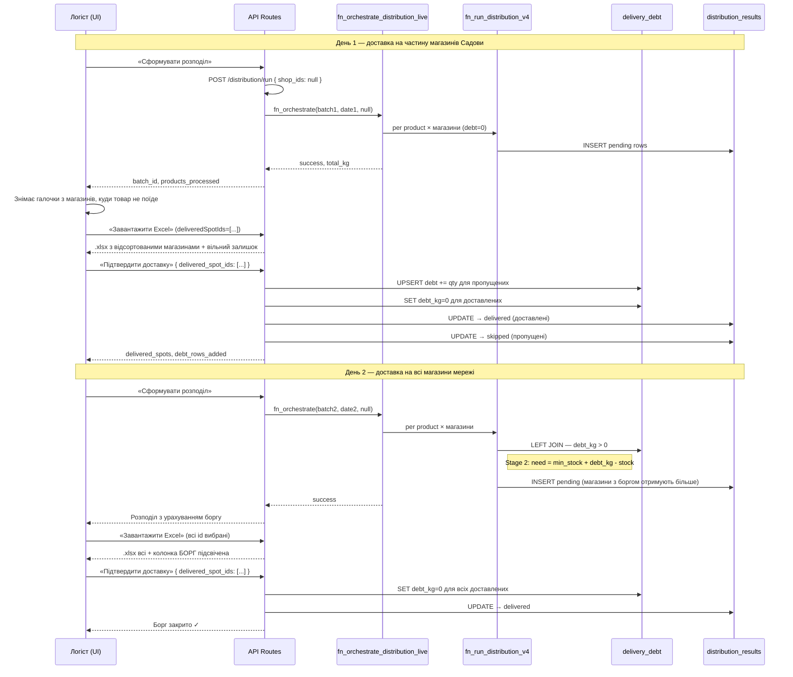
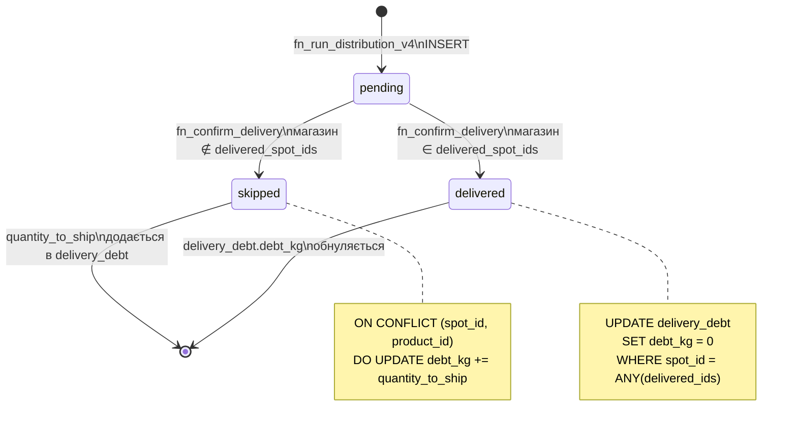
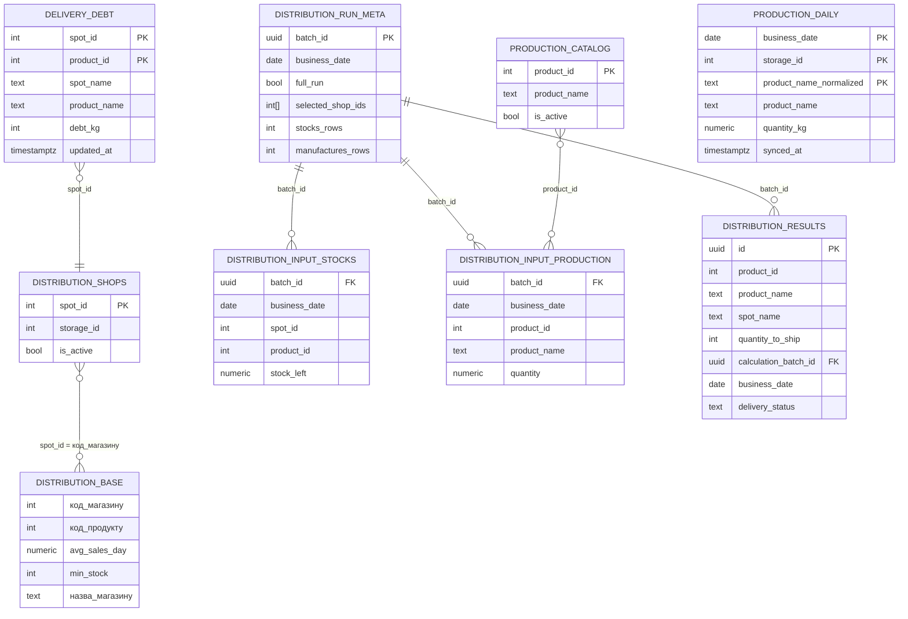

# Sadova — Distribution Full Architecture

Повний опис системи розподілу продукції цеху Садова (аналог Гравитона):
10-крокова логіка, Clean Architecture шари, Mermaid діаграми, OpenAPI контракти.

> Система Садова є повним автономним дзеркалом архітектури Гравитон, що працює у схемі `sadova1` з власним переліком магазинів та своїми виробничими потужностями.

---

## 1. Бізнес-сценарій (10 кроків)

```
Крок 1   Розподіл запускається ЗАВЖДИ по всіх магазинах мережі Садова (null shop_ids)
         → fn_orchestrate_distribution_live → fn_run_distribution_v4
         → sadova1.distribution_results (status=pending)

Крок 2   Логіст вибирає магазини, які ФІЗИЧНО отримують товар сьогодні
         (чекбокси у UI)

Крок 3   Логіст натискає «Підтвердити доставку»
         POST /api/sadova/confirm-delivery { delivered_spot_ids: [...] }

Крок 4   Excel формується тільки для вибраних магазинів + "Вільні залишки"
         Дані кількостей — з distribution_results (крок 1)
         Борг — з delivery_debt (якщо є з попередніх днів)

Крок 5   По пропущених магазинах формується борг
         fn_confirm_delivery → INSERT/UPSERT delivery_debt (+=quantity_to_ship)
         distribution_results: pending → skipped для пропущених
         distribution_results: pending → delivered для доставлених

Крок 6   Борг фіксується в Supabase:
         sadova1.delivery_debt (spot_id, product_id, debt_kg)
         Колонка "Борг" в Excel = debt_kg для цього spot+product

Крок 7   Наступного дня: логіст запускає новий розподіл по всіх магазинах
         fn_run_distribution_v4 JOIN delivery_debt:
           Stage 2: need = min_stock + debt_kg - (stock + already_allocated)
         → магазини з боргом отримують пріоритет

Крок 8   Логіст підтверджує доставку для всіх магазинів

Крок 9   Excel показує кількість розподілу + колонку БОРГ (з бека delivery_debt)
         Борг підсвічується amber кольором в Excel

Крок 10  fn_confirm_delivery SET debt_kg = 0 для всіх delivered_spot_ids
         Борг очищено — починаємо чистий цикл
```

---

## 2. Clean Architecture

```
┌─────────────────────────────────────────────────────────────────────────┐
│  FRAMEWORKS & DRIVERS (Infrastructure)                                  │
│                                                                         │
│  • Supabase PostgreSQL (schema: sadova1, categories)                    │
│  • Poster POS API — live stocks (storage.getStorageLeftovers)           │
│                     live production (storage.getManufactures)           │
│  • Supabase Edge Function — poster-live-stocks (batch fetch)            │
│  • Next.js 16 App Router — API Routes + React Client Components         │
│  • ExcelJS — генерація .xlsx файлів                                     │
└───────────────────────────┬─────────────────────────────────────────────┘
                            │
┌───────────────────────────▼─────────────────────────────────────────────┐
│  INTERFACE ADAPTERS (API Routes)                                        │
│                                                                         │
│  POST /api/sadova/distribution/run                                      │
│    → приймає shop_ids (null = всі), запускає повний цикл                │
│                                                                         │
│  POST /api/sadova/confirm-delivery                                      │
│    → фіксує факт доставки, записує борг                                 │
│                                                                         │
│  GET  /api/sadova/confirm-delivery?date=                                │
│    → поточний борг + pending рядки для UI                               │
│                                                                         │
│  GET  /api/sadova/shops                                                 │
│    → активні магазини з distribution_shops + categories.spots           │
│                                                                         │
│  POST /api/sadova/sync-stocks                                           │
│    → синхронізує залишки та виробництво з Poster                        │
│    → зберігає в production_daily (кеш)                                  │
│                                                                         │
│  GET  /api/sadova/production-daily?date=                                │
│    → кеш виробництва з БД (миттєве завантаження)                        │
└───────────────────────────┬─────────────────────────────────────────────┘
                            │
┌───────────────────────────▼─────────────────────────────────────────────┐
│  USE CASES (Application Business Rules — PostgreSQL Functions)          │
│                                                                         │
│  fn_orchestrate_distribution_live(batch_id, date, shop_ids)             │
│    → обходить всі продукти каталогу                                     │
│    → для кожного викликає fn_run_distribution_v4                        │
│                                                                         │
│  fn_run_distribution_v4(product_id, batch_id, …)                        │
│    Stage 1: закрити критичний дефіцит (stock < min_stock)               │
│    Stage 2: пріоритетний поповнення з урахуванням боргу                 │
│             need = min_stock + debt_kg - (effective_stock + qty)        │
│    Stage 3: top-up до 4x min_stock (рівномірно)                         │
│                                                                         │
│  fn_confirm_delivery(date, delivered_spot_ids[])                        │
│    A: UPSERT delivery_debt += quantity_to_ship (для пропущених)         │
│    B: SET debt_kg = 0 (для доставлених)                                 │
│    C: UPDATE distribution_results → delivered / skipped                 │
└───────────────────────────┬─────────────────────────────────────────────┘
                            │
┌───────────────────────────▼─────────────────────────────────────────────┐
│  ENTITIES (Enterprise Business Rules — Tables)                          │
│                                                                         │
│  sadova1.distribution_results    — результати розподілу (pending/…)     │
│  sadova1.delivery_debt           — борг по магазину + продукту          │
│  sadova1.distribution_base       — норми: avg_sales, min_stock          │
│  sadova1.distribution_shops      — активні магазини мережі              │
│  sadova1.distribution_input_stocks    — знімок залишків на момент run   │
│  sadova1.distribution_input_production — знімок виробництва на момент   │
│  sadova1.distribution_run_meta   — метадані партії                      │
│  sadova1.production_catalog      — каталог продуктів цеху               │
│  sadova1.production_daily        — кеш виробництва за день              │
└─────────────────────────────────────────────────────────────────────────┘
```

---

## 3. Mermaid Diagrams

### 3.1 Sequence — повний 2-денний цикл



### 3.2 State — lifecycle рядка distribution_results



### 3.3 ER — ключові таблиці sadova1 schema



### 3.4 Component — UI архітектура вкладки Розподіл Садова

```mermaid
graph TD
    PAGE["distribution/page.tsx\n(orchestrates state)"]

    CONFIRM["SadovaDeliveryConfirm\n───────────────────\n• завантажує shops + борг\n• вибір магазинів (чекбокси)\n• кнопки: Run / Export / Confirm"]

    PANEL["SadovaDistributionPanel (ref)\n───────────────────\n• таблиця результатів розподілу\n• runDistribution(null)\n• exportExcel(deliveredSpotIds)"]

    PAGE -->|onRunDistribution(null)| CONFIRM
    PAGE -->|onExportExcel(ids)| CONFIRM
    PAGE -->|onActionStateChange| PANEL
    CONFIRM -->|panelRef.runDistribution(null)| PANEL
    CONFIRM -->|panelRef.exportExcel(deliveredIds)| PANEL

    API1["/api/sadova/shops"]
    API2["/api/sadova/confirm-delivery (GET)"]
    API3["/api/sadova/distribution/run (POST)"]
    API4["sadova1.distribution_results\n(Supabase client)"]
    API5["sadova1.delivery_debt\n(Supabase client)"]

    CONFIRM --> API1
    CONFIRM --> API2
    CONFIRM --> API3
    PANEL --> API4
    PANEL --> API5
```

---

## 4. OpenAPI / Swagger

```yaml
openapi: 3.0.3
info:
  title: Sadova Distribution API
  version: 1.0.0
  description: |
    Повний API для розподілу продукції Садова.
    Дзеркальна архітектура Гравитон, прив'язана до схеми sadova1.
    Всі ендпоінти потребують Supabase JWT авторизацію.

servers:
  - url: /api/sadova

security:
  - supabaseJWT: []

tags:
  - name: distribution
    description: Розрахунок розподілу
  - name: delivery
    description: Підтвердження доставки та борг
  - name: shops
    description: Список активних магазинів
  - name: production
    description: Виробничий кеш

paths:

  /distribution/run:
    post:
      tags: [distribution]
      summary: Запустити розподіл
      description: |
        Синхронізує залишки та виробництво з Poster POS,
        потім запускає fn_orchestrate_distribution_live.
        ЗАВЖДИ запускається по всіх активних магазинах (shop_ids: null).
        Повертає batch_id для подальшого завантаження результатів.
      requestBody:
        required: true
        content:
          application/json:
            schema:
              type: object
              properties:
                shop_ids:
                  type: array
                  nullable: true
                  items:
                    type: integer
                  example: null
            example:
              shop_ids: null
      responses:
        "200":
          description: Розподіл успішно розраховано

  /confirm-delivery:
    post:
      tags: [delivery]
      summary: Підтвердити доставку
      description: |
        Фіксує факт фізичної доставки за вибраними магазинами.
        - Магазини в `delivered_spot_ids` → debt_kg = 0, рядки → delivered
        - Магазини НЕ в списку → debt_kg += quantity_to_ship, рядки → skipped
        Ідемпотентний.
      requestBody:
        required: true
        content:
          application/json:
            schema:
              type: object
              required: [delivered_spot_ids]
              properties:
                business_date:
                  type: string
                  format: date
                delivered_spot_ids:
                  type: array
                  items:
                    type: integer
      responses:
        "200":
          description: Доставка підтверджена

    get:
      tags: [delivery]
      summary: Поточний стан боргу та pending розподілу
      parameters:
        - name: date
          in: query
          schema:
            type: string
            format: date
      responses:
        "200":
          description: Поточний стан

  /shops:
    get:
      tags: [shops]
      summary: Список активних магазинів Садова
      responses:
        "200":
          description: Список магазинів з sadova1.distribution_shops

  /production-daily:
    get:
      tags: [production]
      summary: Кеш виробництва за день
      parameters:
        - name: date
          in: query
          schema:
            type: string
            format: date
        - name: storage_id
          in: query
          schema:
            type: integer
      responses:
        "200":
          description: Кеш виробництва з sadova1.production_daily

  /sync-stocks:
    post:
      tags: [production]
      summary: Синхронізація залишків та виробництва з Poster
      responses:
        "200":
          description: Синхронізація виконана

components:
  securitySchemes:
    supabaseJWT:
      type: http
      scheme: bearer
```

---

## 5. Інваріанти системи (Садова)

| Інваріант | Де забезпечується |
|-----------|-------------------|
| Розподіл завжди по всіх магазинах | `SadovaDeliveryConfirm` → `onRunDistribution(null)` |
| Excel тільки по вибраних магазинах | `exportExcel(deliveredSpotIds)` → нормалізація назв + фільтрація |
| Борг не може бути від'ємним | `CHECK (debt_kg >= 0)` в схемі `sadova1` |
| Борг ідемпотентний | `ON CONFLICT DO UPDATE debt_kg += EXCLUDED.debt_kg` |
| Пересчёт не зачіпає борг | `fn_run_distribution_v4` тільки читає `delivery_debt`, не пише |
| Кеш виробництва зберігається | `sync-stocks` → upsert `sadova1.production_daily` |

---

## 6. Відомі імена магазинів (маппінг)

> На відміну від Гравитону, Садова обслуговує свій унікальний перелік магазинів.
> Формування списку здійснюється автоматично шляхом JOIN таблиці `sadova1.distribution_shops` (де `is_active = true`) з глобальною таблицею `categories.spots`.

---

## 7. Файли системи

```
src/
├── app/
│   ├── sadova/
│   │   ├── layout.tsx                         — хедер + таббар
│   │   ├── page.tsx                           — Огляд
│   │   ├── distribution/
│   │   │   └── page.tsx                       — Розподіл
│   │   └── stores/
│   │       ├── page.tsx                       — список магазинів
│   │       └── [slug]/page.tsx                — деталі по магазину
│   └── api/sadova/
│       ├── distribution/run/route.ts          — POST запуск розподілу
│       ├── confirm-delivery/route.ts          — POST/GET підтвердження + борг
│       ├── shops/route.ts                     — GET список магазинів
│       ├── sync-stocks/route.ts               — POST sync з Poster
│       └── production-daily/route.ts          — GET кеш виробництва
│
├── components/sadova/
│   ├── BIDashboardV2.tsx                      — Огляд
│   ├── SadovaDistributionPanel.tsx            — таблиця розподілу
│   └── SadovaDeliveryConfirm.tsx              — вибір магазинів + підтвердження доставки
│
└── lib/
    ├── distribution-export.ts                 — спільна генерація Excel
    └── sadova-catalog.ts                      — специфічний каталог Садова

supabase/migrations/
├── 20260403_sadova_graviton_parity_upgrade.sql — основний скріпт перенесення боргів Садової
```
